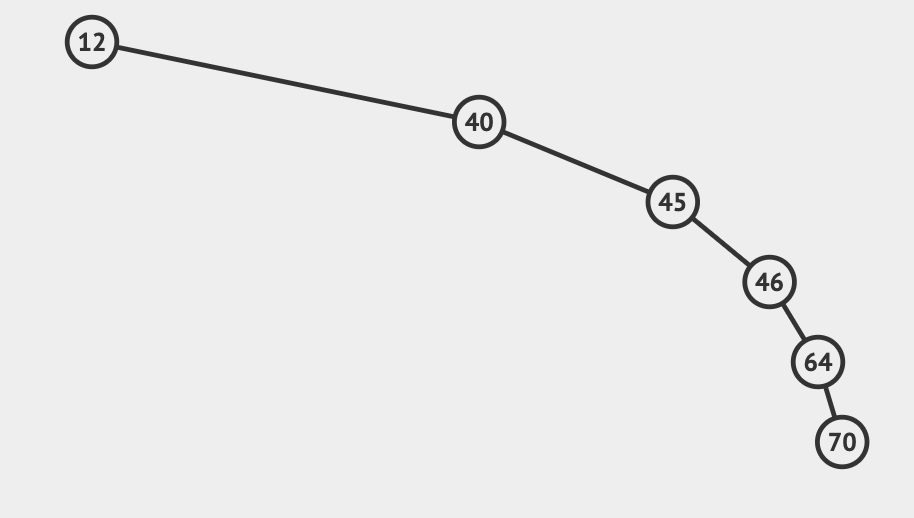

# 二叉搜索树
## 简介
> 二叉搜索树（Binary Search Tree,BST）又叫二叉排序树，基于二分法查找思想设计的树。它的定义如下：
> 1. 它是一棵二叉树
> 2. 左子树的所有节点的值都小于它的根节点，右子树的所有节点的值都大于它的根节点
> 3. 左右子树也是一棵二叉搜索树

## 增加节点
```go
func (n *Node) Add(value int) {
	if value > n.Data {
		if n.Right == nil {
			n.Right = &Node{
				Left:  nil,
				Data:  value,
				Right: nil,
			}
		} else {
			n.Right.Add(value)
		}
	} else if value < n.Data {
		if n.Left == nil {
			n.Left = &Node{
				Left:  nil,
				Data:  value,
				Right: nil,
			}
		} else {
			n.Left.Add(value)
		}
	} else {
		fmt.Println(value, " already exist")
	}
}
```

## 查找节点
```go
func (n *Node) Find(value int) *Node {
	if n == nil {
		return nil
	}
	if n.Data == value {
		return n
	} else if n.Data > value {
		return n.Left.Find(value)
	} else {
		return n.Right.Find(value)
	}
}
```
测试
```go
func TestNode_Find(t *testing.T) {
	var node = &Node{
		Left:  nil,
		Data:  10,
		Right: nil,
	}
	node.Add(7)
	node.Add(8)
	node.Add(13)
	node.Add(14)
	result := node.Find(13)
	if result == nil || result.Data != 13 {
		t.Fatal("find fail")
	}
	t.Log(result.Data, result.Left, result.Right)

	result = node.Find(11)
	if result!=nil{
		t.Fatal("should be nil")
	}
}

```

## 删除节点

### 递归版本
```go
// 递归版本
func (n *Node) DeleteNodeRecursion(key int) *Node {
	if n == nil {
		return nil
	}
	// 删除的节点在子树上
	if key < n.Data {
		n.Left = n.Left.DeleteNodeRecursion(key)
		return n
	}
	if key > n.Data {
		n.Right = n.Right.DeleteNodeRecursion(key)
		return n
	}
	// 删除的节点为当前节点
	if n.Right == nil { // 只有一个左子树
		return n.Left
	}
	if n.Left == nil { // 只有一个右子树
		return n.Right
	}
	// 有两个子树
	// 从右子树选择最小的node替换
	minNode := n.Right
	for minNode.Left != nil {
		minNode = minNode.Left
	}
	// 替换当前节点的值并删除右子树最小node
	n.Data = minNode.Data
	n.Right = n.Right.deleteMinNode()
	return n
}

// 递归删除节点
func (n *Node) deleteMinNode() *Node {
	if n.Left == nil { //左子树为空，则删除当前节点
		pRight := n.Right
		n.Right = nil
		return pRight
	}
	// 左子树不为空，则继续删除左子树
	n.Left = n.Left.deleteMinNode()
	return n
}
```
测试
```go
func ExampleDeleteNodeRecursion() {
	var node = &Node{
		Left:  nil,
		Data:  10,
		Right: nil,
	}
	node.Add(7)
	node.Add(8)
	node.Add(13)
	node.Add(14)
	node.Print()
	fmt.Println()
	node = node.DeleteNodeRecursion(7)
	node.Print()
	fmt.Println()
	node = node.DeleteNodeRecursion(14)
	node.Print()
	fmt.Println()
	node = node.DeleteNodeRecursion(8)
	node.Print()
	fmt.Println()
	node = node.DeleteNodeRecursion(10)
	node.Print()
	node = node.DeleteNodeRecursion(13)
	node.Print()
	// Output:
	// 10(7(,8),13(,14))
	// 10(8,13(,14))
	// 10(8,13)
	// 10(,13)
	// 13
}
```

### 迭代版本
```go
// 迭代版本
func (n *Node) DeleteNodeIteration(key int) *Node {
	// 特殊情况处理
	if n == nil {
		return n
	}
	cur := n
	var pre *Node
	for cur != nil {
		if cur.Data == key {
			break
		}
		pre = cur
		if cur.Data > key {
			cur = cur.Left
		} else {
			cur = cur.Right
		}
	}
	if pre == nil {
		return cur.deleteOneNode()
	}
	// pre 要知道是删除左孩子还有右孩子
	if pre.Left != nil && pre.Left.Data == key {
		pre.Left = cur.deleteOneNode()
	}
	if pre.Right != nil && pre.Right.Data == key {
		pre.Right = cur.deleteOneNode()
	}
	return n
}

// 删除一个具体节点
func (n *Node) deleteOneNode() *Node {
	if n == nil {
		return n
	}
	if n.Right == nil {
		return n.Left
	}
	cur := n.Right
	for cur.Left != nil {
		cur = cur.Left
	}
	cur.Left = n.Left
	return n.Right
}
```
测试
```go
func ExampleDeleteNodeIteration() {
	var node = &Node{
		Left:  nil,
		Data:  10,
		Right: nil,
	}
	node.Add(7)
	node.Add(8)
	node.Add(13)
	node.Add(14)
	node.Print()
	fmt.Println()
	node = node.DeleteNodeIteration(7)
	node.Print()
	fmt.Println()
	node = node.DeleteNodeIteration(14)
	node.Print()
	fmt.Println()
	node = node.DeleteNodeIteration(8)
	node.Print()
	fmt.Println()
	node = node.DeleteNodeIteration(10)
	node.Print()
	node = node.DeleteNodeIteration(13)
	node.Print()
	// Output:
	// 10(7(,8),13(,14))
	// 10(8,13(,14))
	// 10(8,13)
	// 10(,13)
	// 13
	//
}
```

# 总结
> 二叉搜素树采用二分法思想，查找效率高
> 
> 但是二叉搜索树具有不平衡性，容易出现斜树

