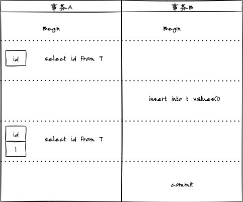
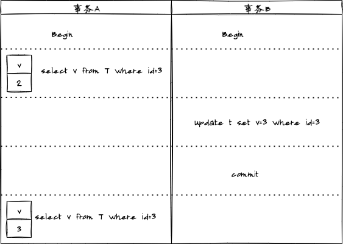
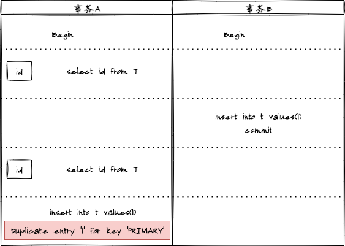

## 事务的特性

### 原子性(Atomicity)

> 事务必须是原子工作单元，对于其数据修改，要么全部执行，要么全都不执行

### 一致性(Consistency)

> 事务在完成时，必须使所有的数据都保持一致状态

### 隔离性(Isolation)

> 由并发事务所作的修改必须与任何其他并发事务所作的修改隔离

### 持久性(Durability)

> 事务完成之后，它对于系统的影响是永久性的。即数据一定会被写入数据库中并持久化存储，无论之后发生了什么事故，事务提交的数据都不应该被丢失掉

## 事务的实现

- Undo log：实现事务的原子性；
- Redo log：实现事务的持久性；
- 锁/MVCC：实现事务的隔离性；
- Redo Log + Undo Log：实现事务的一致性；

## 事务的隔离级别

> 当数据库上有多个事务同时执行的时候，就可能出现**脏读(dirty read)**、**不可重复读(non-repeatable read)**、**幻读(phantom read)**，为了解决这些问题，就有了隔离级别的概念

1. 脏读问题

2. 不可重复读问题

3. 幻读问题

针对上面三种问题，分别有四种隔离级别：

1. **未提交读(read uncommitted，RU)**

> 未提交读，是指一个事务还未提交时，它做的变更就能被别的事务看到。即**没有提交却可以读**

2. **提交读(read committed，RC)**

> 提交读，是指一个事务提交之后，它做的变更才会被其他事务看到。即**提交才可以读**
>
> 大多数数据库系统的默认隔离级别

3. **可重复读(repeatable read，RR)**

> 可重复度，是指同一个事务执行过程看到的数据，总是跟这个事务在启动时看到的数据是一致的。即同一个事务多次请求读取数据，会看到同样的数据行。
>
> MySQL的默认隔离级别

4. **串行化(serializable，S)**

> 是最高的隔离级别，它通过强制事务排序，使之不可能相互冲突。
>
> 这个级别可能导致大量的超时现象和锁竞争。

以上四种隔离级别解决问题如下：

| 隔离级别\解决问题 |        脏读        |     不可重复读     |        幻读        |                     实现原理                     |
| :---------------: | :----------------: | :----------------: | :----------------: | :----------------------------------------------: |
|     未提交读      |        :x:         |        :x:         |        :x:         |                   没有视图概念                   |
|      提交读       | :heavy_check_mark: |        :x:         |        :x:         |        每个SQL语句开始执行的时候创建视图         |
|     可重复读      | :heavy_check_mark: | :heavy_check_mark: |        :x:         | 事务启动时创建视图，且整个事务期间都在用这个视图 |
|      串行化       | :heavy_check_mark: | :heavy_check_mark: | :heavy_check_mark: |              加锁的方式避免并行访问              |

各个隔离级别都有它自己的使用场景，需要根据业务情况来定，隔离级别从上到下，性能变差。

## MVCC

MySQL InnoDB默认级别是可重复度隔离级别，为了解决不可重复读问题，InnoDB采用了MVCC(多版本并发控制)的方式。它为存储的每一行增加三个额外的隐藏字段

- DATA_TRX_ID：产生当前记录项的事务ID
- DELETE BIT：用于标识该记录是否是删除记录
- DATA_ROLL_PTR：指向当前记录项的undo信息

### SELECT

1. InnoDB只查找版本早于当前事务版本的数据行（行的事务版本号<=当前事务的系统版本号），这样可以确保事务读取的行，要么是在事务开始前以及存在，要么是事务自身插入或者修改过的。

2. 行的删除版本要么未定义，要么大于当前事务版本号，这样可以确保事务读取到的行，在事务开始之前未被删除。

> 只有符合上述两个条件的记录，才能返回作为查询结果

### INSERT

> InnoDB为新插入的每一行保存当前事务版本号作为行版本号

### DELETE

> InnoDB为删除的每一行保存当前事务版本号作为行删除标识

### UPDATE

> InnoDB为插入一行新记录，保存当前事务版本作为行版本号，同时保存当前事务版本号到原来的行座位行删除标识

