# Grafana

## 1. Grafana简介

### 1.1 grafana简介

> Grafana是适用于所有指标的分析平台，允许用户查询、可视化、提醒和理解指标。

另外一种定义

> Grafana是一款开源的、功能丰富的支持Graphite、Elasticsearch、OpenTSDB、Prometheus和InfluxDB等数据源的指标仪表板和图形编辑器。

**官网：**`https://grafana.com/`

**Github：**`https://github.com/grafana/grafana`

## 2 Grafana使用（基础）

Grafana的使用主要围绕Dashboard（仪表板），如图所示：

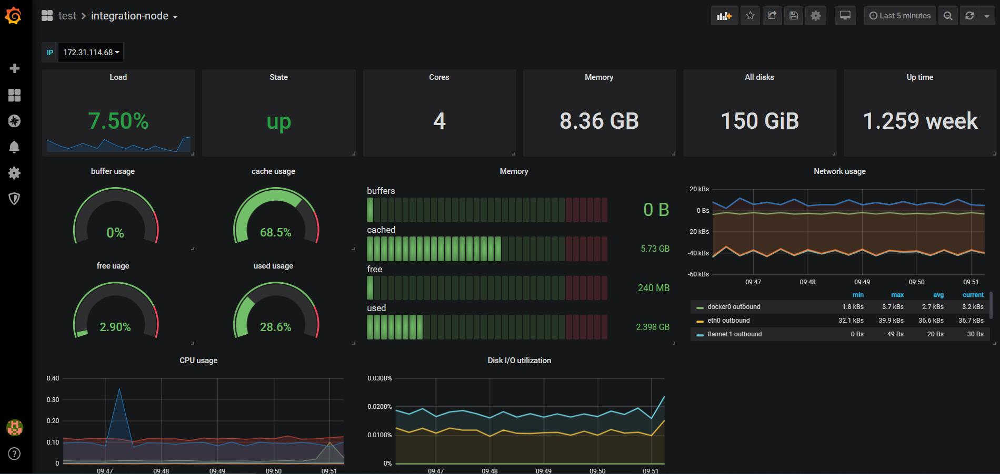

> **仪表板**由一组面板（panel）组织排列的视图
>
> - 支持动态选择可视化数据，如图中左上角的IP下拉选，该功能是由**变量**实现<!--2.2.3会介绍到-->
> - 支持新增面板、收藏、分享、保存修改、设置、时间选择，如图中右上角展示

### 2.1 panel（面板）

#### 2.1.1 Queries （查询）

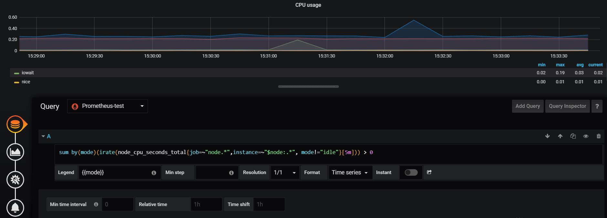

查询界面支持选择数据源、查询编辑器以及查询条件，并且支持多条查询；

- **Lengend**  在图表下方表格展示指标中标签的值。例如：填写**{{hostname}}**将替换为指标标签中**hostname**对应的标签值；

- **Min step** 面板的数据间隔步长，注意，时间范围选择（右上角）会变成该间距的倍数。例如：面板数据时间间隔设置为1m；（可用鼠标放在图线上看数据时间间隔）

- **Resolution** 控制采样点，降低采样点可以加快速度；

- **Format** 在表格、时间序列或热图之间切换；

- **Instant** 即时，对于**某些面板**可以展示历史数据，也可以只展示当前数据，勾选则表示即时；

- **Link to Graph in Prometheus** 重定向到Prometheus Web页面；

由于可以有多个表达式查询，下面三个是用于全局控制多条查询语句的时间

- **Min time interval** 最小时间间隔，建议设置为采集频率；可以在表达式中使用` $__interval`和`$__interval_ms`两个变量；

- **Relative time** 相对时间，面板展示最近多长时间；

- **Time shift** 时间偏移，面板展示到现在之前一段时间，例如：1h之前；

#### 2.1.2 Visualization（可视化）

可视化支持许多类型的面板：`Graph`、`Singlestat`、`Table`、`Heatmap`、`Alert list`、`Dashboard list`、`Text`等，且支持从社区下载其他类型面板插件，例如饼图、世界地图等；

##### **Graph**

Graph常用来展示多条数据的折线图、条形图，[相关配置参考官网](https://grafana.com/docs/features/panels/graph/)

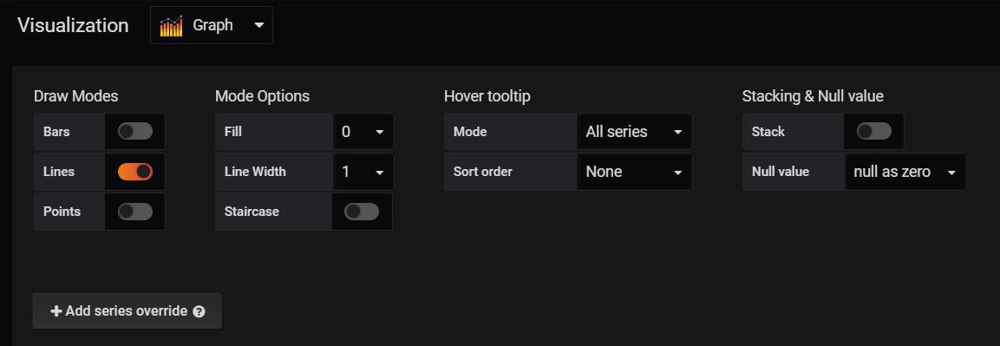

- **Draw Modes**：支持三种方式画图：Bars（条形图）、lines（折线图）、Points(点图)；

- **Model Options**：对图形的一些配置选项：Fill (图形填充颜色深度)、Line Width(线的宽度)、Staircase(将折线图转换为梯状)；

- **Hover tooltip**：鼠标停放提示，Mode支持：**All series**（鼠标停放在线上时展示所有线的数据）、**Single**（鼠标停放在线上时展示该条线的数据）、**Sort order**支持None、Increasing、Decreasing，来排序展示；

- **Stacking & Null value**：**Stack**，一条线放在另一条线上面展示；**Null value**: 当数据丢失时可以选择进行弥补，例如connected连接前后线，null as zero将丢失数据设置为空；

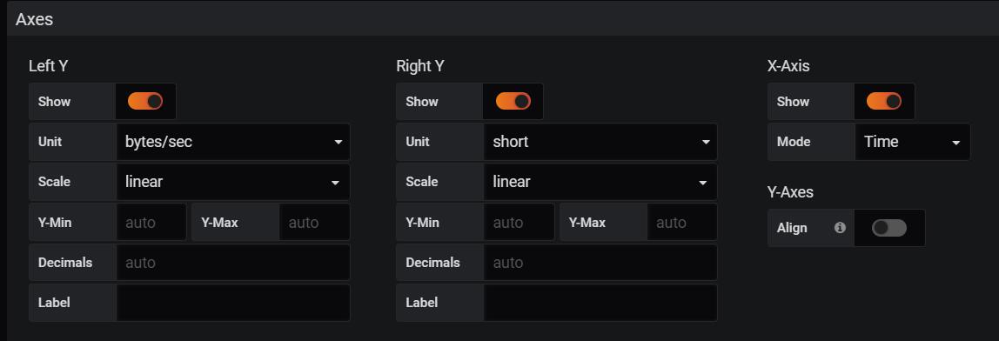

**Left Y / Right Y**： 

在**左侧Y轴**和**右侧Y轴**可以使用自定义的：

- **单位** - Y值的显示单位；
- **比例** - 用于Y值的比例，线性或对数；（默认线性）
- **Y-Min** - 最小Y值；（默认自动）
- **Y-Max** - 最大Y值；（默认自动）
- **小数** - 控制Y值显示的小数位数；（默认为自动）
- **标签** - Y轴标签；（默认为“”）

**X-Axis** ：x轴，Mode支持：**Time**，x轴以时间维度展示；**Series**根据自定义分组条形图展示；**Histogram**根据值分布统计以条形图展示；

**Y-Axes**：Y轴 ~~(暂无需求)~~

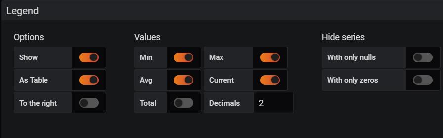

- **Options**：**As Table**以表格展示下面Values勾选的值；**To the right**在图的右边展示表；

- **Values**: 历史所有值的最小值、最大值、平均值、当前值、总计值；小数位数；

- **Hide series**：对于一些特定值使用空值或零值隐藏；（~~暂无需求~~）

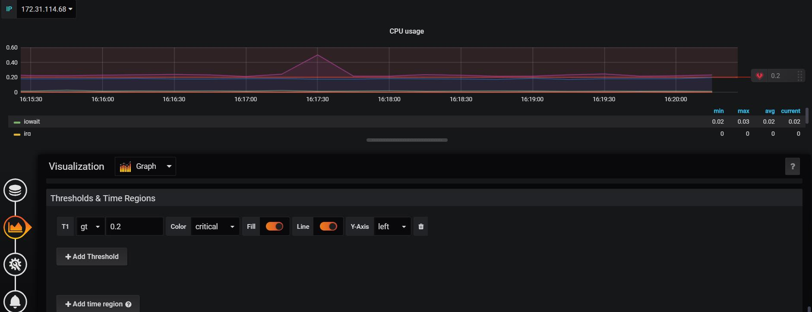

- **Thresholds & Time Regions** 可以增加阈值，例如值gt(大于)0.2的时候显示告警；可以突出显示某段时间，例如周一到周五；

##### **Singlestat**

Singlestat常用来展示单一数据统计数据，可设置最大值、最小值、平均值、总和值，另外提供数字到文本的转换，例如机器节点状况指标up，值1代表机器正常运行，值0代表机器挂掉；[相关配置参考官网](https://grafana.com/docs/features/panels/singlestat/)

##### **Table**

Table支持时间序列的多种模式，以时间序列为顺序展示指标数据；[相关配置参考官网](https://grafana.com/docs/features/panels/table_panel/)

##### **Heatmap**

Heatmap常用来展示数据的分布，例如耗时分布情况，[相关配置参考官网](https://grafana.com/docs/features/panels/heatmap/)

##### **Alert list**

Alert list 用于展示仪表板警报信息，~~暂无需求~~，[相关配置参考官网](https://grafana.com/docs/features/panels/alertlist/)

##### **Dashboard list**

Dashboard list支持指向其他仪表板的动态链接。该列表可以配置为使用加星标的仪表板。[相关配置参考官网](https://grafana.com/docs/features/panels/dashlist/)

##### **Text**

Text支持为仪表板制作信息和说明面板，支持三种模式：markdown、HTML、text。[相关配置参考官网](https://grafana.com/docs/features/panels/text/)

#### 2.1.3 General

1. `Title`：标题，仪表板的名称
2. `Transparent`：透明，面板是否透明展示；
3. `Description`：描述

**Repeating**

根据模板变量的值动态创建新面板，可以使用该功能；例如：想为每个产品创建同一个面板分别展示，可以选择产品这个变量；

**Drilldown Links**

支持添加动态链接到其他仪表板或外部URL；

#### 2.1.3 Alert

~~暂无需求~~

### 2.2 Settings（设置）

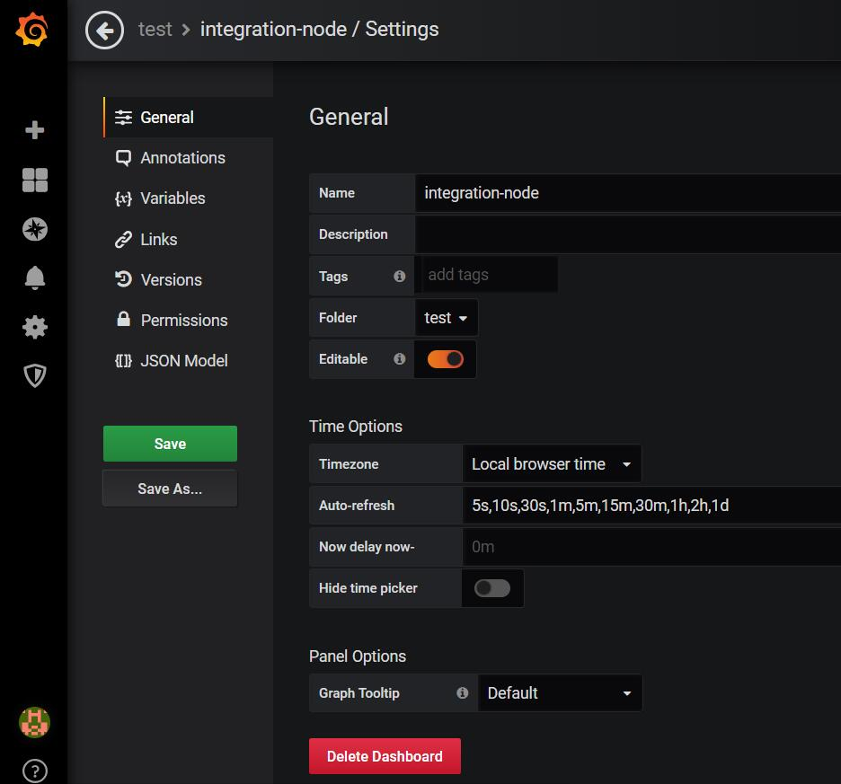

#### 2.2.1 General 

> 一般性设置

- `Name`：仪表板名称
- `Description`：描述
- `Tags`：标签，用于主页面搜素
- `Folde`r：文件夹，用于管理仪表板
- `Editable`：是否可编辑

**Time Options**

- `Timezone`：时间区域，本地浏览器时间还是UTC
- `Auto-refresh`：自动刷新时间
- `Now delay now-`：例如填写1m，表示忽略最近一分钟的指标数据，因为可能最近一分钟的指标不完整
- `Hide time picker`：是否隐藏时间选择器

**Panel Options**

- `Graph Tooltip`：图形工具提示~~暂无需求~~

#### 2.2.2 Annotations（注释）

> 可以在图标上标记，描述事件

使用方法：选择面板—>按住CTRL或CMD+单击/选择—>填写

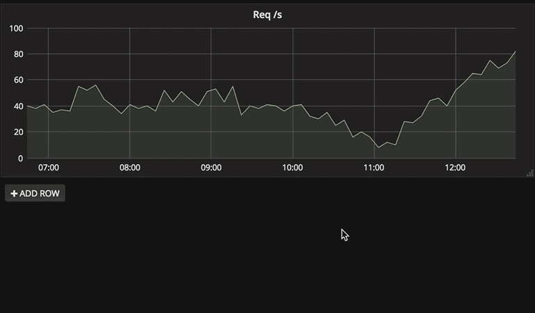

可以用于记录异常情况，稍后进行排查分析

在设置页面可以设置Annotations的颜色，这样在面板上可以很清楚的发现。

#### 2.2.3 Variables（变量）

> 变量是值得占位符
>
> 目的：变量使得仪表板具有更多交互式和动态，变量显示为仪表板顶部的下拉选择框，通过这些下拉菜单，可以轻松更改仪表板中显示的数据。
>
> 使用范围：可以在指标查询和面板标题中使用变量；

**Example**：如下图红线框所示，可以根据变量IP动态选择展示各个机器的指标数据

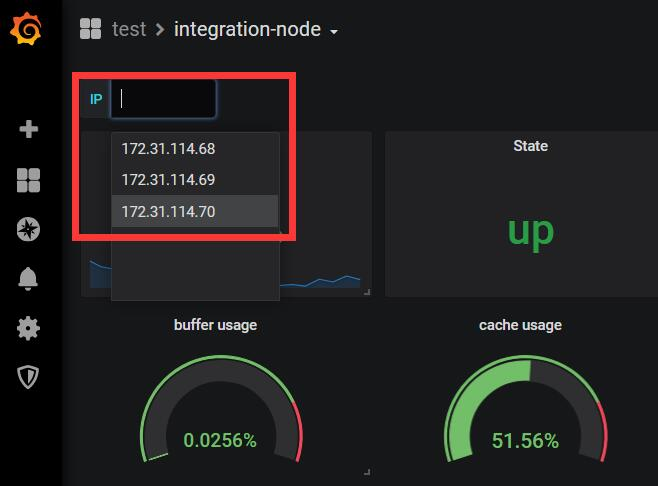

**变量引用（基础）**：

- `$varname` 示例：`apps.frontend.$server.requests.count`、`node_load1{instance=~"$node"}`
- `[[varname]]` 示例：`apps.frontend.[[server]].requests.count`

第一种方式比较容易读写，但不允许在单词中间使用变量，但第二种写法可以例如`my.server[[serverNumber]].count`

**变量引用（高级）**：

> 对于多值引用，尤其是选择`All`选项时，不同的数据源对于多值的拼接是不同的。例如，MySql数据源的默认值是将多个值连接为逗号分隔的引号：`'server01','server02'`。在某些情况下，可能希望使用逗号分隔的字符串而不带引号：`server01,server02`。现在可以使用高级格式化选项。

形式：`${var_name:option}`[详情参考官网](https://grafana.com/docs/reference/templating/#advanced-formatting-options)

**添加变量**：点击仪表板设置按钮—>Variable—>new

**General**

1. `Name`：名称，变量的名称，是度量标准查询中引用变量使用的名称。必须唯一，不包含空格；
2. `Lable`：标签，此变量的下拉列表左边的名称；
3. `Type`：类型，定义变量的类型；**一般选择Query**; [详情查看官网](https://grafana.com/docs/reference/templating/#variable-types)
4. `Hide`：隐藏，隐藏下拉选择框的选项；例如选择Lable，则下拉选择框的左边标签不再显示；选择Variable，整个下拉选择框不再显示；

**Query Options**

1. `Data Source`：数据源
2. `Query`：特定的查询表达式，不同的数据源用不同的表达式，[详情参考官网](https://grafana.com/docs/reference/templating/#query-expressions)。对于Prometheus**一般使用labe_values(metric,label)表示返回指定metric中的label值**
3. `Regex`：正则表达式，例如该列的值是以`["en-US"]`，可以使用正则表达式`/\[\"(.*)\"\]/`提取到`en-US`;
4. `Sort`：排序，在下拉列表中定义选项的排序顺序；
5. `Refresh`：刷新，控制何时更新变量选项列表；

**Selection Options**

1. `Multi-value`：多值，如果启用，该变量将支持同时选择多个选项；
2. `Include All option`：包含 All 选项，如果启用，支持勾选所有选项；对于一些正则表达式需要转换的需注意，所有的下拉选择以`|`进行合并;
3. `Custom all value`：（`Include All option`选项启用的情况下出现该选项），由于All选项会使得数据特别长，影响性能。例如当前变量是语种，比较多，比较关注的是中文和英文，可以在此填写`中文|英文`;

**Value groups/tags (Experimental feature)**

~~暂无需求~~

**Preview of Values**	

预览下拉选择的值

#### 2.2.4 Links（链接）

~~暂无需求~~

#### 2.2.5 Versions（版本）

> 版本可以看到对仪表板历史操作的版本，可以很方便的回退到某个版本，或者比较两个版本的差别

#### 2.2.6 Permissions （权限）

> 可以对某个用户或某个团队设置该仪表板的权限

#### 2.2.7 JSON Model

> JSON模型是定义仪表板的数据结构。包括设置，面板设置和布局，查询等

### 2.3 Dashboards（各个仪表板）

提供统一的视图管理仪表板、组织仪表板、播放仪表板、共享仪表板

#### 2.3.1 Manage（管理）

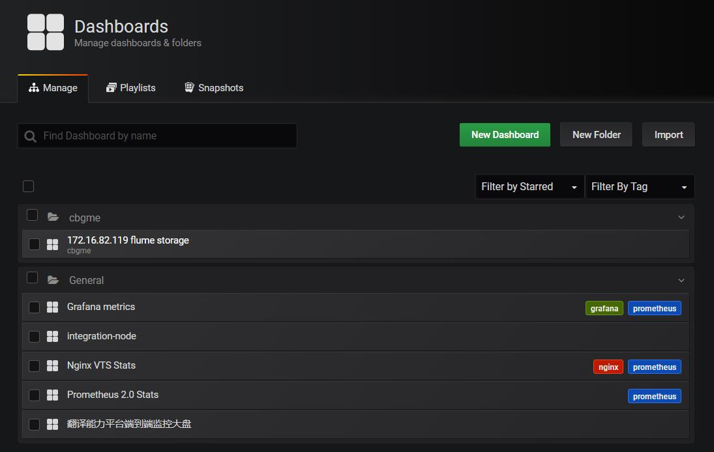

功能：

- 创建仪表板
- 创建文件夹
- 将仪表板移动到文件夹中
- 删除多个仪表板
- 导航到文件夹页面（设置文件夹和仪表板的权限）

**文件夹**

> 文件夹是一种组织和分组仪表板的方法

#### 2.3.2 Playlists（播放列表）

> 播放列表是一种特殊类型的仪表板，可通过仪表板列表进行旋转。播放列表可以是构建态势感知的好方法，非常适合大屏幕展示。

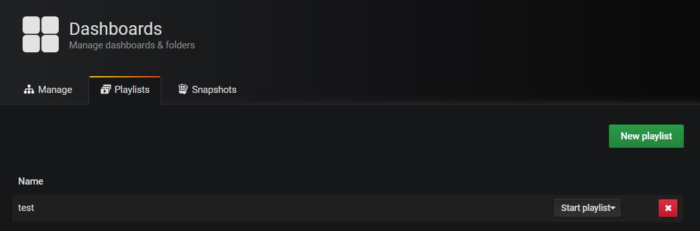

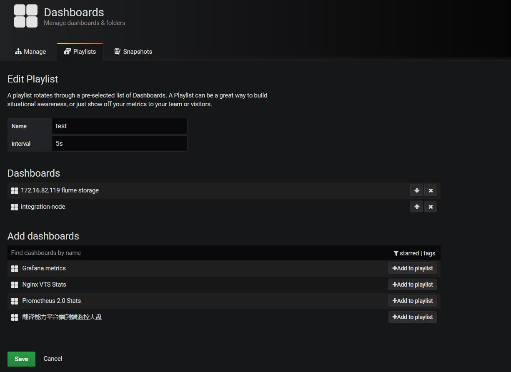

支持将仪表板加入到播放列表，且支持播放顺序和播放间隔；

#### 2.3.3 Snapshots（快照）

> 快照可以提供一种即时方式共享交互式仪表板，我们只需复制URL即可访问仪表板；具体快照设置是在每个仪表板中设置，例如设置过期时间等；

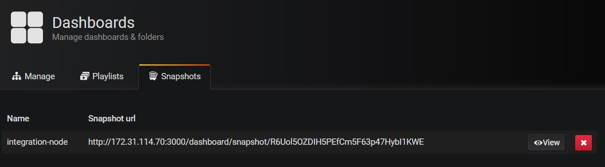

## 3 Grafana管理（高级）

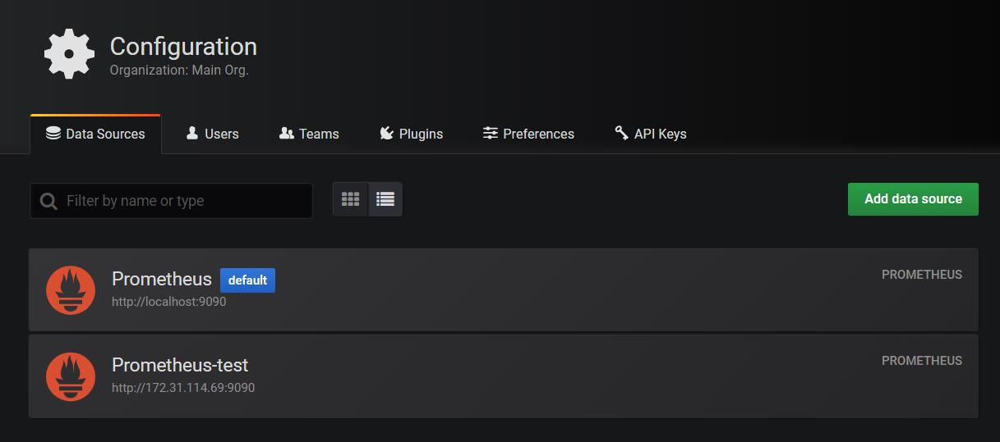

### 3.1 Configuration（配置）

#### 3.1.1 Data Source（数据源）

> grafana为每个数据源提供一个特定的查询编辑器，每个数据源的查询语言和功能不同。

**支持的数据源：**`Graphite`、`Elasticsearch`、 `OpenTSDB`、`Prometheus`、`InfluxDB`等

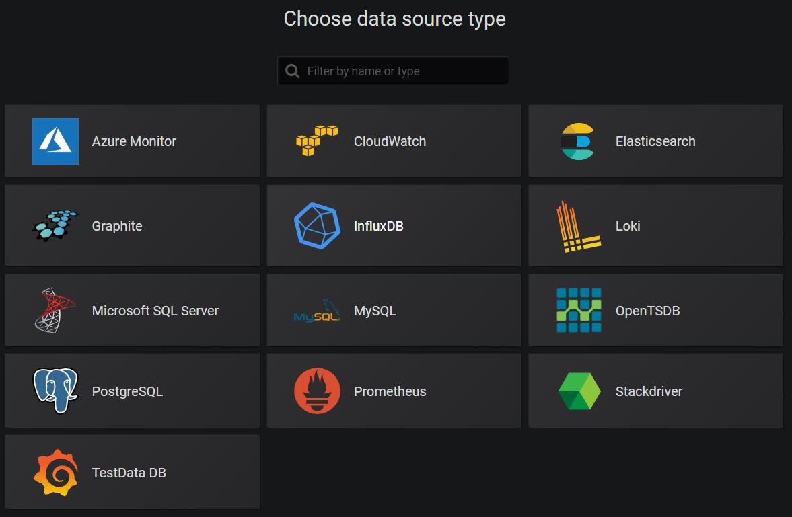

这里以Prometheus设置为例：

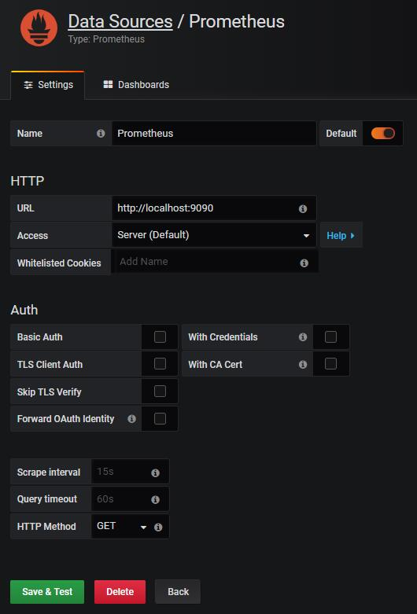

配置项目说明：

1. `Name`：数据源名称，右边`default`用于是否设置为默认，如果开启，则在面板查询中首先会选择该数据源；

HTTP相关：

1. `URL`：Prometheus的URL地址，Prometheus在9090端口提供web方式查询
2. `Access`：如何访问数据源，分为两种：`Server`和`Browser`，`Server`会经过grafana服务端访问数据源，`Browser`会直接访问数据源；
3. `Whitelisted Cookies`：Grafana按名称指定应转发到数据源的cookie。

Auth相关：

1. `Basic Auth`：勾选后会让填写用户名和密码；
2. `TLS Client Auth`：勾选后让填写证书和密钥；
3. `Skip TLS Verify`：跳过TLS验证；
4. `Forward OAuth Identity`：将用户的上游OAuth标识转发给数据源（它们的访问令牌被传递）；
5. `With Credentials`:是否应使用跨站点请求发送cookie或auth标头等凭据；
6. `With CA Cert`：需要验证自签名TLS证书；

其他配置：

1. `Scrape interval`：采集间隔，默认是Prometheus配置的全局采集间隔；
2. `Query timeout`：查询超时时间；
3. `HTTP Method`：Prometheus >=v2.1.0才支持POST；

#### 3.1.2 User （用户）

> 用户权限管理

用户角色分为三种：`Admin Role`、`Editor Role`、`Viewer Role`，其中：

`Admin Role`：管理员角色可以做一切范围的组织，例如：

- 添加和编辑数据源；
- 添加和编辑组织用户和团队；
- 配置App插件并色湖之组织设置；

`Editor Role`：编辑者角色

- 可以创建和修改仪表板和警报规则；
- **无法**创建或编辑数据源，也无法邀请新用户；

`Viewer Role`：查看者角色

- 查看仪表板
- **无法**创建或编辑仪表板或数据源

#### 3.1.3 Teams（团队）

> 可以建立多个团队，例如开发团队、测试团队、运维团队，每个团队可以使用不同的UI主题等配置

#### 3.1.4 Plugins（插件）

> 提供许多可视化插件，帮助用户展示指标数据，理解指标数据

#### 3.1.5 Preferences（首选项）

> 设置组织名、UI主题、首页仪表板、时区等

#### 3.1.6 API keys 

> 可提供给其他应用程序的仅查看API访问。

### 3.2 Server Admin（服务管理）

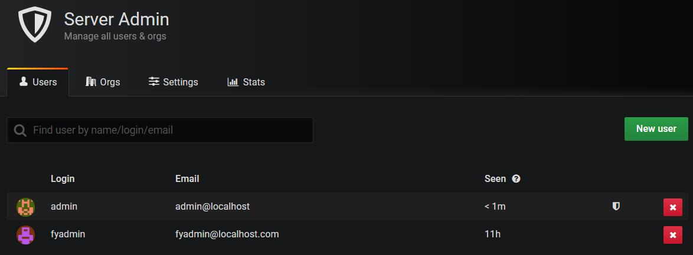

#### 3.2.1 Users（用户）

> 是用于用户管理，支持新增用户，修改用户，删除用户；

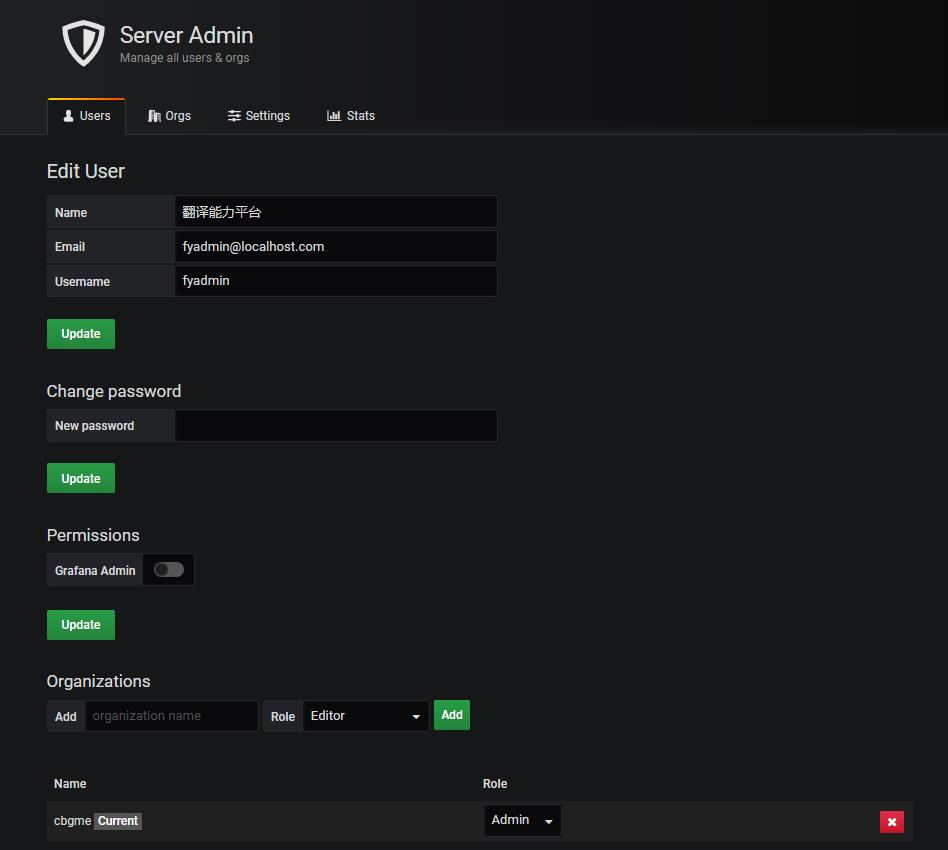

修改用户可以更改账户密码等等，最主要是修改用户角色权限，如：`Admin`、`Editor`、`Viewer`（参考2.1.2节）；同时所属组织，一个用户可以加入多个组织；

#### 3.2.2 Orgs（组织）

> 用于组织的管理，支持新增组织、修改组织、删除组织

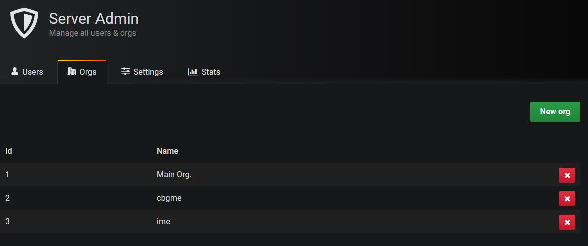

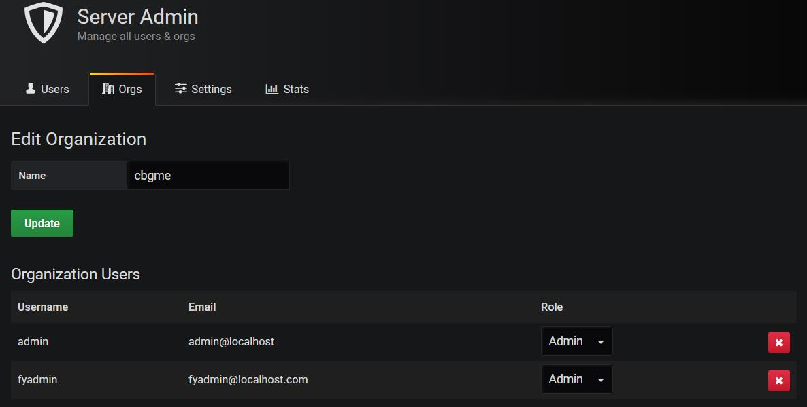

编辑组织可以修改组织名称、管理当前组织内用户角色权限等信息；

**用户和组织是多对多的关系**

#### 3.2.3 Settings（设置）

> 这里是一些系统设置，保存在grafana.ini或custom.ini中定义，或在环境变量中定义；

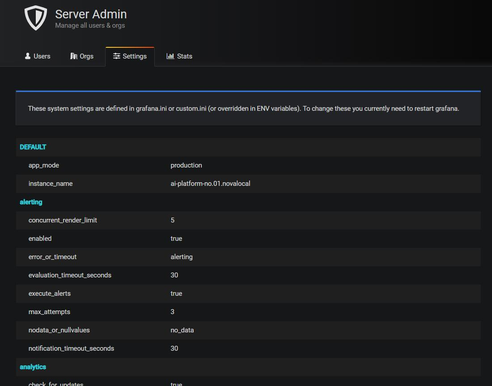

维护人员需详细了解

~~暂无需求~~

#### 3.2.4 Stats（状态）

>查看一些统计信息，例如总的用户数，活跃的用户数等

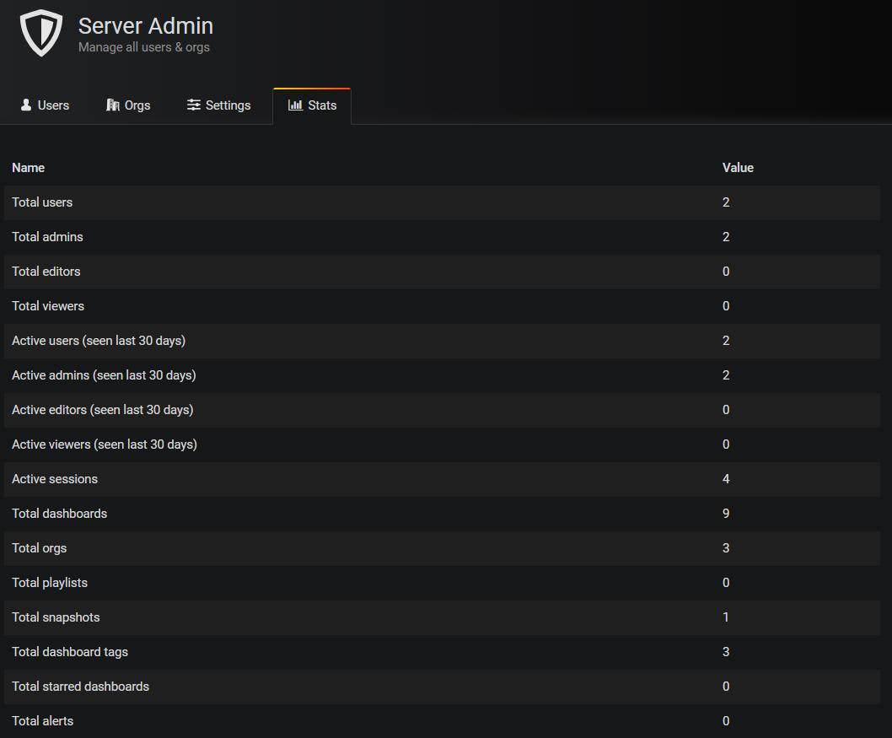

维护人员需了解

