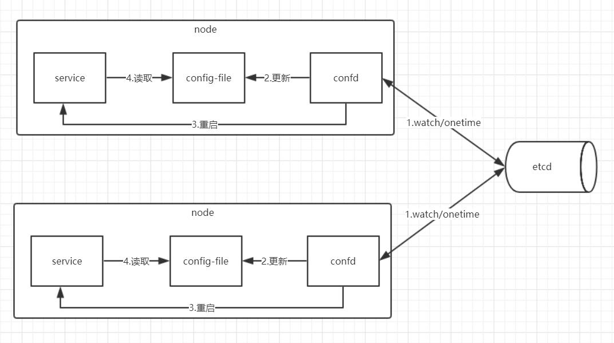

## 1. confd

### 1.1 confd简介

> confd是一个轻量级配置管理工具，通过加载存储在etcd、consul、redis、zookeeper等的数据，结合配置模板动态更新配置文件。

**github地址**：`https://github.com/kelseyhightower/confd`

**官网：**`http://www.confd.io/`

### 1.2 confd功能角色

confd的功能类似于快递员，负责去配置服务中读取配置数据，然后更新配置文件，并通知应用服务热加载配置文件。



## 2. confd部署

下载地址：`https://github.com/kelseyhightower/confd/releases`

以Linux系统为例：

```shell
#下载二进制包
wget https://github.com/kelseyhightower/confd/releases/download/v0.16.0/confd-0.16.0-linux-amd64
#重命名，并移动到PATH的目录
mv confd-0.16.0-linux-amd64 /usr/local/bin/confd
chmod +x /usr/local/bin/confd
#验证
confd --help
```

## 3. confd使用

### 3.1 创建confdir

`confdir`(默认是`/etc/confd`)包含两个目录：

- `conf.d`：confd的配置文件，主要包含配置的生成逻辑，例如模板源，目标配置文件，后端存储的keys，服务重启命令执行等。
- `templates`: 包含配置模板，修改符合[Golang Text template](https://golang.google.cn/pkg/text/template/#pkg-overview)的模板文件。

```shell
mkdir -p /etc/confd/{conf.d,templates}
```

### 3.2 模板源配置

模板源配置文件是以TOML格式的文件，包含配置的生成逻辑，例如模板源，后端存储对应keys，命令执行等。默认目录在`/etc/confd/conf.d`

参数说明：

**必要参数**

- `dest`(string) : 目标文件.
- `keys`(array of things) : 存储的keys.
- `src`(string) :  [模板配置](https://github.com/kelseyhightower/confd/blob/master/docs/templates.md)的相对路径.

**可选参数**

- `git`(int) : 文件的gid
- `mode`(string) : 文件的权限模式
- `uid`（int) : 文件的uid
- `reload_cmd`(string) : 重启命令配置
- `check_cmd`(string) : 检查命令配置，使用{{.src}}引用模板源
- `prefix`(string) : keys的前缀字符串

例如：`/etc/confd/conf.d/prometheus.toml`

```go
[template]
src = "prometheus.tmpl"
dest = "/data/server/prometheus/prometheus-2.11.1.linux-amd64/prometheus.yml"
keys = [
"prometheus/job",
]
reload_cmd = "curl -X POST http://192.168.45.172:9090/-/reload"
```

### 3.3 模板源

Template定义了单一应用配置的模板，默认存储在`/etc/confd/templates`目录下，模板文件符合Go的`text/template`格式。

例如: `/etc/confd/templates/prometheus.tmpl`

```go
global:
  scrape_interval: 15s
  scrape_timeout: 10s
  evaluation_interval: 15s
alerting:
  alertmanagers:
  - static_configs:
    - targets: []
scrape_configs:
{{range gets "/prometheus/job/*"}}
- job_name: {{.Key}}
  static_configs:
  - targets: [{{.Value}}]
{{end}}
```

### 3.4 启动confd的服务

confd支持以`daemon`或者`onetime`两种模式运行。

`onetime`模式，只会生成一次，之后key无论变化不会再生成：

```shell
confd -onetime -backend etcd -node http://192.168.45.172:2379
```

`daemon`模式，会监听后端存储的配置变化，并根据配置模板动态生成目标配置文件：

```shell
confd -watch -backend etcd -node http://192.168.45.172:2379 &
```

### 3.5 etcd设置数据

```shell
etcdctl set /prometheus/job/prometheus "192.168.45.172:9090"

etcdctl set /prometheus/job/pushgateway "192.168.45.172:9091"
```

### 3.6 验证配置文件数据

根据**模板源配置**里设置的目标配置文件查看是否符合预期

```yaml
global:
  scrape_interval: 15s
  scrape_timeout: 10s
  evaluation_interval: 15s
alerting:
  alertmanagers:
  - static_configs:
    - targets: []
scrape_configs:

- job_name: /prometheus/job/prometheus
  static_configs:
  - targets: [192.168.45.172:9090]

- job_name: /prometheus/job/pushgateway
  static_configs:
  - targets: [192.168.45.172:9091]
```

## 4. confd模板功能函数

### map

string->interface{}的key/value键值对

例如：

```
{{$endpoint := map "name" "elasticsearch" "private_port" 9200 "public_port" 443}}

name: {{index $endpoint "name"}}
private-port: {{index $endpoint "private_port"}}
public-port: {{index $endpoint "public_port"}}
```

### base

与[path.Base](https://golang.org/pkg/path/#Base)功能同名

例如：

```
{{with get "/key"}}
    key: {{base .Key}}
    value: {{.Value}}
{{end}}
```

### exists

检查key是否存在，如果不存在返回false

例如：

```
{{if exists "/key"}}
    value: {{getv "/key"}}
{{end}}
```

### get

返回键值对，如果不存在返回error

例如：

```
{{with get "/key"}}
    key: {{.Key}}
    value: {{.Value}}
{{end}}
```

### cget

返回键值对，且值被加密。如果不存在返回error

例如：

```
{{with cget "/key"}}
    key: {{.Key}}
    value: {{.Value}}
{{end}}
```

### gets

返回所有键值对，键值对列表，如果key不匹配返回error

例如：

```
{{range gets "/*"}}
    key: {{.Key}}
    value: {{.Value}}
{{end}}
```

### cgets

返回所有键值对，键值对列表，key匹配参数且值被加密，如果key不匹配返回一个错误

例如：

```
{{range cgets "/*"}}
    key: {{.Key}}
    value: {{.Value}}
{{end}}
```

### getv

以字符串形式返回值，其中key与其参数或可选的默认值匹配。如果未找到key且未给出默认值，则返回错误

例如：

```
value: {{getv "/key"}}
```

**With a default value**

```
value: {{getv "/key" "default_value"}}
```

### cgetv

将加密值作为字符串返回，如果未找到key，返回错误

例如：

```
value: {{cgetv "/key"}}
```

### getvs

返回所有值，[]string，其中key与其参数匹配。如果未找到密钥，则返回错误。

例如：

```
{{range getvs "/*"}}
    value: {{.}}
{{end}}
```

### cgetvs

返回所有加密值，[]string，其中key与其参数匹配。如果未找到key则返回错误

例如：

```
{{range cgetvs "/*"}}
    value: {{.}}
{{end}}
```

### getenv

检索由key命名的环境变量的值。 如果变量不存在，返回为空。 （可选）可以提供一个默认值，如果该键不存在，将返回该值。

例如：

```
export HOSTNAME=`hostname`
hostname: {{getenv "HOSTNAME"}}
```

**With a default value**

```
ipaddr: {{getenv "HOST_IP" "127.0.0.1"}}
```

### datetime

与time.Now同名

例如：

```
# Generated by confd {{datetime}}
```

Outputs:

```
# Generated by confd 2015-01-23 13:34:56.093250283 -0800 PST
# Generated by confd {{datetime.Format "Jan 2, 2006 at 3:04pm (MST)"}}
```

Outputs:

```
# Generated by confd Jan 23, 2015 at 1:34pm (EST)
```

### split

用分隔字符拆分输入的字符串并返回一个子字符串切片

例如：

```
{{ $url := split (getv "/deis/service") ":" }}
    host: {{index $url 0}}
    port: {{index $url 1}}
```

**toUpper**

返回大写的字符串

例如：

```
key: {{toUpper "value"}}
```

### toLower

返回小写的字符串

例如：

```
key: {{toLower "Value"}}
```

### json

返回 json值得map[string]interface{}

### lookupSRV

LookupSRV函数按照RFC 2782标准来构建用于查询的DNS。也就是说，它查询_service._proto.name。当service和proto参数都是空字符串时，LookupSRV将会直接查找name

例如：

```
{{range lookupSRV "mail" "tcp" "example.com"}}
  target: {{.Target}}
  port: {{.Port}}
  priority: {{.Priority}}
  weight: {{.Weight}}
{{end}}
```

### base64Encode

返回一个base64编码得字符串

例如：

```
key: {{base64Encode "Value"}}
```

### base64Decode

返回一个base64解码的字符串

例如：

```
key: {{base64Decode "VmFsdWU="}}
```

### jsonArray

从json数组返回一个 []interface{}

例如：

```
{{range jsonArray (getv "/services/data/")}}
val: {{.}}
{{end}}
```

### ls

返回所有子键，[]string，其中path匹配其参数。如果找不到path，则返回空列表

例如：

```
{{range ls "/deis/services"}}
   value: {{.}}
{{end}}
```

### lsdir

返回所有子键，[]string，其中path匹配其参数。它只返回包含子键的子键。如果找不到路径，则返回空列表。

例如：

```
{{range lsdir "/deis/services"}}
   value: {{.}}
{{end}}
```

### dir

返回给定键的父目录

例如：

```
{{with dir "/services/data/url"}}
dir: {{.}}
{{end}}
```

### join

字符串拼接

例如：

```
{{$services := getvs "/services/elasticsearch/*"}}
services: {{join $services ","}}
```

### replace

字符串替换

例如：

```
{{$backend := getv "/services/backend/nginx"}}
backend = {{replace $backend "-" "_" -1}}
```

### lookupIP

查找ip

例如：

```
{{range lookupIP "some.host.local"}}
    server {{.}};
{{end}}
```

### atoi

字符换转整数

例如：

```
{{seq 1 (atoi (getv "/count"))}}
```