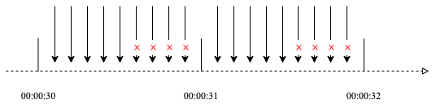
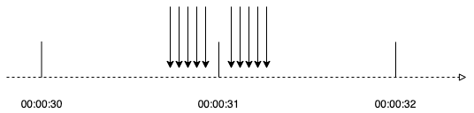
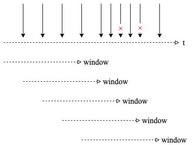
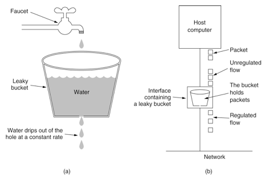
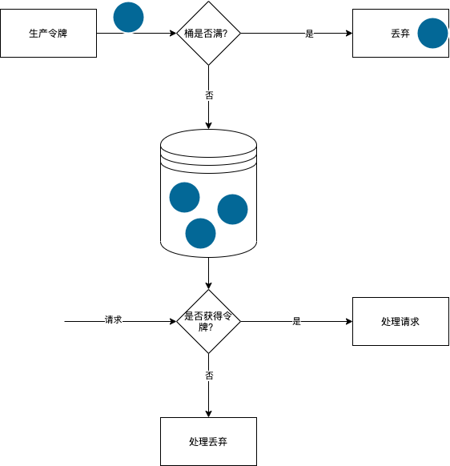

> 限流，是一种自我保护的机制，服务端通过一些限流手段控制并发访问请求，目的是为了防止系统因突发流量导致服务不可用或者崩溃。

常用的限流方法：

- 计数器限流
- 滑动窗口限流
- 漏桶限流
- 令牌桶限流

## 计数器限流

> 在一段时间间隔内，对请求进行计数，与阈值进行比较判断是否需要限流 
> 时间结束后重置计数器
> 因此计数器限流也叫固定时间限流



如图所示，假设每秒钟限流5次，那么接下来的第6次、第7次...会被拒绝，但下一秒钟又可以继续访问，直到达到限流5次后，又被拒绝。

### 单机版

```go
type CounterLimiter struct {
	mux     sync.Mutex
	ctime   time.Time
	cycle   time.Duration
	counter int
	limit   int
}

func NewCounterLimiter(limit int, cycle time.Duration) *CounterLimiter {
	return &CounterLimiter{
		mux:     sync.Mutex{},
		ctime:   time.Now(),
		cycle:   cycle,
		counter: 0,
		limit:   limit,
	}
}

func (c *CounterLimiter) Reset() {
	c.ctime = time.Now()
	c.counter = 0
}

func (c *CounterLimiter) Allow() bool {
	c.mux.Lock()
	defer c.mux.Unlock()
	now := time.Now()
	if now.Sub(c.ctime) >= c.cycle {
		c.Reset()
		return true
	}
	if c.counter >= c.limit {
		return false
	}
	c.counter++
	return true
}
```

测试

```go
func TestCounterLimiter_Allow(t *testing.T) {
	c := NewCounterLimiter(5, time.Second)
	var wg sync.WaitGroup
	wg.Add(10)
	for i := 0; i < 10; i++ {
		go func() {
			defer wg.Done()
			if allow := c.Allow(); allow {
				t.Log("allow")
				time.Sleep(time.Millisecond * 200) //模拟处理耗时
			} else {
				t.Log("unallow")
			}
		}()
		time.Sleep(time.Millisecond * 100)
	}
	wg.Wait()
}
```

测试结果，由于我们限制了每秒种只能处理5个请求，前5个运行通过，后5个由于限流，不允许通过

```text
=== RUN   TestCounterLimiter_Allow
    counter_test.go:17: allow
    counter_test.go:17: allow
    counter_test.go:17: allow
    counter_test.go:17: allow
    counter_test.go:17: allow
    counter_test.go:20: unallow
    counter_test.go:20: unallow
    counter_test.go:20: unallow
    counter_test.go:20: unallow
    counter_test.go:20: unallow
```

但是计数器限流存在一个问题，如下图所示：



假设限制每秒钟限流5个请求
虽然在00:00:30-00:00:31之前有5个请求，但没有超过5个，00:00:31-00:00:32之间有5个请求，但也没有超过5个。
但是在00:00:31秒附近确有10次请求。
我们模拟这种场景测试如下：

```go
func TestCounterLimiter_Allow2(t *testing.T) {
	c := NewCounterLimiter(5, time.Second)
	var wg sync.WaitGroup
	wg.Add(10)
	worker := func() {
		defer wg.Done()
		if allow := c.Allow(); allow {
			t.Log("allow")
			time.Sleep(time.Millisecond * 200) //模拟处理耗时
		} else {
			t.Log("unallow")
		}
	}
	time.Sleep(time.Millisecond * 900)
	for i := 0; i < 5; i++ {
		go worker()
	}
	time.Sleep(time.Millisecond * 100)
	for i:=0;i<5;i++{
		go worker()
	}
	time.Sleep(time.Millisecond*900)
	wg.Wait()
}
```

测试结果：

```text
=== RUN   TestCounterLimiter_Allow2
    counter_test.go:35: allow
    counter_test.go:35: allow
    counter_test.go:35: allow
    counter_test.go:35: allow
    counter_test.go:35: allow
    counter_test.go:35: allow
    counter_test.go:35: allow
    counter_test.go:35: allow
    counter_test.go:35: allow
    counter_test.go:35: allow
```

很显然计数器限流存在临界值问题，限流不够均衡。假设极端情况下，在临界值附近有2倍的流量，很显然我们的系统会处理不过来。

### 分布式

> 分布式是当前的主流模式，在分布式环境下我们可以使用redis+lua脚本实现计数器限流

```lua
-- KEYS[1] target key
-- KEYS[2] max count key from redis config
-- ARGV[n = 3] max count, duration(milliseconds), current timestamp

-- HASH: KEYS[1]
--   field:count
--   field:limit
--   field:duration
--   field:reset

local res = {}
local limit = redis.call('hmget', KEYS[1], 'count', 'limit', 'duration', 'reset')

if limit[1] then
  res[1] = tonumber(limit[1]) - 1
  res[2] = tonumber(limit[2])
  res[3] = tonumber(limit[3]) or ARGV[3]
  res[4] = tonumber(limit[4])
  if res[1] >= -1 then
    redis.call('hincrby', KEYS[1], 'count', -1)
  else
    res[1] = -1
  end
else
  local total = tonumber(redis.call('get', KEYS[2]) or ARGV[2])
  res[1] = total - 1
  res[2] = total
  res[3] = tonumber(ARGV[3])
  res[4] = tonumber(ARGV[1]) + res[3]
  redis.call('hmset', KEYS[1], 'count', res[1], 'limit', res[2], 'duration', res[3], 'reset', res[4])
  redis.call('pexpire', KEYS[1], res[3])
end

return res
```

测试

```go
package main

import (
	"fmt"
	"html"
	"log"
	"net/http"
	"strconv"
	"time"

	"github.com/garyburd/redigo/redis"
)

var conn redis.Conn

const lua string = `
-- KEYS[1] target key
-- KEYS[2] max count key from redis config
-- ARGV[n = 3] max count, duration(milliseconds), current timestamp

-- HASH: KEYS[1]
--   field:count
--   field:limit
--   field:duration
--   field:reset

local res = {}
local limit = redis.call('hmget', KEYS[1], 'count', 'limit', 'duration', 'reset')

if limit[1] then
  res[1] = tonumber(limit[1]) - 1
  res[2] = tonumber(limit[2])
  res[3] = tonumber(limit[3]) or ARGV[3]
  res[4] = tonumber(limit[4])
  if res[1] >= -1 then
    redis.call('hincrby', KEYS[1], 'count', -1)
  else
    res[1] = -1
  end
else
  local total = tonumber(redis.call('get', KEYS[2]) or ARGV[2])
  res[1] = total - 1
  res[2] = total
  res[3] = tonumber(ARGV[3])
  res[4] = tonumber(ARGV[1]) + res[3]
  redis.call('hmset', KEYS[1], 'count', res[1], 'limit', res[2], 'duration', res[3], 'reset', res[4])
  redis.call('pexpire', KEYS[1], res[3])
end

return res
`

func init() {
	var err error
	conn, err = redis.Dial("tcp", "localhost:6379")
	if err != nil {
		panic(err)
	}
}


func main() {
	defer conn.Close()
	total := "5"
	s := redis.NewScript(2, lua)
	http.HandleFunc("/", func(w http.ResponseWriter, r *http.Request) {
		if r.URL.Path == "/" {
			now := strconv.FormatInt(time.Now().UnixNano()/1e6, 10)
			duration := strconv.FormatInt(10*time.Second.Milliseconds(), 10)
			log.Println(total, now, duration)
			v, err := redis.Ints(s.Do(conn, "user-1001", "total-user", now, total, duration))
			if err != nil {
				http.Error(w, err.Error(), 500)
				return
			}
			if v[0] >= 0 {
				w.WriteHeader(200)
				fmt.Fprintf(w, "Path: %q\n", html.EscapeString(r.URL.Path))
				fmt.Fprintf(w, "Remaining: %d\n", v[0])
				fmt.Fprintf(w, "Total: %d\n", v[1])
				fmt.Fprintf(w, "Duration: %v\n", v[2])
				fmt.Fprintf(w, "Reset: %v\n", v[3])
			} else {
				w.WriteHeader(429)
				fmt.Fprintf(w, "Rate limit exceeded, retry seconds.\n")
			}
		}
	})
	log.Fatal(http.ListenAndServe(":8080", nil))
}
```

## 滑动窗口限流

> 滑动窗口(Sliding Window)限流在每次检查时，查看最近窗口（例如10秒钟）的请求次数，如果超过最大次数（例如5次）就拒绝，反之则允许
> 由于时间窗口是滑动的即没有像计数器限流固定的临界点，解决了计数器的临界问题



### 分布式

```lua
local res = {}
local key = KEYS[1]
local score = tonumber(ARGV[1])
local limit = tonumber(redis.call('get', KEYS[2]) or ARGV[2])
local duration = tonumber(ARGV[3])
local max = tonumber(score - duration*1000000)
redis.call("zremrangebyscore", key, 0, max)
local count = redis.call("zcard", key)
if count >= limit then
	res[1] = -1
else
	res[1] = limit - count - 1
	redis.call("zadd", key, score, score)
	redis.call("pexpire", key, duration)
end
res[2] = limit
res[3] = duration
res[4] = duration*100000 + score
return res
```

测试

```go
package main

import (
	"fmt"
	"html"
	"log"
	"net/http"
	"strconv"
	"time"

	"github.com/garyburd/redigo/redis"
)

const limitWindow  =`
local res = {}
local key = KEYS[1]
local score = tonumber(ARGV[1])
local limit = tonumber(redis.call('get', KEYS[2]) or ARGV[2])
local duration = tonumber(ARGV[3])
local max = tonumber(score - duration*1000000)
redis.call("zremrangebyscore", key, 0, max)
local count = redis.call("zcard", key)
if count >= limit then
	res[1] = -1
else
	res[1] = limit - count - 1
	redis.call("zadd", key, score, score)
	redis.call("pexpire", key, duration)
end
res[2] = limit
res[3] = duration
res[4] = duration*100000 + score
return res
`

var connWindow redis.Conn

func init() {
	var err error
	connWindow, err = redis.Dial("tcp", "localhost:6379")
	if err != nil {
		panic(err)
	}
}


func main() {
	defer connWindow.Close()
	total := "5"
	s := redis.NewScript(2, limitWindow)
	http.HandleFunc("/", func(w http.ResponseWriter, r *http.Request) {
		if r.URL.Path == "/" {
			now := strconv.FormatInt(time.Now().UnixNano()/1e6, 10)
			duration := strconv.FormatInt(10*time.Second.Milliseconds(), 10)
			log.Println(total, now, duration)
			v, err := redis.Ints(s.Do(connWindow, "user-1001", "total-user", now, total, duration))
			if err != nil {
				http.Error(w, err.Error(), 500)
				return
			}
			if v[0] >= 0 {
				w.WriteHeader(200)
				fmt.Fprintf(w, "Path: %q\n", html.EscapeString(r.URL.Path))
				fmt.Fprintf(w, "Remaining: %d\n", v[0])
				fmt.Fprintf(w, "Total: %d\n", v[1])
				fmt.Fprintf(w, "Duration: %v\n", v[2])
				fmt.Fprintf(w, "Reset: %v\n", v[3])
			} else {
				w.WriteHeader(429)
				fmt.Fprintf(w, "Rate limit exceeded, retry seconds.\n")
			}
		}
	})
	log.Fatal(http.ListenAndServe(":8080", nil))
}
```

## 漏桶限流

> 漏桶算法（Leaky Bucket）主要目的是控制数据注入到网络的速率，平滑网络上的突发流量。
> 漏桶可以看作是一个带有常量服务时间的单服务器队列，如果漏桶（包缓存）溢出，那么数据包会被丢弃。
> 如图所示，把请求比作是谁，水来了都先放进桶里，并以限定的速度出水，当水来的过猛而出水不够快时就会导致水直接溢出。



### 单机版

uber团队开源的[漏桶](github.com/user-go/ratelimit)，使用比较简单。

```go
package main

import (
	"fmt"
	"time"

	"go.uber.org/ratelimit"
)

func main() {
	rl := ratelimit.New(100) // per second

	prev := time.Now()
	for i := 0; i < 10; i++ {
		now := rl.Take()
		fmt.Println(i, now.Sub(prev))
		prev = now
	}
}
```

## 令牌桶限流

> 令牌桶算法包含三个过程：
>  
> - 生产令牌：以固定的速率向令牌桶中增加令牌，如果桶中令牌个数达到上限，则丢弃多余令牌；
> - 消费令牌：每来一次请求，就会消耗桶中的令牌，可以对耗时高的请求增加每次消费的令牌个数；
> - 判断是否通过：请求到来，根据消费的令牌个数是否小于等于桶中令牌个数，如果满足则允许通过，否则不允许通过；



### 分布式

```lua
-- KEYS[1] target key
-- ARGV[n = 3] current timestamp, max count, interval

-- HASH: KEYS[1]
--   field: count
--   field: limit
--   field: interval
--   field: timestamp

local res = {}
local curr_timestamp = tonumber(ARGV[1])
local limit = redis.call('hmget', KEYS[1], 'count', 'limit', 'interval', 'timestamp')
if limit[1] then
 local count = tonumber(limit[1])
 local total = tonumber(limit[2])
 local interval = tonumber(limit[3])
 local last_timestamp = tonumber(limit[4])
 --计算上一次放令牌到现在的时间间隔中，一共应该放入多少令牌
 local increase_token = math.max(0, math.floor((curr_timestamp - last_timestamp) / interval))
 local token = math.min(total, count + increase_token)
 res[1] = token
 --取令牌
 if token >0 then
  res[1] = token - 1
 end
 --更新当前桶中的令牌数量 
 redis.call('hset', KEYS[1], 'count', res[1])
    res[2] = total
 res[3] = interval
 res[4] = last_timestamp
 if increase_token >0 then
  --如果这次有放入令牌，则更新时间
  res[4] = curr_timestamp
  redis.call('hset', KEYS[1], 'timestamp', res[4])
 end
else
 local total = tonumber(ARGV[2])
 res[1] = total - 1
 res[2] = total
 res[3] = tonumber(ARGV[3])
 res[4] = curr_timestamp
 redis.call('hmset',KEYS[1],'count',res[1],'limit',res[2],'interval',res[3],'timestamp',res[4])
end
return res
```
