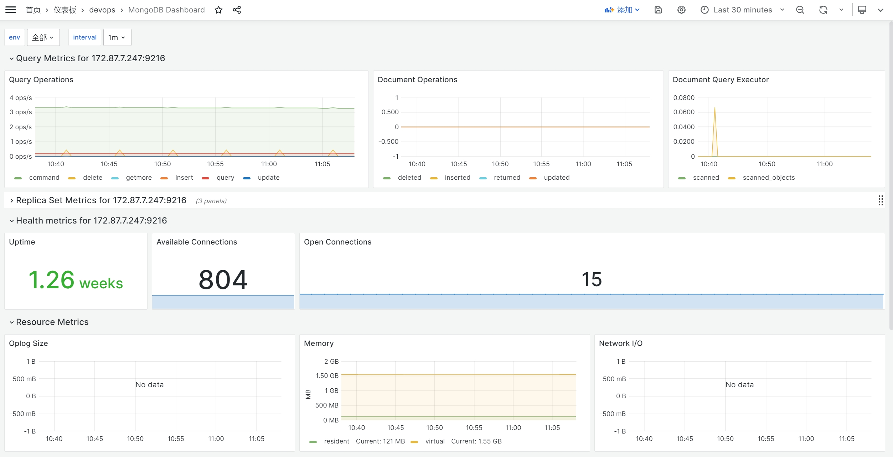

<!-- more -->

## MongoDB监控

我们通过mongodb-exporter监控mongodb状态

## mongodb-exporter部署

```shell
docker run -d -p 9216:9216 -p 17001:17001 --restart=always --name=mongodb_exporter percona/mongodb_exporter:0.40 --mongodb.uri=mongodb://172.87.7.247:27017/admin?ssl=false --collect-all --compatible-mode
```

注意：

- --collect-all，参数用于收集所有指标
- --compatible-mode，用于兼容旧的指标，否则部分grafana的dashboard展示不兼容

## mongodb-dashboard



## mongodb常用监控语句

### 监控数据库是否宕机

```promQL
mongodb_up == 0
```

