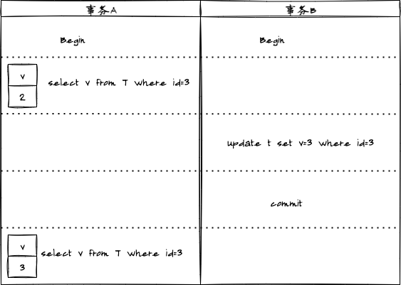
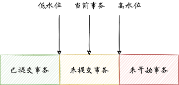

## 事务的特性

- 原子性(Atomicity): 事务中的所有操作要么全部完成，要么全部不完成（回滚），不会在事务中间遇到错误而中断。
- 一致性(Consistency): 事务开始和结束时，数据都必须保持一致状态，即符合约束、完整性、默认值以及其它定义的规则。事务执行的结果不能破坏数据库的完整性和一致性。
- 隔离性(Isolation): 各个事务互相隔离，每个事务的执行都不会影响其它事务的执行或者结果。
- 持久性(Durability): 一个事务一旦提交成功，它对数据库中的数据的改变就是永久性的，即使发生数据库故障也不应该对其产生影响。

## 事务的实现

- Undo log：实现事务的原子性；
- Redo log：实现事务的持久性；
- 锁/MVCC：实现事务的隔离性；锁机制来保证事务在执行时互相隔离，防止事务间相互干扰，即写-写问题。MVCC 机制是通过保存历史版本的方式来实现，事务可以读取数据在事务开始时的版本，而不受到事务期间其他事务所做的改变的影响，即写-读问题。
- 以上三者保证了事务的一致性；

## 并发事务带来的问题

当数据库上有多个事务同时执行的时候，就可能出现**脏读(dirty read)**、**不可重复读(non-repeatable read)**、**幻读(phantom read)**，为了解决这些问题，就有了隔离级别的概念

### 脏读问题

> 脏读是指：一个事务中访问到了另外一个事务未提交的数据


### 不可重复读问题

> 不可重复读是指：一个事务多次读取同一行数据，但是在多次读取中数据发生了改变。



### 幻读问题

> 幻读是指：一个事务多次执行同一条 SQL 语句，但结果集却不同，导致无法支撑后续的业务操作


## 事务的隔离级别

针对上面三种问题，分别有四种隔离级别：

### 未提交读(read uncommitted，RU)

> 未提交读，是指一个事务还未提交时，它做的变更就能被别的事务看到。即**没有提交却可以读**

### 提交读(read committed，RC)

> 提交读，是指一个事务提交之后，它做的变更才会被其他事务看到。即**提交才可以读**
>
:eyes: **大多数数据库系统的默认隔离级别**

### 可重复读(repeatable read，RR)

> 可重复度，是指同一个事务执行过程看到的数据，总是跟这个事务在启动时看到的数据是一致的。即同一个事务多次请求读取数据，会看到同样的数据行。
>
:eyes: **MySQL的默认隔离级别**

### 串行化(serializable，S)

> 是最高的隔离级别，它通过强制事务排序，使之不可能相互冲突。
>
> 这个级别可能导致大量的超时现象和锁竞争。

以上四种隔离级别解决问题如下：

| 隔离级别\解决问题 |        脏读        |     不可重复读     |        幻读        |                     实现原理                     |
| :---------------: | :----------------: | :----------------: | :----------------: | :----------------------------------------------: |
|     未提交读      |        :x:         |        :x:         |        :x:         |                   没有视图概念                   |
|      提交读       | :heavy_check_mark: |        :x:         |        :x:         |        每个SQL语句开始执行的时候创建视图         |
|     可重复读      | :heavy_check_mark: | :heavy_check_mark: |        :x:         | 事务启动时创建视图，且整个事务期间都在用这个视图 |
|      串行化       | :heavy_check_mark: | :heavy_check_mark: | :heavy_check_mark: |              加锁的方式避免并行访问              |

各个隔离级别都有它自己的使用场景，需要根据业务情况来定，隔离级别从上到下，性能变差。

## MVCC

MySQL InnoDB默认级别是可重复度隔离级别，为了解决不可重复读问题，InnoDB采用了MVCC(多版本并发控制)的方式。它为存储的每一行增加三个额外的隐藏字段

- DATA_TRX_ID：产生当前记录项的事务ID
- DELETE BIT：用于标识该记录是否是删除记录
- DATA_ROLL_PTR：指向当前记录项的undo信息

### MVCC下SQL语句实际处理

#### SELECT

1. InnoDB只查找版本早于当前事务版本的数据行（行的事务版本号<=当前事务的系统版本号），这样可以确保事务读取的行，要么是在事务开始前以及存在，要么是事务自身插入或者修改过的。

2. 行的删除版本要么未定义，要么大于当前事务版本号，这样可以确保事务读取到的行，在事务开始之前未被删除。

> 只有符合上述两个条件的记录，才能返回作为查询结果

#### INSERT

> InnoDB为新插入的每一行保存当前事务版本号作为行版本号

#### DELETE

> InnoDB为删除的每一行保存当前事务版本号作为行删除标识

#### UPDATE

> InnoDB为插入一行新记录，保存当前事务版本作为行版本号，同时保存当前事务版本号到原来的行作为行删除标识

MVCC多版本在事务启动时用到**一致性读视图(consisten read view)**，那什么是事务的一致性视图呢？

InnoDB每个事务都有唯一的事务ID(transaction id)，它在事务开始的时候向InnoDB的事务系统申请的，是严格按照递增的顺序申请的。

每行数据也都是有多个版本的，每次事务更新数据的时候，都会生成一个新的数据版本，并且将事务ID赋值给这个数据版本的事务ID，同时旧的数据版本要保留。如下图所示：


图中虚线框中同一行数据有4个版本，每个版本均有对应的事务ID。

InnoDB为每个事务构造了一个数组，用来保存这个事务启动瞬间，当前正在**活跃**（启动还为提交）的所有事务ID，数组里面事务ID的最小值记为**低水位**，事务ID的最大值+1记为**高水位**。这个视图数组和高水位就组成了当前事务的一致性视图。



对于数据版本的事务ID，则存在以下情况：

- 如果落在绿色部分，表示这个版本是已提交事务或者当前事务自己生成的，这个版本数据是可见的；
- 如果落在红色部分，表示这个版本是由将来启动的事务生成的，则不可见；
- 如果落在黄色部分，存在两种情况
  - 若row trx_id在数组中，表示这个版本是由**还未提交的事务**生成的，这个版本数据是不可见的；
  - 若row trx_id不在数组中，表示这个版本是由**已经提交的事务**生成的，这个版本数据是可见的；

示例：

```sql
create table `t`(
 `id` int(11) not null,
 `k` int(11) default null,
 primary key (`id`)
)engine=InnoDB;
insert into t(id,k) values(1,1),(2,2);
```

我们以**可重复读隔离级别**为例：

|                    事务A                    |                               事务B                               |             事务C              |
| :-----------------------------------------: | :---------------------------------------------------------------: | :----------------------------: |
| start transaction with consistent snapshot; |                                                                   |                                |
|                                             |            start transaction with consistent snapshot;            |                                |
|                                             |                                                                   | update t set k=k+1 where id=1; |
|                                             | update t set k=k+1 where id=1;  <br/>select k from t where id =1; |                                |
|   select k from t where id=1;<br/>commit;   |                                                                   |                                |
|                                             |                              commit;                              |                                |

这里注意：

`begin/start transaction` 命令并不是一个事务的起点，在执行到它们之后的第一个操作 InnoDB 表的语句，事务才真正启动。如果你想要马上启动一个事务，可以使用 `start transaction with consistent snapshot`这个命令。

这里我们假设事务A、B、C的版本号分别是100、101、102。

id=1这行数据存在以下版本：

| 事务ID | 90（历史事务ID） |  102  |  101  |
| :----: | :--------------: | :---: | :---: |
|   值   |        1         |   2   |   3   |

事务A查询的时候，事务B还没有提交，因此3不可见。事务C虽然提交了，但是事务A启动时，就创建了一致性视图，对于事务A来说，它的视图数组是[99,100]，依旧不可见。

对于事务一致性视图来说，除了自己的更新总是可见以为，还有三种情况：

1. 版本未提交，不可见；
2. 版本已提交，但是是在视图创建后提交的，不可见。
3. 版本已提交，而且是在视图前提交的，可见。

那么问题来了，事务B更新的时候，如果按照一致性视图，不应该更新k=3呀，这里就需要一条规则：**更新数据都是先读后写**，这个读要属于**当前读**，否则事务C就不生效了。

读存在两种读：**当前读**和**快照读**。

### 快照读

> 读取的是记录的可见版本，不用加锁

简单的select操作，属于快照读，例如：

```sql
select * from table where ?；
```

### 当前读

**幻读在当前读才有可能出现**，那么Innodb是如何防止幻读的呢，innodb提供了一个间隙锁的技术，行数结合间隙锁，达到最终目的。

> 读取的是记录的最新版本，并且，当前读返回的记录，都会加上锁，保证其他事务不会再并发修改这条记录。

特殊的读操作，以及插入、更新、删除操作都属于当前读，例如：

```sql
select * from table where ? lock in share mode;
select * from table where ? for update;
insert into table values(...);
update table set ? where ?;
delete from table where ?;
```

我们以**读提交隔离级别**为例：

由于`start transaction with consistent snapshot;`在读提交隔离级别下没有意义，等价于普通的`start transaction`

|                  事务A                  |                               事务B                               |             事务C              |
| :-------------------------------------: | :---------------------------------------------------------------: | :----------------------------: |
|           start transaction;            |                                                                   |                                |
|                                         |                        start transaction;                         |                                |
|                                         |                                                                   | update t set k=k+1 where id=1; |
|                                         | update t set k=k+1 where id=1;  <br/>select k from t where id =1; |                                |
| select k from t where id=1;<br/>commit; |                                                                   |                                |
|                                         |                              commit;                              |                                |

事务A在执行`select k from t where id=1;`才创建一致性视图，此时事务C已提交，因此k=2;

同样事务B，事务C已提交，因此可见，且自己修改的肯定可见，因此k=3;

## 那么MySQL可重复读解决幻读了吗？

我们试验为例：

假设存在表`dept`

```shell
mysql> desc dept;
+-------+-------------+------+-----+---------+-------+
| Field | Type        | Null | Key | Default | Extra |
+-------+-------------+------+-----+---------+-------+
| id    | int(10)     | NO   | PRI | NULL    |       |
| value | varchar(32) | YES  |     |         |       |
+-------+-------------+------+-----+---------+-------+
2 rows in set (0.00 sec)
```

开启两个事务进行试验

|                            事务A                             |              事务B              |
| :----------------------------------------------------------: | :-----------------------------: |
|                      start transaction;                      |                                 |
|                                                              |       start transaction;        |
|         select * from dept;<br/>Empty set (0.01 sec)         |                                 |
|                                                              | insert into dept values(1,'a'); |
|         select * from dept;<br/>Empty set (0.01 sec)         |                                 |
|                                                              |             commit;             |
|         select * from dept;<br/>Empty set (0.01 sec)         |                                 |
| insert into dept values(1,'a');<br/>Duplicate entry '1' for key 'PRIMARY' |                                 |

事务A就很奇怪，明明查询不到数据，写入时却报主键重复错误:cry:(**幻读出现**)

继续试验：

|                            事务A                             |              事务B              |
| :----------------------------------------------------------: | :-----------------------------: |
|                      start transaction;                      |                                 |
|                                                              |       start transaction;        |
|                 select * from dept;<br/>1,a                  |                                 |
|                                                              | insert into dept values(2,'b'); |
|                 select * from dept;<br/>1,a                  |                                 |
|                                                              |             commit;             |
|                 select * from dept;<br/>1,a                  |                                 |
| update dept set value='z';<br/>Query OK, 2 rows affected (0.00 sec) |                                 |

事务A又奇怪了，明明只有一条数据，为啥影响了两条数据:sob:（**幻读出现**）

那么MySQL如何解决幻读呢

|                           事务A                            |                            事务B                             |
| :--------------------------------------------------------: | :----------------------------------------------------------: |
|                     start transaction;                     |                                                              |
|                                                            |                      start transaction;                      |
| select * from dept where id>=1 for update;<br/>1,z<br/>2,z |                                                              |
|                                                            | insert into dept values(3,'c');<br/>Lock wait timeout exceeded; try restarting transaction |
|            select * from dept;<br/>1,z<br/>2,z             |                                                              |
|                                                            |                           commit;                            |
|              insert into dept values(3,'c');               |                                                              |
|                          commit;                           |                                                              |
|        select * from dept;<br/>1,z<br/>2,z<br/>3,c         |                                                              |

可以看到通过对`id>=1`加锁，成功解决幻读问题，但是如果在间隙锁之外进行数据操作，其实还是会出现幻读。因此MySQL可重复读隔离级别通过间隙锁部分解决幻读问题，并没有完全解决，如果要解决幻读问题只能使用串行化隔离级别。
