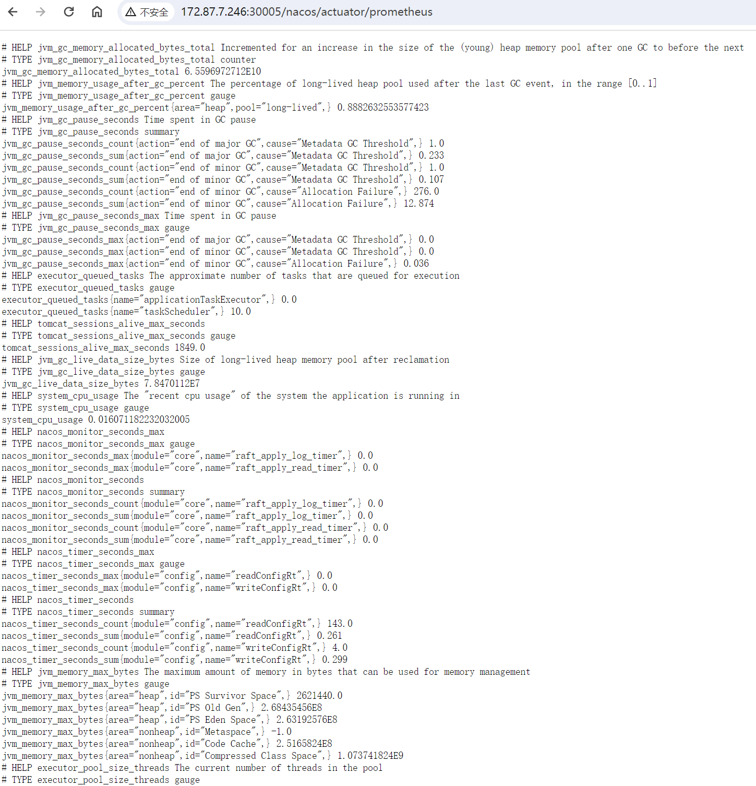
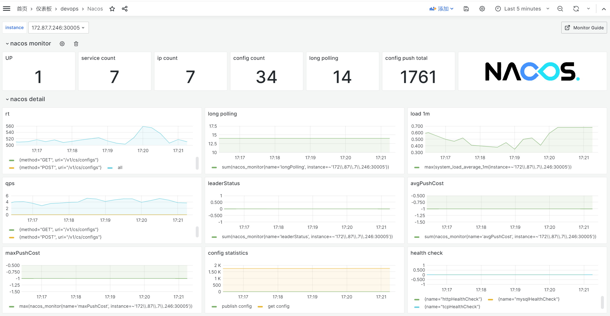

<!-- more -->

Nacos支持Prometheus metrics，接口地址：/nacos/actuator/prometheus。 但是需要配置去开启该接口

## 修改配置

将Nacos配置文文件：application.properties中下行注释取消

```
management.endpoints.web.exposure.include=*
```

## 重启Nacos

```shell
sh bin/shutdown.sh
sh bin/startup.sh -m standalone
```

## 验证指标



## 配置面板



