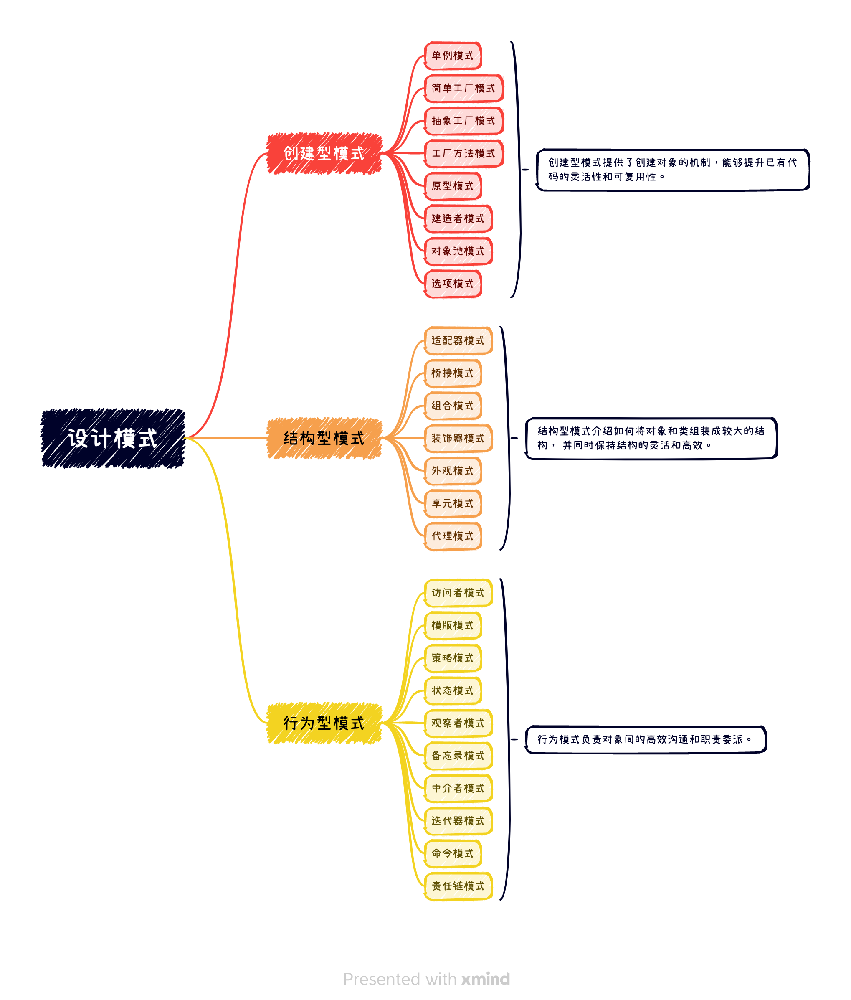

:::tip
面向对象是**武器**

设计模式是**招式**

设计原则是**心法**

以心法为基础，以武器运用招式应对复杂的编程问题
:::

<!-- more -->

## 什么是设计模式

设计模式最早来源于建筑领域
> 克里斯托弗.亚历山大在作品《建筑的永恒之道》中这样说："每个模式都描述了一个在我们的环境中不断出现的问题，然后描述了该问题的解决方案的核心，通过这种方式，我们可以无数次地重用那些已有的成功的解决方案，无须再重复相同的工作。"

之后四人组（Gang of Four，简称GoF）将模式的概念应用在软件开发设计中，定义如下：
> 它是一套被反复使用、多数人知晓的、经过分类编目的、代码设计经验的总结。
>
> 它描述了在软件设计过程中的一些不断重复发生的问题，以及该问题的解决方案。

简单来说，就是**解决特定问题的一系列解决方案**，是前辈们的代码设计经验的总结。

## 有哪些优点

- **提高代码复用性**：设计模式的核心目标之一是提供可复用的解决方案。通过使用设计模式，可以将通用的解决方法应用于不同的情况，从而减少代码的冗余和重复编写。
- **提高代码的可读性和可维护性**：设计模式通过引入一定的结构和规范，使代码更有组织性和可读性。开发人员可以更轻松地理解和维护代码逻辑。
- **降低代码耦合度**：设计模式通过将系统分解为多个独立的部分，每个部分都有明确定义的职责和接口，从而降低了代码的耦合度。这使得系统更易于扩展、修改和维护。
- **提高系统的可扩展性和灵活性**：设计模式鼓励使用接口和抽象类进行编程，而不是具体的实现类。这种松耦合的设计使得系统更易于扩展，可以方便地引入新的功能和模块。
- **提高系统的可测试性**：设计模式将系统分解为多个独立的部分，每个部分都可以独立测试。这样可以更容易地编写和执行单元测试，提高代码的质量和可靠性。

## 有哪些要素

- **问题**：问题或称为上下文、场景，指在软件开发中需要解决的某个问题或需求。设计模式通常解决针对特定上下文或场景中出现的问题。
- **解决方案**：解决方案或称为模型、模式，是指用于解决上述问题的通用方法或最佳实践。设计模式描述了解决某问题的方法或模板，并提供了这些方法的实现细节，使得类似问题可以被解决且易于复用。
- **效果**：效果或称为结果、贡献，是指使用该模式带来的好处和优点。设计模式提供了可重用、灵活的解决方案，增加可维护性、可扩展性和可重用性。
- **元素**：元素或称为参与者、角色、类和对象，组成了设计模式的各个部分。这些元素可以是类、对象、接口、方法等等。元素描述了在特定上下文或场景中参与模式实现的各种组件。

## 具体分类

<Catalog />