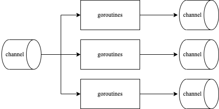
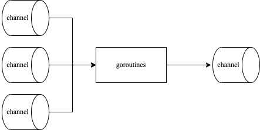

<!-- more -->

## 扇出模式

即多个相同goroutine从同一个channel读取数据并处理



```go
func TestFanOut(t *testing.T) {
	var nums = []int{1, 2, 3, 4, 5, 6, 7, 8, 9, 10}
	in := echo(nums)
	c1 := odd(in)
	c2 := odd(in)
	c3 := odd(in)
	t.Log("c1")
	for n := range c1 {
		t.Log(n)
	}
	t.Log("c2")
	for n := range c2 {
		t.Log(n)
	}
	t.Log("c3")
	for n := range c3 {
		t.Log(n)
	}
}
```

输出结果

```text
=== RUN   TestFanOut
    fan-in-fan-out_test.go:24: c1
    fan-in-fan-out_test.go:26: 1
    fan-in-fan-out_test.go:26: 7
    fan-in-fan-out_test.go:26: 9
    fan-in-fan-out_test.go:28: c2
    fan-in-fan-out_test.go:30: 3
    fan-in-fan-out_test.go:32: c3
    fan-in-fan-out_test.go:34: 5
--- PASS: TestFanOut (0.00s)
```

我们使用三个协程从一个channel中过滤2的倍数，分别放在三个channel输出。由于Go语言调度不确定性，因此测试结果可能不一致。

## 扇入模式

从多个channel读取数据并处理，将结果放入一个channel



```go
func merge(cs ...<-chan int) <-chan int {
	var wg sync.WaitGroup
	out := make(chan int)
	output := func(c <-chan int) {
		for n := range c {
			out <- n
		}
		wg.Done()
	}
	wg.Add(len(cs))
	for _, c := range cs {
		go output(c)
	}
	go func() {
		wg.Wait()
		close(out)
	}()
	return out
}
```

扇入使用示例：

```go
func TestFanIn(t *testing.T) {
	var nums = []int{1, 2, 3, 4, 5, 6, 7, 8, 9, 10}
	in := echo(nums)
	c1 := square(in)
	c2 := square(in)

	for n := range merge(c1, c2) {
		t.Log(n)
	}
}
```

输出结果为：

```text
=== RUN   TestFanIn
    fan-in-fan-out_test.go:14: 1
    fan-in-fan-out_test.go:14: 4
    fan-in-fan-out_test.go:14: 16
    fan-in-fan-out_test.go:14: 9
    fan-in-fan-out_test.go:14: 25
    fan-in-fan-out_test.go:14: 49
    fan-in-fan-out_test.go:14: 36
    fan-in-fan-out_test.go:14: 64
    fan-in-fan-out_test.go:14: 100
    fan-in-fan-out_test.go:14: 81
--- PASS: TestFanIn (0.00s)
```

其中：

- c1、c2是两个相同的goroutine从同一个channel取数据进行平方计算，这就是扇出；
- merge从c1、c2两个channel里取数据合并到一个channel里，这就是扇入；
  