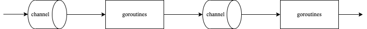

管道是Unix/Linux上一种典型的并发程序设计模式，也是Unix崇尚**组合**设计哲学的具体体现，例如执行：

```bash
ls -l | grep "\.go"
```

就可以利用管道机制过滤出当前路径下以".go"结尾的文件列表。

`ls -l`的输出作为`grep "\.go"`的输入很容易将两个功能模块串在一起。

## 管道模式



Go通常使用channel原语构建管道模式

```go
package concurrency

func echo(nums []int) <-chan int {
	out := make(chan int, len(nums))
	go func() {
		for _, n := range nums {
			out <- n
		}
		close(out)
	}()
	return out
}

func square(in <-chan int) <-chan int {
	out := make(chan int)
	go func() {
		for n := range in {
			out <- n * n
		}
		close(out)
	}()
	return out
}

func odd(in <-chan int) <-chan int {
	out := make(chan int)
	go func() {
		for n := range in {
			if n%2 != 0 {
				out <- n
			}
		}
		close(out)
	}()
	return out
}
```

管道模式使用示例

```go
package concurrency

import "testing"

func TestPipeline(t *testing.T) {
	var nums = []int{1, 2, 3, 4, 5, 6, 7, 8, 9, 10}
	for n := range square(odd(echo(nums))) {
		t.Log(n)
	}
}
```

输出结果

```text
=== RUN   TestPipeline
    pipeline_test.go:8: 1
    pipeline_test.go:8: 9
    pipeline_test.go:8: 25
    pipeline_test.go:8: 49
    pipeline_test.go:8: 81
--- PASS: TestPipeline (0.00s)
```

`echo`将数组切片转换为channel，其结果作为`odd`的入参，`odd`过滤2的倍数，剩余的数作为`square`的入参，`square`将数字求得平方。
从上面我们可以看出管道模式有良好的**可扩展性**，我们很容易扩展其他功能函数。

## 参考资料

[Go Concurrency Patterns: Pipelines and cancellation](https://go.dev/blog/pipelines)
[GO编程模式：PIPELINE](https://coolshell.cn/articles/21228.html)
