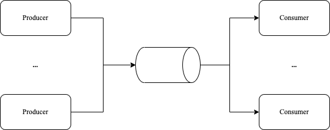

**生产者/消费者**模式是并发编程中常见的模型，该模型主要通过平衡生产者和消费者来提高程序的整体处理数据的能力

## 生产者/消费者模式

该模型中：生产者生产数据，放到队列中，消费者从队列中取数据。这样生产者和消费者变成异步的两个过程。



定义生产者

```go
// Producer: 生产factor倍数
func Producer(factor int, out chan<- int) {
	for i := 0; ; i++ {
		out <- i * factor
	}
}
```

定义消费者

```go
// Consumer: 消费打印队列
func Consumer(in <-chan int) {
	for v := range in {
		fmt.Println(v)
	}
}
```

启动生产者和消费者模型

```go
	ch := make(chan int, 10)
	go Producer(3, ch)
	go Producer(5, ch)
	go Consumer(ch)
	time.Sleep(1 * time.Second)
```

在这个例子中，我们启动：

- 两个生产者，分别生产3的倍数、5的倍数
- 一个消费者，打印队列中的数据
