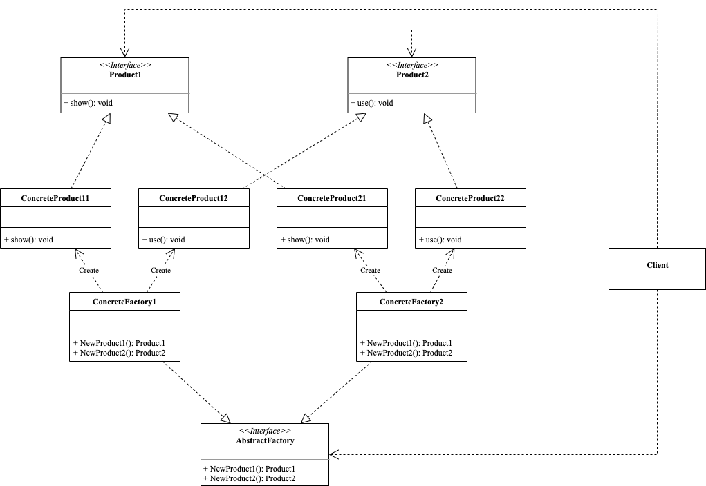

<!-- more -->

## 问题

工厂方法模式只考虑生产同等级的产品，而抽象工厂模式(Abstract Factory Pattern)可生产多个等级的产品。抽象工厂模式用于生成**产品族**的工厂，所生成的对象是有关联的，同一个具体工厂所生产的位于不同等级的一组产品称为一个产品族，例如：

- 桌子、椅子、沙发是一个产品族
- 欧洲牌、亚洲牌是一个产品等级

## 解决方案

### 角色



- Abstract Factory: 抽象工厂
  
  它声明了一组用于创建一族产品的方法，每一个方法对应一种产品。

- Concrete Factory: 具体工厂
  
  它实现了在抽象工厂中声明的创建产品的方法，生成一组具体产品，这些产品构成了一个产品族，每一个产品都位于某个产品等级结构中。

- Abstract Product: 抽象产品

  它为每种产品声明接口，在抽象产品中声明了产品所具有的业务方法。

- Product: 具体产品

  它定义具体工厂生产的具体产品对象，实现抽象产品接口中声明的业务方法。

### 代码示例

```go
package abstract_factory

import "fmt"

// 抽象产品1
type Product1 interface {
	Show()
}

// 抽象产品2
type Product2 interface {
	Use()
}

// 抽象工厂
type AbstractFactory interface {
	NewProduct1() Product1
	NewProduct2() Product2
}

// 具体产品11
type ConcreteProduct11 struct{}

func (*ConcreteProduct11) Show() {
	fmt.Println("Product11 show")
}

// 具体产品12
type ConcreteProduct12 struct{}

func (*ConcreteProduct12) Use() {
	fmt.Println("Product12 use")
}

// 具体工厂1
type ConcreteFactory1 struct{}

func (ConcreteFactory1) NewProduct1() Product1 {
	return &ConcreteProduct11{}
}

func (ConcreteFactory1) NewProduct2() Product2 {
	return &ConcreteProduct12{}
}

// 具体产品21
type ConcreteProduct21 struct{}

func (*ConcreteProduct21) Show() {
	fmt.Println("Product21 show")
}

type ConcreteProduct22 struct{}

func (*ConcreteProduct22) Use() {
	fmt.Println("Product22 use")
}

// 具体工厂2
type ConcreteFactory2 struct{}

func (ConcreteFactory2) NewProduct1() Product1 {
	return &ConcreteProduct21{}
}

func (ConcreteFactory2) NewProduct2() Product2 {
	return &ConcreteProduct22{}
}
```

使用示例如下：

```go
package abstract_factory

func ExampleConcreteFactory1_NewProduct() {
	var factory AbstractFactory
	factory = ConcreteFactory1{}
	product1 := factory.NewProduct1()
	Product2 := factory.NewProduct2()
	product1.Show()
	Product2.Use()
	// Output:
	// Product11 show
	// Product12 use
}

func ExampleConcreteFactory2_NewProduct() {
	var factory AbstractFactory
	factory = ConcreteFactory2{}
	product1 := factory.NewProduct1()
	product2 := factory.NewProduct2()
	product1.Show()
	product2.Use()
	// Output:
	// Product21 show
	// Product22 use
}
```

## 效果

### 应用场景

在以下情况下可以使用抽象工厂模式：

- 一个系统不应当依赖于产品类实例如何被创建、组合和表达的细节，这对于所有类型的工厂模式都是重要的。
- 系统中有多于一个的产品族，而每次只使用其中某一产品族。
- 属于同一个产品族的产品将在一起使用，这一约束必须在系统的设计中体现出来。
- 系统提供一个产品类的库，所有的产品以同样的接口出现，从而使客户端不依赖于具体实现。

### 优缺点

#### 优点

- 抽象工厂模式隔离了具体类的生产，使得客户并不需要知道什么被创建。
- 抽象工厂模式可以在类的内部对产品族进行约束，保证客户端始终只使用同一个产品族中的对象。
- 抽象工厂模式可以方便地切换产品系列，只需要更换具体工厂即可。

#### 缺点

- 产品族扩展非常困难，要增加一个系列的某一产品，既要在抽象的工厂里加代码，又要在具体的工厂里加代码。**产品族难扩展，产品等级易扩展**
- 抽象工厂模式增加了系统的抽象性和理解难度。

## 总结

抽象工厂模式通过引入抽象工厂接口和抽象产品接口，提供了一种统一的接口用于创建一组相关的产品对象。它可以将产品的创建过程封装起来，使得客户端代码可以与具体产品的实现细节解耦。抽象工厂模式的灵活性和可扩展性允许在运行时动态切换不同的具体工厂和产品族。
