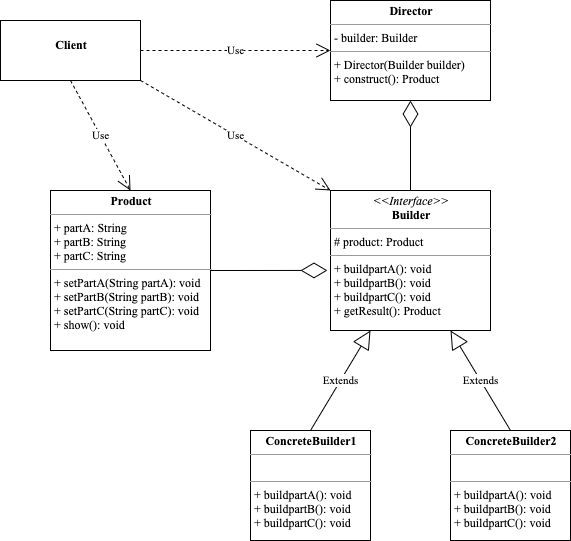

<!-- more -->

建造者模式(Builder Pattern)又叫生成器模式，它将一个复杂对象的构建与它的表示分离。使统一的构建过程可以创建不同的表示。

它将一个复杂的对象分解为多个简单的对象，然后一步一步构建而成，它将变与不变相分离，即产品的组成部分是不变的，但每一部分是可以灵活选择的。

## 问题

当对象非常复杂，且存在以下场景：

- 对象的构建过程非常复杂，且有多个步骤时
- 对象构造时需要传入很多参数时
- 对象的组成部分有多种选择，构建需要考虑各个部分的组合时

## 解决方案

### 角色



- Product：产品角色

  包含多个组成部分的复杂对象，由具体建造者来创建各个零部件。

- Builder：抽象建造者

  为创建产品各个子部件指定抽象接口，一般是buildXXX()方法，通常还包含一个返回复杂产品的方法getResult()。

- Concrete Builder：具体建造者

  实现Builder接口，完成复杂产品的各个部件的具体创建方法。

- Director：指挥者

  调用建造者对象中的部件构建与装配方法完成复杂对象的创建，在指挥者中不涉及具体产品的信息。

### 代码示例

```go
package builder

import "fmt"

type Product struct {
	partA string
	partB string
	partC string
}

func (p *Product) setPartA(partA string) {
	p.partA = partA
}

func (p *Product) setPartB(partB string) {
	p.partB = partB
}

func (p *Product) setPartC(partC string) {
	p.partC = partC
}

func (p Product) show() {
	fmt.Printf("A:%s\tB:%s\tC:%s", p.partA, p.partB, p.partC)
}

type Builder interface {
	buildPartA()
	buildPartB()
	buildPartC()
	getResult() Product
}

type Director struct {
	builder Builder
}

func (d *Director) Director(builder Builder) {
	d.builder = builder
}

func (d Director) construct() Product {
	d.builder.buildPartA()
	d.builder.buildPartB()
	d.builder.buildPartC()
	return d.builder.getResult()
}

type ConcreteBuilder1 struct {
	product *Product
}

func (c ConcreteBuilder1) buildPartA() {
	c.product.setPartA("A1")
}

func (c ConcreteBuilder1) buildPartB() {
	c.product.setPartB("B1")
}

func (c ConcreteBuilder1) buildPartC() {
	c.product.setPartC("C1")
}

func (c ConcreteBuilder1) getResult() Product {
	return *c.product
}

type ConcreteBuilder2 struct {
	product *Product
}

func (c ConcreteBuilder2) buildPartA() {
	c.product.setPartA("A2")
}

func (c ConcreteBuilder2) buildPartB() {
	c.product.setPartB("B2")
}

func (c ConcreteBuilder2) buildPartC() {
	c.product.setPartC("C2")
}

func (c ConcreteBuilder2) getResult() Product {
	return *c.product
}
```

使用示例如下：

```go
package builder

func ExampleDirector() {
	builder := ConcreteBuilder1{product: &Product{}}
	var director Director
	director.Director(builder)
	product := director.construct()
	product.show()
	// Output: A:A1	B:B1	C:C1
}

func ExampleDirector_second() {
	builder := ConcreteBuilder2{product: &Product{}}
	var director Director
	director.Director(builder)
	product := director.construct()
	product.show()
	// Output: A:A2	B:B2	C:C2
}
```

## 效果

### 应用场景

- 当要创建的对象是由多个部件组成，而且部件的组合方式可能有不同的变化时，可以使用建造者模式来封装复杂的创建逻辑，提高代码的复用性和可维护性。
- 当要创建的对象的构建过程需要分步进行，而且每一步都可能有不同的实现方式时，可以使用建造者模式来将构建过程和表示分离，提高代码的灵活性和扩展性。
- 当要创建的对象的表示和构建过程都需要根据不同的需求进行定制时，可以使用建造者模式来将客户端和具体建造者解耦，提高代码的可定制性和可配置性。

例如：

房屋装修是一个复杂的过程，包含：地板的选择、墙体的装修颜色、天花板的设计、家具的布局等等。客户把装修要求告诉装修项目经理，项目经理指挥工人一步步装修，最后完成整个房屋的装修与布局。

汽车的建造通常包含：轮胎的选择、发动机的选择、车身设计、车内装潢等等，方案虽然不同，但步骤通常是一致的。

### 优缺点

#### 优点

- 封装性好，创建和使用分离，调用者无需关注细节部分。
- 扩展性好，各个具体的建造者相互独立，有利于系统的解耦。
- 客户端不必知道产品内部组成的细节，建造者可以对创建过程逐步细化，而不对其他模块产生任何影响，便于控制细节风险。

#### 缺点

- 产品的组成部分必须相同，这限制了其使用范围。
- 如果产品内部发生变化，则建造者也要同步修改，后期维护成本较大。

## 总结

建造者设计模式是一种创建型模式，它可以用于创建复杂的对象，将对象的构建过程和表示分离开来。它适用于以下情况：

- 当要创建的对象是由多个部件组成，而且部件的组合方式可能有不同的变化时。
- 当要创建的对象的构建过程需要分步进行，而且每一步都可能有不同的实现方式时。
- 当要创建的对象的表示和构建过程都需要根据不同的需求进行定制时。
