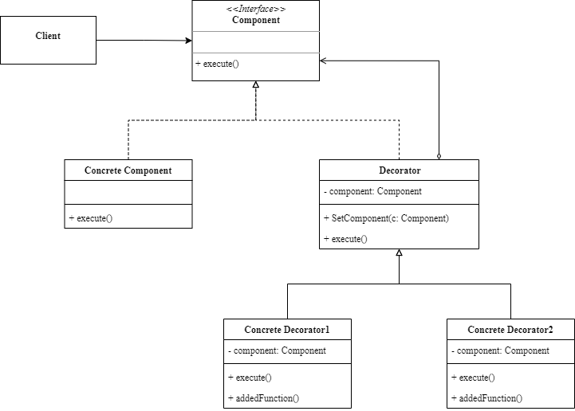

<!-- more -->

## 什么是装饰器模式

装饰器模式(Decorator Pattern)：它可以在不改变原有对象的结构和功能的情况下，动态地给对象添加新的功能或者增强原有功能。装饰器设计模式的核心思想是使用一个装饰器对象来包装原有对象，从而实现对原有对象的功能扩展或修改。

### 包含哪些角色



- Component: 组件接口
  
  所有被装饰组件及装饰器对应的接口标准

- ConcreteComponent: 具体组件
  
  需要被装饰的组件，实现组件接口标准

- Decorator: 装饰器
  
  持有一个组件（Component）对象的实例，并定义一个与组件接口一致的接口。

- ConcreteDecorator: 装饰器实现
  
  继承自装饰器抽象类的具体子类装饰器，可以有多种实现，在被装饰组件对象的基础上为其添加新的特性。

### 代码示例

```go
package decorator

import "fmt"

type Component interface {
	execute()
}

type ConcreteComponent struct{}

func (c ConcreteComponent) execute() {
	fmt.Println("concrete component execute")
}

type Decorator struct {
	component Component
}

func (d *Decorator) Decorator(c Component) {
	d.component = c
}

func (d Decorator) execute() {
	d.component.execute()
}

type ConcreteDecortor1 struct {
	Decorator
}

func (c ConcreteDecortor1) addedFunction() {
	fmt.Println("concrete decortor1 add function")
}

func (c ConcreteDecortor1) execute() {
	c.addedFunction()
	c.Decorator.execute()
}

type ConcreteDecortor2 struct {
	Decorator
}

func (c ConcreteDecortor2) addedFunction() {
	fmt.Println("concrete decortor2 add function")
}

func (c ConcreteDecortor2) execute() {
	c.addedFunction()
	c.Decorator.execute()
}
```

使用示例

```go{13-15,22-24}
func ExampleComponent() {
	c := ConcreteComponent{}
	c.execute()
	//c1装饰c
	var c1 ConcreteDecortor1
	c1.Decorator.Decorator(c)
	c1.execute()
	//c2装饰c
	var c2 ConcreteDecortor2
	c2.Decorator.Decorator(c)
	c2.execute()
	//c2装饰c1
	var c21 ConcreteDecortor2
	c21.Decorator.Decorator(c1)
	c21.execute()
	// Output:
	// concrete component execute
	// concrete decortor1 add function
	// concrete component execute
	// concrete decortor2 add function
	// concrete component execute
	// concrete decortor2 add function
	// concrete decortor1 add function
	// concrete component execute
}
```

::: tip
我们注意到c1可以装饰c、c2可以装饰c，同时c2也可以装饰c1，说明装饰器模式是可叠加的，这也是装饰器模式的一个优点。
:::

### 应用场景

- 当需要在不改变原有对象的结构和功能的情况下，给对象添加新的功能或者增强原有功能时。
- 当需要根据不同的需求，灵活地组合不同的功能扩展或修改时。
- 当需要保持原有对象的接口不变，保证了装饰后的对象和原有对象的兼容性时。

### 有哪些优缺点

#### 优点

- 可以在不修改原有对象的代码的情况下，给对象添加新的功能或者增强原有功能，符合开闭原则。
- 可以保持原有对象的接口不变，保证了装饰后的对象和原有对象的兼容性。
- 可以增加一批类的功能，而非仅仅一个类。
- 可以根据需要灵活地组合不同的装饰器对象，实现多种功能扩展或修改。

#### 缺点

- 会增加系统的复杂度，因为需要创建多个装饰器对象和管理它们之间的关系。
- 会增加系统的运行时开销，因为每次调用原有对象的方法时，都需要经过装饰器对象的转发和处理。

## 总结

### 装饰器设计模式和继承

装饰器模式和继承都是扩展类功能的机制，但两者的区别如下：

| 对比 | 装饰器模式 | 继承 |
| --- | --- | --- |
| 重用性 | 可以应用多个类 | 只能应用一个类 |
| 复杂性 | 较复杂 | 简单易理解 |
| 耦合性 | 低耦合 | 高耦合 |

因此：如果想给一批类增加功能时可以考虑使用装饰器模式，而如果仅给一个对象增加功能就使用继承。


### 装饰器设计模式和适配器设计模式

装饰器模式和适配器模式的区别在于它们的应用场景和目的不同：

- 装饰器模式可以应用于任何需要对对象进行功能扩展或修改的场景，例如日志记录、缓存、验证等。
- 适配器模式主要应用于两个不兼容的接口之间的转换，例如不同类型的电源插头、不同格式的数据源等。
