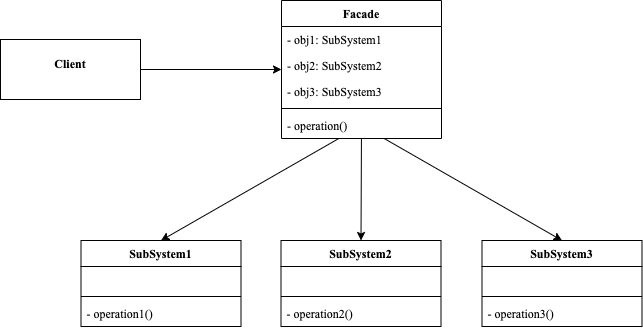

<!-- more -->

## 什么是外观模式

外观模式（Facade Pattern）：又叫作门面模式，是一种通过为多个复杂的子系统提供一个一致的接口，而使这些子系统更加容易被访问的模式。该模式对外有一个统一接口，外部应用程序不用关心内部子系统的具体细节，这样会大大降低应用程序的复杂度，提高了程序的可维护性。



外观模式经常在我们不知不觉中使用，例如：MVC架构中，Controller层对外提供简单的接口，Controller层包含多个Service层进行功能划分，每个Service层也可能包含多个Dao层进行数据操作。


### 包含哪些角色

- Facade: 外观角色
  
  定义一个简单的接口

- Subsystem：子系统角色

### 代码示例

```go
package facade

import "fmt"

type Facade struct {
	system1 Subsystem1
	system2 Subsystem2
	system3 Subsystem3
}

func (f Facade) Operation() {
	f.system1.Operation1()
	f.system2.Operation2()
	f.system3.Operation3()
}

type Subsystem1 struct{}

func (s Subsystem1) Operation1() {
	fmt.Println("subsystem1 operation")
}

type Subsystem2 struct{}

func (s Subsystem2) Operation2() {
	fmt.Println("subsystem2 operation")
}

type Subsystem3 struct{}

func (s Subsystem3) Operation3() {
	fmt.Println("subsystem3 operation")
}
```

使用示例

```go
package facade

func ExampleOperation() {
	f := Facade{
		system1: Subsystem1{},
		system2: Subsystem2{},
		system3: Subsystem3{},
	}
	f.Operation()
	// Output:
	// subsystem1 operation
	// subsystem2 operation
	// subsystem3 operation
}
```

## 总结

### 优点

- 降低了子系统与客户端之间的耦合度，使得子系统的变化不会影响调用它的客户类。
- 对客户屏蔽了子系统组件，减少了客户处理的对象数目，并使得子系统使用起来更加容易。
- 降低了大型软件系统中的编译依赖性，简化了系统在不同平台之间的移植过程，因为编译一个子系统不会影响其他的子系统，也不会影响外观对象。
- 只是提供了一个访问子系统的统一入口，并不影响用户直接使用子系统类。

### 缺点

- 不能很好地限制客户使用子系统类，如果对客户访问子系统类做太多的限制则减少了可变性和灵活性。
- 在不引入抽象外观类的情况下，增加新的子系统可能需要修改外观类或客户端的源代码，违背了**开闭原则**。
  