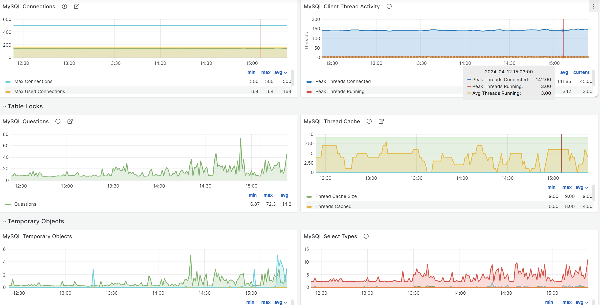

## MySQL监控

我们通过mysqld-exporter去将MySQL相关状态转换成指标，从而进行监控

## mysql-exporter部署

```sh
docker run -d --name mysql_exporter --restart always -p 9104:9104 -v ./.my.cnf:/.my.cnf prom/mysqld-exporter
```

其中**.my.cnf**配置数据库连接信息，其内容如下：
[client]
host=your host
port=your port
user=your username
password=your password

## mysql-grafana面板



## mysql常见监控语句

### 监控数据库是否宕机

```promQL
mysql_up == 0
```
### 监控数据库是否超过最大连接数80%

```promQL
max_over_time(mysql_global_status_threads_connected[1m]) / mysql_global_variables_max_connections * 100 > 80
```

::: warning
如果超过最大连接数，会报**Too many connections**错误
:::

### 数据库慢查询

```promQL
increase(mysql_global_status_slow_queries[1m]) > 0
```