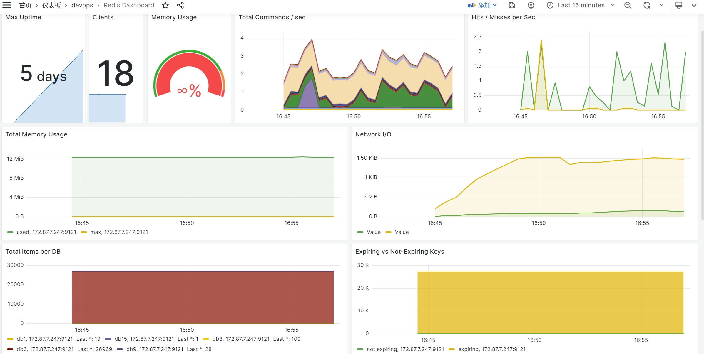

<!-- more -->

## Redis监控

我们通过redis-exporter监控redis状态

## redis-exporter部署

```shell
docker run -d --name redis_exporter --restart always -p 9121:9121 oliver006/redis_exporter --redis.addr redis://172.87.7.247:6379
```

## redis-dashboard



## redis常见监控语句

### 监控Redis是否宕机

```promQL
redis_up == 0
```

### Redis连接数过多

```promQL
redis_connected_clients / redis_config_maxclients * 100 > 90
```