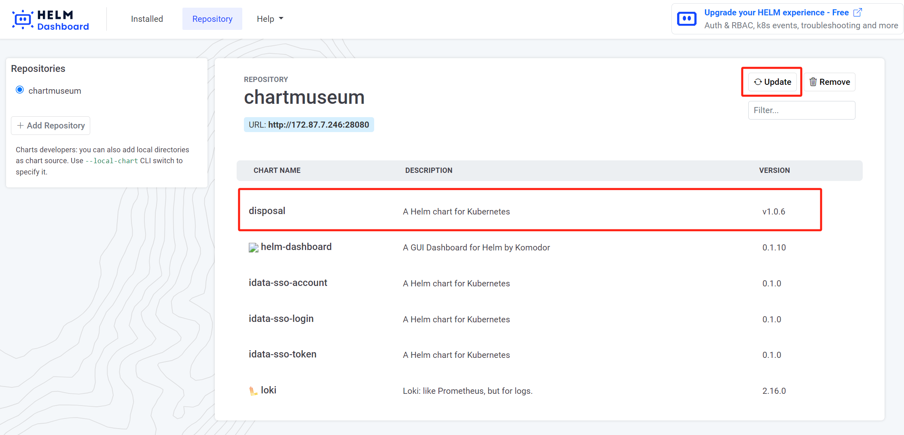

chartmuseum是Helm的chart仓库，它支持多种存储后端，如本地文件系统、Amazon S3、Google Cloud Storage、Openstack Swift、Azure Blob Storage、Minio等。

<!-- more -->

## chartmuseum 部署

这里采用docker部署

```bash
docker run --rm -it \
  -p 8080:8080 \
  -e DEBUG=1 \
  -e STORAGE=local \
  -e STORAGE_LOCAL_ROOTDIR=/charts \
  -v $(pwd)/charts:/charts \
  ghcr.io/helm/chartmuseum:v0.16.1
```

## helm 配置

### 安装依赖

配合该仓库需要在我们安装的helm基础上，安装相关插件 helm-push (https://github.com/chartmuseum/helm-push)

```bash
helm plugin install https://github.com/chartmuseum/helm-push
```

### 配置环境

将私有仓库加入本地

```bash
helm repo add hhm http://127.0.0.1:8080
helm repo update
```

## 推送 chart

```bash
helm cm-push disposal-v1.0.6.tgz hhm
```

## 验证版本

我们通过helm-dashboard查看chart包是否已更新


