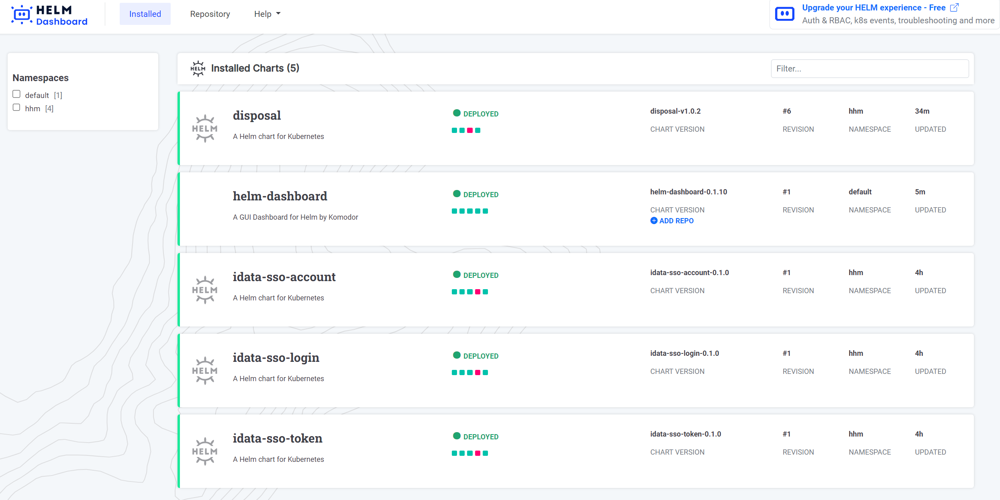
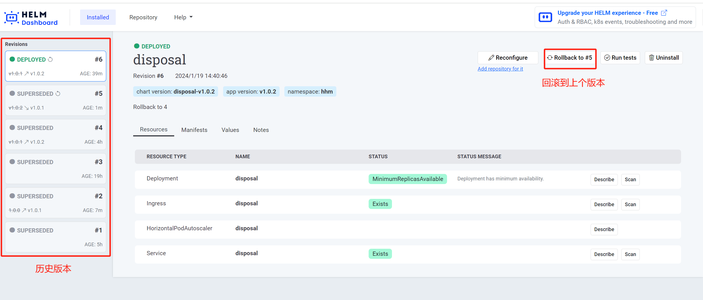
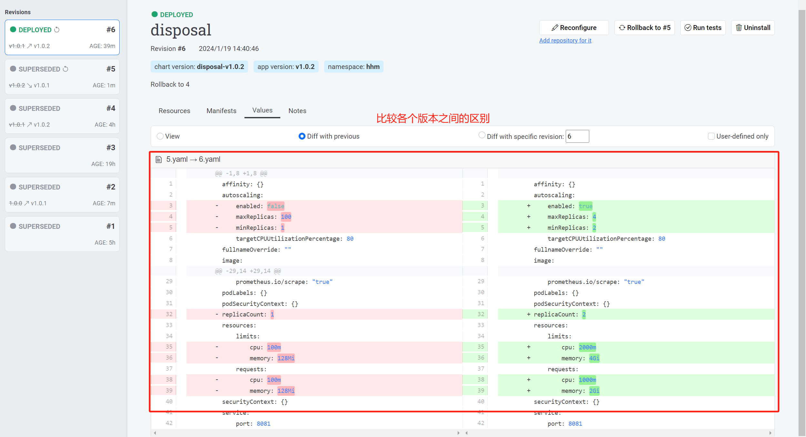

helm-dashboard是helm的可视化界面，可以查看集群内通过helm部署的chart包。好处：不需要登录机器就可以升级、回滚chart包。

<!-- more -->

## Helm Dashboard简介

### 常用特性
 
- 查看、升级、回滚chart包及其内容
- 查看各个版本之间的区别

### 查看已安装的chart包

### 单个chart包的升级、回滚和修改配置

### 比较各个版本之前的区别

### Helm Dadshboard 魔改

helm-dashboard依赖的前端静态资源如：

- https://cdnjs.cloudflare.com/ajax/libs/highlight.js/10.7.1/styles/github.min.css
- https://cdnjs.cloudflare.com/ajax/libs/highlight.js/9.13.1/styles/lightfair.min.css
- https://cdn.jsdelivr.net/npm/diff2html/bundles/css/diff2html.min.css

由于国内网络原因，偶尔访问不到，导致页面加载不出来，影响使用。因此需要将这些cdn资源改为本地引用。[代码修改详见](https://github.com/Hexiaopi/helm-dashboard/commit/4eb18e1655606cd80ce1eb8001f03eaca6a55dc7)