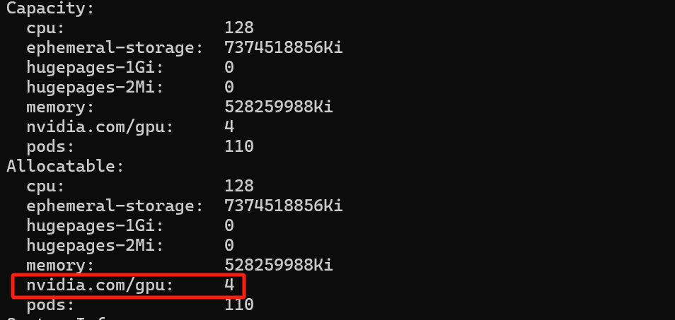

<!-- more -->

# gpu机器搭建k8s

## 查看GPU

```
(base) root@ubuntu:~# lspci | grep -i nvidia
01:00.0 VGA compatible controller: NVIDIA Corporation Device 2230 (rev a1)
01:00.1 Audio device: NVIDIA Corporation Device 1aef (rev a1)
22:00.0 VGA compatible controller: NVIDIA Corporation Device 2230 (rev a1)
22:00.1 Audio device: NVIDIA Corporation Device 1aef (rev a1)
41:00.0 VGA compatible controller: NVIDIA Corporation Device 2230 (rev a1)
41:00.1 Audio device: NVIDIA Corporation Device 1aef (rev a1)
61:00.0 VGA compatible controller: NVIDIA Corporation Device 2230 (rev a1)
61:00.1 Audio device: NVIDIA Corporation Device 1aef (rev a1)
```

可以看到有四张nvidia显卡和nvidia声卡

## 查看是否已安装gpu nvidia驱动

```
(base) root@ubuntu:~# lsmod | grep  -i nvidia
nvidia_uvm           1216512  16

             61440  0
nvidia_modeset       1241088  1 nvidia_drm
nvidia              56471552  1128 nvidia_uvm,nvidia_modeset
drm_kms_helper        184320  4 ast,nvidia_drm
drm                   495616  7 drm_kms_helper,drm_vram_helper,ast,nvidia,nvidia_drm,ttm
```

此时已安装nvidia驱动

如果未安装：参考[链接](https://docs.nvidia.com/cuda/cuda-installation-guide-linux/)进行安装

## 查看gpu型号、gpu驱动版本

```
(base) root@ubuntu:~# nvidia-smi
Wed May 29 03:28:30 2024
+-----------------------------------------------------------------------------+
| NVIDIA-SMI 525.116.04   Driver Version: 525.116.04   CUDA Version: 12.0     |
|-------------------------------+----------------------+----------------------+
| GPU  Name        Persistence-M| Bus-Id        Disp.A | Volatile Uncorr. ECC |
| Fan  Temp  Perf  Pwr:Usage/Cap|         Memory-Usage | GPU-Util  Compute M. |
|                               |                      |               MIG M. |
|===============================+======================+======================|
|   0  NVIDIA RTX A6000    Off  | 00000000:01:00.0 Off |                  Off |
| 30%   29C    P8    12W / 300W |   8142MiB / 49140MiB |      0%      Default |
|                               |                      |                  N/A |
+-------------------------------+----------------------+----------------------+
|   1  NVIDIA RTX A6000    Off  | 00000000:22:00.0 Off |                  Off |
| 30%   27C    P8     9W / 300W |  27682MiB / 49140MiB |      0%      Default |
|                               |                      |                  N/A |
+-------------------------------+----------------------+----------------------+
|   2  NVIDIA RTX A6000    Off  | 00000000:41:00.0 Off |                  Off |
| 30%   28C    P8    12W / 300W |  28252MiB / 49140MiB |      0%      Default |
|                               |                      |                  N/A |
+-------------------------------+----------------------+----------------------+
|   3  NVIDIA RTX A6000    Off  | 00000000:61:00.0 Off |                  Off |
| 30%   26C    P8    12W / 300W |      2MiB / 49140MiB |      0%      Default |
|                               |                      |                  N/A |
+-------------------------------+----------------------+----------------------+

+-----------------------------------------------------------------------------+
| Processes:                                                                  |
|  GPU   GI   CI        PID   Type   Process name                  GPU Memory |
|        ID   ID                                                   Usage      |
|=============================================================================|
|    0   N/A  N/A   1228160      C   python                            772MiB |
|    0   N/A  N/A   1228264      C   /usr/bin/python                  3576MiB |
|    0   N/A  N/A   4009358      C   python                           1896MiB |
|    0   N/A  N/A   4009359      C   python                           1896MiB |
|    1   N/A  N/A   1084495      C   python                          27680MiB |
|    2   N/A  N/A   3972345      C   python                          28250MiB |
+-----------------------------------------------------------------------------+
```

可以看到四张显卡，对应编号是：0、1、2、3，其中：0、1、2三张卡已经有python进程正在使用。

## 查看docker运行时

```
(base) root@ubuntu:~# docker info | grep -i 'Default Runtime'
WARNING: No swap limit support
 Default Runtime: nvidia
```

docker默认的运行时是：`runc`，为了使用gpu资源，需要使用：`nvidia`作为docker运行时。

如果未安装docker，参考：[链接](https://docs.nvidia.com/datacenter/cloud-native/container-toolkit/latest/install-guide.html)进行安装

## 使用minikube安装k8s

### 下载minikube

```
curl -LO https://storage.googleapis.com/minikube/releases/latest/minikube-linux-amd64
sudo install minikube-linux-amd64 /usr/local/bin/minikube
```

### 启动minikube

```
minikube start --image-mirror-country='cn' --image-repository='registry.cn-hangzhou.aliyuncs.com/google_containers' --force --driver docker --container-runtime docker --gpus all
```

其中：

- --force，原因是使用root用户，报错信息：The "docker" driver should not be used with root privileges. If you wish to continue as root, use --force.
- --driver docker，采用docker作为容器运行时
- --image-repository=registry.cn-hangzhou.aliyuncs.com/google_containers，由于国内环境无法访问国外镜像，采用阿里云的镜像仓库
- --gpus，all指定所有显卡

### 查看当前k8s集群

```
(base) root@ubuntu:/home/k8s# kubectl get pods -A
NAMESPACE     NAME                               READY   STATUS    RESTARTS     AGE
kube-system   coredns-7c445c467-d6zsw            1/1     Running   0            24s
kube-system   etcd-minikube                      1/1     Running   0            40s
kube-system   kube-apiserver-minikube            1/1     Running   0            37s
kube-system   kube-controller-manager-minikube   1/1     Running   0            39s
kube-system   kube-proxy-lblvn                   1/1     Running   0            25s
kube-system   kube-scheduler-minikube            1/1     Running   0            37s
kube-system   storage-provisioner                1/1     Running   1 (8s ago)   35s
```

### 开启nvidia插件

```
minikube addons enable nvidia-device-plugin
```

或者

手动安装插件
```
kubectl apply -f https://raw.githubusercontent.com/NVIDIA/k8s-device-plugin/v0.15.0/deployments/static/nvidia-device-plugin.yml
```

### 设置别名

```shell
alias kubectl="minikube kubectl --"
```

### 验证是否能否设别GPU资源

```
kubectl describe nodes
```



### 部署应用使用gpu

```
apiVersion: v1
kind: Pod
metadata:
  name: gpu
spec:
  containers:
  - name: gpu-container
    image: nvidia/cuda:12.2.2-devel-ubuntu22.04
    command:
      - "/bin/sh"
      - "-c"
    args:
      - nvidia-smi && tail -f /dev/null
    resources:
      requests:
        nvidia.com/gpu: 1
      limits:
        nvidia.com/gpu: 1
```

```
kubectl apply -f gpu-deploy.yaml
```

查看日志

```
kubectl logs gpu
```

```
(base) root@ubuntu:~# kubectl logs gpu
Fri May 31 07:19:23 2024
+-----------------------------------------------------------------------------+
| NVIDIA-SMI 525.116.04   Driver Version: 525.116.04   CUDA Version: 12.2     |
|-------------------------------+----------------------+----------------------+
| GPU  Name        Persistence-M| Bus-Id        Disp.A | Volatile Uncorr. ECC |
| Fan  Temp  Perf  Pwr:Usage/Cap|         Memory-Usage | GPU-Util  Compute M. |
|                               |                      |               MIG M. |
|===============================+======================+======================|
|   0  NVIDIA RTX A6000    Off  | 00000000:01:00.0 Off |                  Off |
| 30%   29C    P8    12W / 300W |   3794MiB / 49140MiB |      0%      Default |
|                               |                      |                  N/A |
+-------------------------------+----------------------+----------------------+

+-----------------------------------------------------------------------------+
| Processes:                                                                  |
|  GPU   GI   CI        PID   Type   Process name                  GPU Memory |
|        ID   ID                                                   Usage      |
|=============================================================================|
+-----------------------------------------------------------------------------+
```

## 其他问题

如果无法使用本地镜像，使用以下
```
eval $(minikube docker-env)
```

## 参考文献

- [nvidia-device-plugin](https://github.com/NVIDIA/k8s-device-plugin)
- [Minikube GPU Tutorial](https://anencore94.github.io/2020/08/19/minikube-gpu.html)