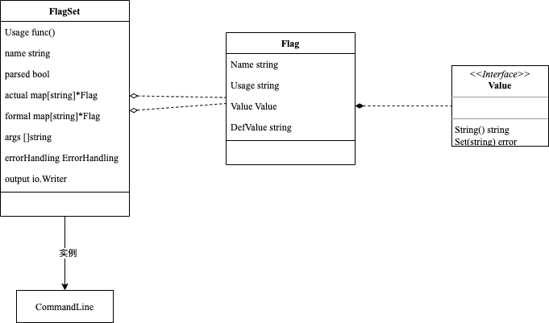

> flag库实现命令行参数解析

## 简单用法

::: tip flag参数使用语法
-flag    // 破折号，使用默认值
--flag   // 双破折号
-flag=x  // 指定参数值
-flag x  // non-boolean flags only
:::

### 字符串类型

```go
// Example1：flag.String 返回指针类型字符串
var flagStrA = flag.String("str-a", "str-a", "flag test *string")
```

使用示例

```go
func ExampleFlagStringPointPrint() {
	flag.CommandLine.Parse([]string{"-str-a", "stra"})
	fmt.Println(*flagStrA)
	// Output:
	// stra
}
```

不过由于flag.String()返回的是指针类型的字符串，因此，也可以使用下面方式定义

```go
// Example2：如果期望定义字符串类型，可以通过init函数初始化
var flagStrB string

func init() {
	// flag.StringVar可以绑定已有的变量
	flag.StringVar(&flagStrB, "str-b", "str-b", "flag test string")
}
```

使用示例

```go
func ExampleFlagStringPrint() {
	flag.CommandLine.Parse([]string{"-str-b", "strb"})
	fmt.Println(flagStrB)
	// Output:
	// strb
}
```

### int类型

```go
// Example3：int类型变量
var flagInt = flag.Int("int", 1, "flag test *int")
```

使用示例

```go
func ExampleFlagIntPointPrint() {
	flag.CommandLine.Parse([]string{"-int", "10"})
	fmt.Println(*flagInt)
	// Output:
	// 10
}
```

### Bool类型

```go
// Example3：int类型变量
var flagInt = flag.Int("int", 1, "flag test *int")
```

::: tip bool类型可以使用以下字面量
1, 0, t, f, T, F, true, false, TRUE, FALSE, True, False
:::

使用示例

```go
func ExampleBoolPointPrint() {
	flag.CommandLine.Parse([]string{"-bool=True"})
	fmt.Println(*flagBool)
	// Output:
	// true
}
```

注意事项

#### bool类型不可使用：-flag x形式

::: warning

```go
func ExampleBoolPointNoticPrint() {
	flag.CommandLine.Parse([]string{"-bool", "false"})
	fmt.Println(*flagBool)
	// Output:
	// true
}
```

虽然显示的传入`false`，但是最终结果是`true`
:::

#### bool类型：-flag形式，认为true

::: warning

```go
func ExampleBoolPointEmptyPrint() {
	flag.CommandLine.Parse([]string{"-bool"})
	fmt.Println(*flagBool)
	// Output:
	// true
}
```

:::

### duration类型

```go
// Example5：duration类型变量
var flagDuration = flag.Duration("duration", time.Minute*1, "flag test *duration")
```

使用示例

```go
func ExampleFlagDurationPointPrint() {
	flag.CommandLine.Parse([]string{"-duration", "1m1s"})
	fmt.Println(*flagDuration)
	// Output:
	// 1m1s
}
```

## 高阶用法

flag标准库提供了基础的数据类型参数，如下：

- bool
- int
- int64
- uint
- uint64
- string
- float64
- duration

### 自定义类型

如果需要自定义类型，需要实现`flag.Value`接口

```go
type Value interface {
	String() string
	Set(string) error
}
```

```go
// Example6: 自定义类型
type URLValue struct {
	URL *url.URL
}

func (v URLValue) String() string {
	if v.URL != nil {
		return v.URL.String()
	}
	return ""
}

func (v *URLValue) Set(s string) error {
	if u, err := url.Parse(s); err != nil {
		return err
	} else {
		v.URL = u
	}
	return nil
}

var u URLValue

func init() {
	flag.Var(&u, "url", "flag test self struct")
}
```

使用示例

```go
func ExampleStructPrint() {
	flag.CommandLine.Parse([]string{"-url", "https://golang.org/pkg/flag/"})
	fmt.Println(u)
	// Output:
	// https://golang.org/pkg/flag/
}
```

### 子命令

这里参考网站示例：[gobyexample](https://gobyexample.com/command-line-subcommands)

```go
package main

import (
    "flag"
    "fmt"
    "os"
)

func main() {

    fooCmd := flag.NewFlagSet("foo", flag.ExitOnError)
    fooEnable := fooCmd.Bool("enable", false, "enable")
    fooName := fooCmd.String("name", "", "name")

    barCmd := flag.NewFlagSet("bar", flag.ExitOnError)
    barLevel := barCmd.Int("level", 0, "level")

    if len(os.Args) < 2 {
        fmt.Println("expected 'foo' or 'bar' subcommands")
        os.Exit(1)
    }

    switch os.Args[1] {

    case "foo":
        fooCmd.Parse(os.Args[2:])
        fmt.Println("subcommand 'foo'")
        fmt.Println("  enable:", *fooEnable)
        fmt.Println("  name:", *fooName)
        fmt.Println("  tail:", fooCmd.Args())
    case "bar":
        barCmd.Parse(os.Args[2:])
        fmt.Println("subcommand 'bar'")
        fmt.Println("  level:", *barLevel)
        fmt.Println("  tail:", barCmd.Args())
    default:
        fmt.Println("expected 'foo' or 'bar' subcommands")
        os.Exit(1)
    }
}
```

使用示例

```shell
./command-line-subcommands foo -enable -name=joe a1 a2
```

```text
subcommand 'foo'
  enable: true
  name: joe
  tail: [a1 a2]
```

```shell
./command-line-subcommands bar -level 8 a1
```

```text
subcommand 'bar'
  level: 8
  tail: [a1]
```

## 底层结构

Flag代表一个标志，例如:`--version`

```go
// A Flag represents the state of a flag.
type Flag struct {
	Name     string // name as it appears on command line
	Usage    string // help message
	Value    Value  // value as set
	DefValue string // default value (as text); for usage message
}
```

FlagSet 代表标志的集合，例如：`--name`、`--age`...

```go
type FlagSet struct {
	// Usage is the function called when an error occurs while parsing flags.
	// The field is a function (not a method) that may be changed to point to
	// a custom error handler. What happens after Usage is called depends
	// on the ErrorHandling setting; for the command line, this defaults
	// to ExitOnError, which exits the program after calling Usage.
	Usage func()

	name          string
	parsed        bool
	actual        map[string]*Flag
	formal        map[string]*Flag
	args          []string // arguments after flags
	errorHandling ErrorHandling
	output        io.Writer // nil means stderr; use Output() accessor
}
```

FlagSet包含一系列方法：

- BoolVar(p *bool,name string,value bool,usage string)
- Bool(name string,value bool,usage string) *bool
- IntVar(p *int,name string,value int,usage string)
- Int(name string,value int,usage string) *int
- Int64Var(p *int64,name string,value int64,usage string)
- Int64(name string,value int64,usage string) *int64
- UIntVar(p *uint,name string,value uint,usage string)
- UInt(name string,value uint,usage string) *Uint
- UInt64Var(p *uint64,name string,value uint64,usage string)
- UInt64(name string,value uint64,usage string) *Uint64
- StringVar(p *string,name string,value string,usage string)
- String(name string,value string,usage string) *string
- Float64Var(p *float64,name string,value float64,usage string)
- Float64(name string,value float64,usage string) *float64
- DurationVar(p *time.Duration,name string,value time.Duration,usage string)
- Duration(name string,value time.Duration,usage string) *time.Duration
- TextVar(p encoding.TextUnmarshaler,name string,value encoding.TextMarshaler,usage string)
- Var(value Value, name string, usage string)

而我们常常使用的是flag库中的以下方法，例如：`flag.StringVar()`

```go
func StringVar(p *string, name string, value string, usage string) {
	CommandLine.Var(newStringValue(value, p), name, usage)
}
```

其本质上是调用`CommandLine.Var`方法，而CommandLine是FlagSet的一个实例：

```go
var CommandLine = NewFlagSet(os.Args[0], ExitOnError)
```

- `os.Args[0]`：是程序运行时的名称。
- `ExitOnError`：是解析参数时遇到错误时退出

`flag.Parse`其本质上也是调用CommandLine的解析，如下：

```go
func Parse() {
	// Ignore errors; CommandLine is set for ExitOnError.
	CommandLine.Parse(os.Args[1:])
}
```

它将`os.Args[1:]`，即除了程序名称外，其余的参数传给CommandLine进行解析。

最为核心的代码莫过于参数的解析，如下：

```go
func (f *FlagSet) Parse(arguments []string) error {
	f.parsed = true
	f.args = arguments
	for {
		seen, err := f.parseOne()
		if seen {
			continue
		}
		if err == nil {
			break
		}
		switch f.errorHandling {
		case ContinueOnError:
			return err
		case ExitOnError:
			if err == ErrHelp {
				os.Exit(0)
			}
			os.Exit(2)
		case PanicOnError:
			panic(err)
		}
	}
	return nil
}
```

这里循环解析每一个Flag，即：`f.parseOne()`。

最后总结其中的关系图:


