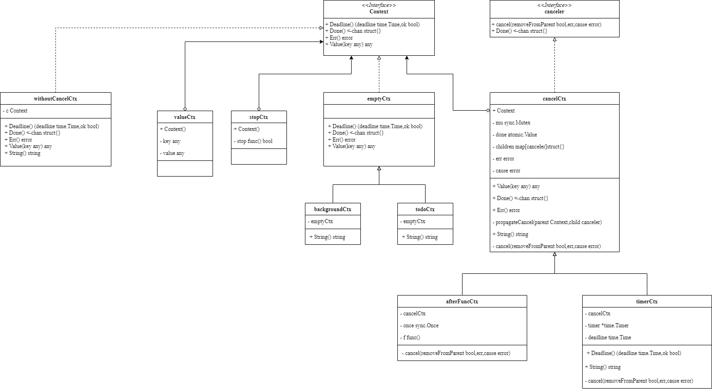

基础篇中已经介绍了Go语言Context的使用方法和场景，本节我们来深入了解一下Context的源码实现。

<!-- more -->

## 关于Context

Context本质是一个接口，定义如下：

```go
type Context interface {
	Deadline() (deadline time.Time, ok bool)
	Done() <-chan struct{}
	Err() error
	Value(key any) any
}
```

其中：
- `Deadline()`返回Context的截止时间，返回值为截止时间和一个布尔值，表示是否设置了截止时间。如果返回的布尔值为false，表示没有设置截止时间。
- `Done()`返回一个只读的channel，当Context被取消或者截止时间到达时，该channel会被关闭。在没有关闭之前，从channel读取会一直阻塞。
- `Err()`返回Context被取消的原因，如果Context没有被取消，返回nil。
- `Value()`返回Context中存储的值，key为任意类型，value为任意类型。

## 空的Context

> 我们知道`Background()`和`TODO()`返回的Context常用于根节点，无法取消，也没有超时时间，也获取不到任何共享数据。这种空Context是怎么实现的呢？

> Background()返回 backgroundCtx{} 类型的Context

```go
func Background() Context {
	return backgroundCtx{}
}
```

> TODO()返回 todoCtx{} 类型的Context

```go
func TODO() Context {
	return todoCtx{}
}
```

其中：`backgroundCtx`和`todoCtx`都是继承了`emptyCtx`结构体。


```go
type backgroundCtx struct{ emptyCtx }

type todoCtx struct{ emptyCtx }
```

> emptyCtx 是一个空的Context结构体，它实现了Context接口的所有方法。

```go
type emptyCtx struct{}

func (emptyCtx) Deadline() (deadline time.Time, ok bool) {
	return
}

func (emptyCtx) Done() <-chan struct{} {
	return nil
}

func (emptyCtx) Err() error {
	return nil
}

func (emptyCtx) Value(key any) any {
	return nil
}
```

`emptyCtx`仅仅实现了`Context`接口方法，却什么也没做。


## 传递数据的Context

WithValue()函数用于创建一个携带了键值对的Context，用于传递数据。

```go
func WithValue(parent Context, key, val any) Context {
	if parent == nil {
		panic("cannot create context from nil parent")
	}
	if key == nil {
		panic("nil key")
	}
	if !reflectlite.TypeOf(key).Comparable() {
		panic("key is not comparable")
	}
	return &valueCtx{parent, key, val}
}
```

其中：`valueCtx`定义如下：

```go
type valueCtx struct {
	Context
	key, val any
}
```

其中：
- Context是接口，存储了父Context实例。
- `key`和`val`是任意类型的键值对。

从上面可以看到一个valueCtx只存储一个键值对。那么多个键值对的父子如何共享数据的呢？

```go{5}
func (c *valueCtx) Value(key any) any {
	if c.key == key {
		return c.val
	}
	return value(c.Context, key)
}

func value(c Context, key any) any {
	for {
		switch ctx := c.(type) {
		case *valueCtx:
			if key == ctx.key {
				return ctx.val
			}
			c = ctx.Context
		case *cancelCtx:
			if key == &cancelCtxKey {
				return c
			}
			c = ctx.Context
		case withoutCancelCtx:
			if key == &cancelCtxKey {
				// This implements Cause(ctx) == nil
				// when ctx is created using WithoutCancel.
				return nil
			}
			c = ctx.c
		case *timerCtx:
			if key == &cancelCtxKey {
				return &ctx.cancelCtx
			}
			c = ctx.Context
		case backgroundCtx, todoCtx:
			return nil
		default:
			return c.Value(key)
		}
	}
}
```

我们可以看到`value()`函数会递归遍历父Context，直到找到`key`对应的`value`。


## 可取消的Context

取消的接口定义如下：

```go
type canceler interface {
	cancel(removeFromParent bool, err, cause error)
	Done() <-chan struct{}
}
```

Go语言可取消的Context定义如下：

```go
type cancelCtx struct {
	Context

	mu       sync.Mutex            // protects following fields
	done     atomic.Value          // of chan struct{}, created lazily, closed by first cancel call
	children map[canceler]struct{} // set to nil by the first cancel call
	err      error                 // set to non-nil by the first cancel call
	cause    error                 // set to non-nil by the first cancel call
}
```

其中：
- `Context`是接口，用于存储父Context。
- `mu`是互斥锁，用于保护`done`、`children`、`err`和`cause`字段。
- `done`是一个原子值，用于保存一个`chan struct{}`类型的值，该值在第一次调用`cancel()`方法时被创建，并在第一次调用`cancel()`方法后被关闭。
- `children`是一个map，用于保存子Context，子Context在调用`cancel()`方法时会被移除。
- `err`和`cause`是错误信息，`err`是取消的原因，`cause`是取消的源头。

`cancelCtx`实现`canceler`的接口

```go
func (c *cancelCtx) cancel(removeFromParent bool, err, cause error) {
	if err == nil {
		panic("context: internal error: missing cancel error")
	}
	if cause == nil {
		cause = err
	}
	c.mu.Lock()
	if c.err != nil {
		c.mu.Unlock()
		return // already canceled
	}
	c.err = err
	c.cause = cause
	d, _ := c.done.Load().(chan struct{})
	if d == nil {
		c.done.Store(closedchan)
	} else {
		close(d)
	}
    //遍历所有的子Context，进行取消
	for child := range c.children {
		// NOTE: acquiring the child's lock while holding parent's lock.
		child.cancel(false, err, cause)
	}
	c.children = nil
	c.mu.Unlock()

	if removeFromParent {
		removeChild(c.Context, c) //从父节点移除子节点
	}
}

func (c *cancelCtx) Done() <-chan struct{} {
	d := c.done.Load()
	if d != nil {
		return d.(chan struct{})
	}
	c.mu.Lock()
	defer c.mu.Unlock()
	d = c.done.Load() //二次检查
	if d == nil {
		d = make(chan struct{})
		c.done.Store(d)
	}
	return d.(chan struct{})
}
```

当我们调用`WithCancel()`,实际上就会创建一个`cancelCtx`类型的Context。

```go{11}
func WithCancel(parent Context) (ctx Context, cancel CancelFunc) {
	c := withCancel(parent)
	return c, func() { c.cancel(true, Canceled, nil) }
}

func withCancel(parent Context) *cancelCtx {
	if parent == nil {
		panic("cannot create context from nil parent")
	}
	c := &cancelCtx{}
	c.propagateCancel(parent, c)
	return c
}
```

其中，最为核心的是`c.propagateCancel(parent, c)`，它将父子Context关联起来。

```go
func (c *cancelCtx) propagateCancel(parent Context, child canceler) {
	c.Context = parent  //记录父实例

	done := parent.Done()
	if done == nil {
		return // parent is never canceled
	}

	select {
	case <-done:
		// parent is already canceled
		child.cancel(false, parent.Err(), Cause(parent))
		return
	default:
	}

	if p, ok := parentCancelCtx(parent); ok { //如果父节点是可取消的Context
		// parent is a *cancelCtx, or derives from one.
		p.mu.Lock()
		if p.err != nil {
			// parent has already been canceled
			child.cancel(false, p.err, p.cause)
		} else {
			if p.children == nil {
				p.children = make(map[canceler]struct{})
			}
			p.children[child] = struct{}{}   //将当前cancelCtx添加到父节点的children中
		}
		p.mu.Unlock()
		return
	}

	if a, ok := parent.(afterFuncer); ok {
		// parent implements an AfterFunc method.
		c.mu.Lock()
		stop := a.AfterFunc(func() {
			child.cancel(false, parent.Err(), Cause(parent))
		})
		c.Context = stopCtx{
			Context: parent,
			stop:    stop,
		}
		c.mu.Unlock()
		return
	}

	goroutines.Add(1)
	go func() {
		select {
		case <-parent.Done():
			child.cancel(false, parent.Err(), Cause(parent))  //启动一个协程，等待父节点取消。一旦父节点取消，则将子节点也取消
		case <-child.Done():
		}
	}()
}
```

## 有超时时间的Context

> Go语言提供了`WithDeadline()`和`WithDeadlineCause()`函数用于创建一个带超时时间的Context。我们先看一下这个带超时时间的Context的定义：

```go
type timerCtx struct {
	cancelCtx
	timer *time.Timer
	deadline time.Time
}
```

我们可以看到`timerCtx`继承了`cancelCtx`，具有可取消功能，同时为了实现超时控制，增加了timer和deadline字段。

`timerCtx`重写了Deadline()函数，如下：

```go
func (c *timerCtx) Deadline() (deadline time.Time, ok bool) {
	return c.deadline, true
}
```

此外，`timerCtx`还重写了`cancel()`函数，如下：

```go
func (c *timerCtx) cancel(removeFromParent bool, err, cause error) {
	c.cancelCtx.cancel(false, err, cause)
	if removeFromParent {
		// Remove this timerCtx from its parent cancelCtx's children.
		removeChild(c.cancelCtx.Context, c)
	}
	c.mu.Lock()
	if c.timer != nil {
		c.timer.Stop()
		c.timer = nil
	}
	c.mu.Unlock()
}
```

我们通过`WithDeadline`和`WithDeadlineCause`函数创建一个timerCtx类型的Context。

```go
func WithDeadline(parent Context, d time.Time) (Context, CancelFunc) {
	return WithDeadlineCause(parent, d, nil)
}

func WithDeadlineCause(parent Context, d time.Time, cause error) (Context, CancelFunc) {
	if parent == nil {
		panic("cannot create context from nil parent")
	}
	if cur, ok := parent.Deadline(); ok && cur.Before(d) {   //如果父Context已经设置了超时时间，并且当前超时时间早于新的超时时间，则直接返回一个取消的Context
		// The current deadline is already sooner than the new one.
		return WithCancel(parent)
	}
	c := &timerCtx{
		deadline: d,
	}
	c.cancelCtx.propagateCancel(parent, c) //将父子Context关联起来
	dur := time.Until(d)
	if dur <= 0 { 
		c.cancel(true, DeadlineExceeded, cause) // deadline has already passed
		return c, func() { c.cancel(false, Canceled, nil) }
	}
	c.mu.Lock()
	defer c.mu.Unlock()
	if c.err == nil {
		c.timer = time.AfterFunc(dur, func() {  //使用time.AfterFunc创建一个定时器，在定时器超时后调用c.cancel()函数取消Context。
			c.cancel(true, DeadlineExceeded, cause)
		})
	}
	return c, func() { c.cancel(true, Canceled, nil) }
}
```

我们可以看到timerCtx集成了cancelCtx，并实现了超时控制逻辑。

## 取消回调的Context

Go语言提供`AfterFunc`函数，用于在Context取消后执行回调函数。其本质上创建了一个`afterFuncCtx`，它的定义如下：

```go
type afterFuncCtx struct {
	cancelCtx
	once sync.Once // either starts running f or stops f from running
	f    func()
}
```

其中：

- `once`是一个sync.Once类型的变量，用于确保回调函数只执行一次。
- `f`是一个回调函数，用于在Context取消后执行。

我们看到afterFuncCtx继承了cancelCtx，那么它是如何实现取消时回调功能呢？

```go{6}
func (a *afterFuncCtx) cancel(removeFromParent bool, err, cause error) {
	a.cancelCtx.cancel(false, err, cause)
	if removeFromParent {
		removeChild(a.Context, a)
	}
	a.once.Do(func() {
		go a.f()
	})
}
```

我们可以看到`afterFuncCtx`重写了cancel函数，当Context取消时，会执行回调函数。once.Do()方法确保回调函数只执行一次。

那么`afterFuncCtx`是怎么创建的呢？

```go
func AfterFunc(ctx Context, f func()) (stop func() bool) {
	a := &afterFuncCtx{
		f: f,
	}
	a.cancelCtx.propagateCancel(ctx, a)  //关联父子Context
	return func() bool {
		stopped := false
		a.once.Do(func() {
			stopped = true
		})
		if stopped {
			a.cancel(true, Canceled, nil)
		}
		return stopped
	}
}
```

::: warning
这里注意返回stop函数。如果在没有结束前执行了stop函数，将导致once函数执行，这样回调函数将不会执行。
::: 

## 完整的UML



Go语言提供了丰富的Context，用于超时控制、取消控制、传递数据等。

其核心是`cancelCtx`类型，`timerCtx`和`afterFuncCtx`类型都继承了`cancelCtx`。分别重写了相应的方法，实现了超时控制和取消回调功能。

此外需要关注Context如何将父子关联起来。