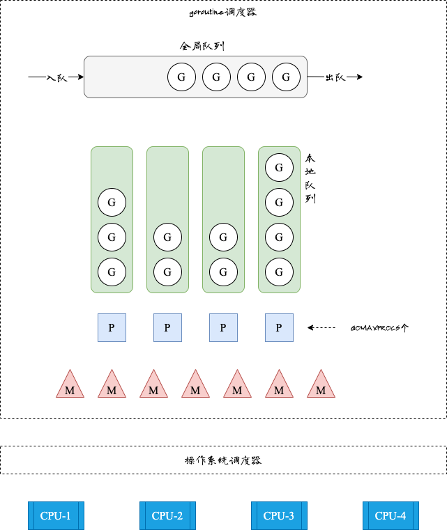

<!-- more -->

一个 goroutine 初始只需要 **2KB** 栈空间，而一个操作系统线程动辄 **8MB**。这个 4000 倍的差距，决定了 Go 程序能同时跑几十万个并发任务，而基于线程的程序撑过几千就已经举步维艰。理解 GPM 调度模型，就是理解这一切背后的运作机制。

## goroutine 不是"轻量级线程"，是一套用户态调度系统

操作系统线程切换代价高昂：需要保存完整 CPU 寄存器状态、切换内核栈、刷新 TLB，一次切换耗时在微秒量级。goroutine 的切换发生在用户态，由 Go 运行时全权管理，只需保存极少的上下文，切换成本比线程低一到两个数量级。

"轻量级线程"这个词严重低估了它的本质——它是一套完整的用户态协作调度系统。

## GPM 模型：三个角色，一个调度循环

Go 运行时用三类对象来描述并发执行：

- **G（goroutine）**：保存执行栈、状态和任务函数。每个 `go` 关键字创建一个 G。
- **P（processor，逻辑处理器）**：调度上下文，持有本地 G 队列（上限 256 个）。P 的数量由 `GOMAXPROCS` 决定，默认等于机器 CPU 核数，程序启动时全部创建完毕。
- **M（machine，OS 线程）**：真正在 CPU 上执行代码的线程。M 必须绑定一个 P 才能运行 G，否则休眠等待。

执行循环的逻辑很简单：M 绑定 P → 从本地队列取 G → 执行 G → 调用 `goexit` 清理 → 循环取下一个。

除各 P 的本地队列外，还有一个**全局队列**兜底。当本地队列满时，会将其中一半的 G 转移到全局队列——这是有锁的操作，代价相对较高，所以 Go 运行时优先使用无锁的本地队列。

## 三种调度策略：用有限线程驱动无限并发

### Work Stealing：本地没活，就去别人那里"偷"

当某个 P 的本地队列为空时，它不会让绑定的 M 闲置，而是随机选择另一个 P，偷走其本地队列中一半的 G 来执行。这个机制让负载在多个 P 之间自然均衡，不依赖中央调度器。

### Hand Off：系统调用阻塞时，P 绝不陪 M 一起等

当 G 执行文件读写等系统调用导致 M 阻塞时，Go 运行时会把 P 从该 M 上"摘走"，交给其他空闲 M 或新建一个 M，让剩余的 G 继续跑。

系统调用返回后，原来的 G 重新竞争 P：
- **有空闲 P**：直接绑定，继续执行
- **没有空闲 P**：G 标记为 runnable，放入全局队列，等待下次调度；原来的 M 进入休眠

::: warning 网络 I/O 与文件 I/O 的关键差异

- **网络 I/O**：由 Go 内置的 netpoller（网络轮询器）处理，G 挂起但 M **不阻塞**，P 可继续运行其他 G
- **文件 I/O**：会真实阻塞 M，因此大量文件读写会触发运行时创建大量 OS 线程，线程数可能暴涨

:::

### 抢占调度：防止一个 G 把调度器"饿死"

Go 没有时间片概念。如果一个 G 长期执行纯计算（比如死循环），从不触发函数调用或 I/O，调度器就无从介入。Go 的解法经历了两代演进：

- **Go 1.2**：在函数调用入口插入抢占检查代码，运行时趁机检查是否需要切换 G。对纯计算、无函数调用的 G **无效**。
- **Go 1.14**：引入基于信号的**异步抢占**。监控线程 `sysmon`（无需绑定 P，独立运行）会对运行超过 **10ms** 的 G 发送 `SIGURG` 信号，强制中断，触发调度。

Go 1.14 之后，"一个 goroutine 饿死其他 goroutine"的问题才算真正解决。

## 这套机制的局限

GPM 不是银弹，以下场景仍然有代价：

- **文件 I/O 密集型应用**：Hand Off 机制会持续创建新 M，线程数量失控时，OS 调度压力不可忽视
- **CGO 调用**：CGO 代码在 M 上执行期间同样会剥离 P，频繁 CGO 会显著降低调度效率
- **goroutine 泄漏**：没有退出机制的 goroutine 会永久驻留内存，这是 Go 程序内存泄漏最常见的根因

## 延伸阅读

- [Golang 调度器 GMP 原理与调度全分析](https://mp.weixin.qq.com/s/rfjysi-LB-uFiGiZjh-XNw)
- [Go 语言精进之路](https://book.douban.com/subject/35720729/)
