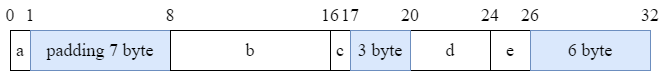
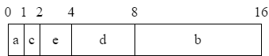

> 合理的排列数据成员的顺序，使得整个结构体的空间占用最小化。

<!-- more -->

## 什么是内存对齐

内存对齐是指数据在内存中存储的方式，以优化处理器访问。处理器一次访问一定数量的连续字节（称为“字”），通常为 4 字节或 8 字节。硬件会将内存的读写对齐到数据总线的宽度，从而可以降低硬件实现的复杂度，又可以提升传输的效率。

## 为什么有内存对齐

- 有些CPU可以访问任意地址上的任意数据，而有些CPU只能在特定地址访问数据，因此不同硬件平台具有差异性，这样的代码就不具有移植性，如果在编译时，将分配的内存进行对齐，这就具有平台可以移植性了
- CPU每次寻址都是要消费时间的，并且CPU 访问内存时，并不是逐个字节访问，而是以字长（word size）为单位访问，所以数据结构应该尽可能地在自然边界上对齐，如果访问未对齐的内存，处理器需要做两次内存访问，而对齐的内存访问仅需要一次访问，内存对齐后可以提升性能。

## 对齐系数

每个特定平台上的编译器都有自己的默认"对齐系数"，常用平台默认对齐系数如下：
- 32位系统对齐系数是4
- 64位系统对齐系数是8

## 对齐规则

对于struct类型，每个成员都会以结构体的起始地址为基地址，按自身类型的对齐边界对齐。

## 对齐示例

```go
package main

import (
	"fmt"
	"unsafe"
)

type S1 struct {
	a int8
	b int64
	c int8
	d int32
	e int16
}

type S2 struct {
	a int8
	c int8
	e int16
	d int32
	b int64
}

func main() {
	fmt.Println("Size of S1:", unsafe.Sizeof(S1{}), "bytes")
	fmt.Println(unsafe.Offsetof(S1{}.a), unsafe.Offsetof(S1{}.b), unsafe.Offsetof(S1{}.c), unsafe.Offsetof(S1{}.d), unsafe.Offsetof(S1{}.e))
	fmt.Println("Size of S2:", unsafe.Sizeof(S2{}), "bytes")
	fmt.Println(unsafe.Offsetof(S2{}.a), unsafe.Offsetof(S2{}.c), unsafe.Offsetof(S2{}.e), unsafe.Offsetof(S2{}.d), unsafe.Offsetof(S2{}.b))
}
```

::: details 执行结果
```text
Size of S1: 32 bytes
0 8 16 20 24
Size of S2: 16 bytes
0 1 2 4 8
```
:::

::: tip
我们可以发现`S1`和`S2`字段包含相同的成员，但是`S1`占用的内存空间是`S2`的2倍。
:::



::: info 
S1结构体中：
- 由于a占1个字节，b占8个字节， 因此a和b之间就会有7字节的填充；
- c占1个字节，d占4个字节， 因此c和d之间就会有3字节的填充；
- e占2个字节，为了对齐8字节，所以又填充6字节；
:::



::: info
S2结构体中：
- a占1个字节，c占1个字节，e占2个字节，d占4个字节，刚好对齐8字节，所以没有任何填充；
- b占8个字节，刚好不需要填充；
:::

## 参考资料

- [详解内存对齐](https://blog.csdn.net/qq_39397165/article/details/119745975)
