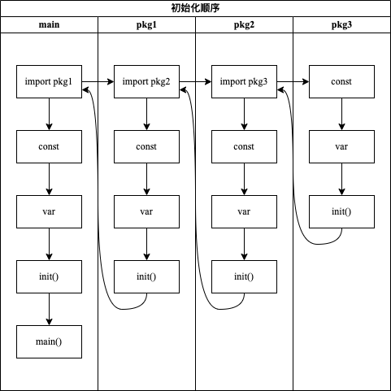

<!-- more -->

# package

> Go语言使用包（package）作为基本单元来组织源码。

## package的优点

> 编译速度快

- Go要求每个源文件在开头显示地列出所有依赖的包，如果引入了未使用的包，Go语言编译器会报错。
- Go要求包之间不能存在循环依赖，这样包的依赖关系便形成了一张有向无环图，这样每个包可以单独编译也可并行编译
- 已编译的Go包不仅记录了该包的信息，还记录了依赖包的信息。只需读取缓存的编译产物即可。

## 注意事项

- Go语言官网工具链对于引入路径包含`internal`目录名的代码包被视为一个特殊的代码包，它只能被此目录的直接父目录的代码包引用，而不能被其他代码包引用。
- Go不支持循环引用，例如：A包引入B包，B包引入A包，这种将不被允许。
- `main`包是一个特殊的包，它是程序入口函数，不能被引用。

## 初始化顺序

Go语言内置函数`init()`，常用于包级数据初始化以及初始状态的检查工作。

- 一个Go包可以有多个`init()`函数；
- `init()`函数不可显示的调用，否则会编译期间报错；
- `init()`只会执行一次；

Go包引入其他包，初始化时按照一定的次序逐一调用该包的init函数。

Go语言运行时按照`常量`->`变量`->`init()`顺序进行初始化。

