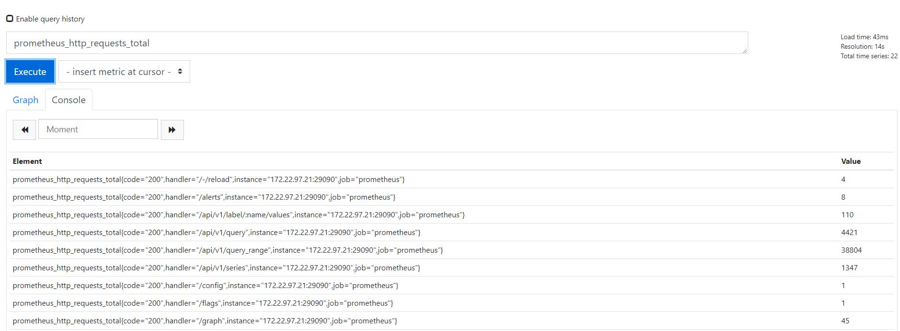
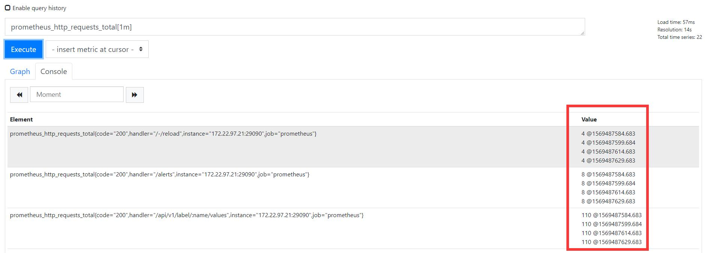
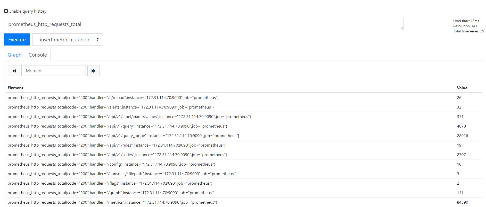
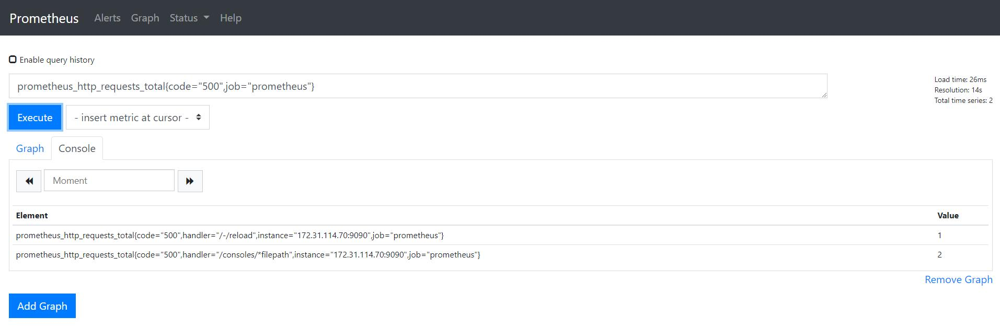
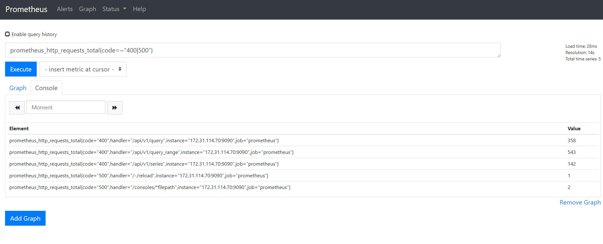

# PromQL

## 1. 名词解释

> **指标**是软件或硬件组件属性的度量。
>
> 为了使指标有价值，我们会跟踪其状态，通常记录一段时间内的数据点。这些数据点成为**观察点**（observation），观察点通常包括值、时间戳，有时也涵盖描述观察点的一系列属性。
>
> 观察点的集合称为**时间序列**（time series）。
>
> 我们通常以固定的时间间隔收集指标，该时间间隔称为**颗粒度**（granularity）或**分辨率**（resolution）

### 1.1 时序（time series）

> 时序（time series)是由指标（metric）以及一组key/value标签定义的。标签可以使时序数据更加丰富。

格式：

```
<metric name>{<label name>=<label value>, ...}
```

例如：

```
api_http_requests_total{method="POST", handler="/messages"}
```

时序按照时间戳和值的顺序存放，称之为向量（vector)。

### 1.2 向量（vector)

可以将采集的时序理解为一个以时间为x轴的数字矩阵：

```
  ^

  │   . . . . . . . . . . . . . . . . .   . .   node_cpu{cpu="cpu0",mode="idle"}

  │     . . . . . . . . . . . . . . . . . . .   node_cpu{cpu="cpu0",mode="system"}

  │     . . . . . . . . . .   . . . . . . . .   node_load1{}

  │     . . . . . . . . . . . . . . . .   . .  

  v

    <------------------ 时间 ---------------->
```

其中每一个点成为一个样本（sample）。

### 1.3 样本（sample)

> 按照某个时序以时间维度采集的数据称之为样本。样本有以下三部分：
>
> - 指标（metric）
>
> - 时间戳：一个毫秒级的unix时间戳
> - 样本值（value）：一个float64值

例如：

```
<--------------- metric ---------------------><-timestamp -><-value->
http_request_total{status="200", method="GET"}@1434417560938 => 94355
http_request_total{status="200", method="GET"}@1434417561287 => 94334

http_request_total{status="404", method="GET"}@1434417560938 => 38473
http_request_total{status="404", method="GET"}@1434417561287 => 38544

http_request_total{status="200", method="POST"}@1434417560938 => 4748
http_request_total{status="200", method="POST"}@1434417561287 => 4785
```

例如：node_exporter暴漏的metrics接口的指标如下所示：

```
# HELP node_cpu Seconds the cpus spent in each mode.
# TYPE node_cpu counter
node_cpu{cpu="cpu0",mode="idle"} 362812.7890625
# HELP node_load1 1m load average.
# TYPE node_load1 gauge
node_load1 3.0703125
```

`# HELP` 用于解释说明

`# TYPE`指标类型，Prometheus支持的指标类型有以下四种:

- `counter`（常用），特点：只增不减；通常记录某些事件发生的次数，可以了解该事件产生速率的变化。例如接口请求次数。
- `gauge`（常用），特点：可增可减；通常记录事件状态，例如可用内存大小。
- `histogram`，用于统计分析样本的分布情况；例如延迟在0-10ms、10-20ms的请求数。
- `summary`，与`histogram`相似；[参考官网](https://prometheus.io/docs/practices/histograms/)

## 2. 查询表达式

> **PromQL**是一种数据查询语言，类似于MySQL，具有强大的功能。允许用户实时选择和汇总时间序列数据，表达式的结果可以显示为图形。

### 2.1 表达式语言数据类型

**PromQL**的表达式语句可以分为四种类型：

- `Instant vector`——即时向量，一组包含每个时间序列的单个样本的时间序列，他们共享相同的时间戳。**(当前时间的指标样本)**
- `Range verctor`——范围向量，一组时间序列，包含每个事件序列随时间变化的一系列数据点。**（一段时间的指标样本）**
- `Scalar`——标量，一个简单的数字浮点值。
- `String`——字符串，**（目前不可用）**

**即时向量和范围向量对比**

即时向量指最新的单个维度的指标数据



范围向量包含一组不同时间戳的指标数据，和时间范围选择有关



### 2.2 Time series Selectors（时间序列表达式）

#### 2.2.1 Instant vector selectors（即时向量选择器）

> 即时向量返回给定时间戳（即时）的一组指标样本。

例如：仅指定指标名称，`prometheus_http_requests_total`



可以通过一组标签来进一步过滤这些时间序列，使用花括号`{}`。例如：`prometheus_http_requests_total{code="500",job="prometheus"}`



可以对标签值进行匹配，匹配运算符：

- `=`：与提供的字符串完全相同的标签；
- `！=`：不等于提供的字符串的标签；
- `=~`：与正则表达式匹配提供的字符串标签；
- `!~`：不与提供的正则表达式匹配的标签；

例如：`prometheus_http_requests_total{code=~"400|500"}`



#### 2.2.2 Range Vector Selectors (范围向量选择器)

> 范围向量返回一段时间的一组指标样本。
>
> 范围持续时间附加在`[]`中，指定每个结果范围向量提取多长时间值。

持续时间指定为数字，紧接着是以单位之一：

- `s`-秒
- `m`-分钟
- `h`-小时
- `d`-天
- `w`-周
- `y`-年

例如：`prometheus_http_requests_total{code="200"}[5m]`表示选择过去5分钟该指标的所有时间序列记录。

#### 2.2.3 Offset modifier（偏移修改器）

> 由于即时向量和范围向量使用当前时间为基准，如果想查询5分钟前的即时向量，或者昨天一天的范围向量，使用关键字`offset`可以进行时间偏移

例如：`http_requests_total offset 5m`表示返回5分钟前的即时向量`http_requests_total`的值。

`offset`需要紧跟向量。例如：

```
sum(http_requests_total{method="GET"} offset 5m) // GOOD.
sum(http_requests_total{method="GET"}) offset 5m // INVALID.
rate(http_requests_total[5m] offset 1w) 		 // GOOD
```

### 2.5 Operators（操作符）

#### 2.5.1 二元运算符

##### 算术运算符

PromQL支持以下算法运算符：

- `+` 加法
- `-` 减法
- `*` 乘法
- `/` 除法
- `%` 求余
- `^` 幂运算

算术运算符定义在标量与标量、即时向量与标量、即时向量与即时向量之间。

**在两个标量之间**：结果是标量；

**在即时向量和标量之间**：运算符应用于向量中的每个数据样本的值；如果时间序列即时向量乘以2，则结果是另一个即时向量，且对应的值是原始向量的每个样本值乘以2。

**在两个即时向量之间**：运算符依次查找左侧向量中的每条数据到右侧向量中的匹配样本数据进行运算，。

------

##### 比较运算符

PromQL支持以下比较运算符：

- `==`
- `!=`
- `>`
- `<`
- `<=`
- `>=`

比较运算符定义在标量与标量、即时向量与标量、即时向量与即时向量之间。

**标量与标量之间**：结果是标量，`bool`必须提供修饰符，即`0`（`false`）或`1`（`true`）；~~待补充~~

**在即时向量和标量之间**：运算符应用于向量中的每个数据样本的值，为`true`的数据样本保留在结果向量中；

**在两个即时向量之间**：运算符相当于过滤器，表达式为`true`且在表达式的右侧找到匹配的数据样本都保留在结果向量中。

------

##### 逻辑运算符

PromQL支持以下逻辑运算符：

- `and`
- `or`
- `unless`

`vector1 and vector2`得到一个向量，该向量由与`vector2`完全匹配标签集的`vector1`数据样本组成。结果向量的指标名称和值为左侧向量。

`vector1 or vector2`得到一个向量，该向量包含`vector1`和`vector2`所有的原始数据（标签集+值）。

`vector1 unless vector2`得到一个向量，该向量包含的指标数据为 `vector1`中不与`vector2`匹配的标签集。（两个向量中的所有匹配元素都被删除）。

------

##### 运算符优先级

先级从高到低依次是：

1. `^`
2. `*`、`/`、`%`
3. `+`、`-`
4. `==`、`!=`、`<=`、`<`、`>=`、`>`
5. `and`、`unless`
6. `or`

------

##### 向量匹配模式

> 向量与向量之间进行运算操作时会基于默认的匹配规则：**依次找到与左边向量元素匹配（标签完全一致）的右边向量元素进行运算，如果没找到匹配元素，则直接丢弃。**

PromQL支持两种匹配模式：`一对一`，`多对一或一对多`。

###### 一对一向量匹配

> 一对一匹配，分别从两边表达式获取的即时向量，依次找到标签集完全相同的元素。格式为`vector1 <operator> vector2`，使用关键字`ignoring`忽略某些标签，关键字`on`使用提供的标签列表匹配。

格式：

```
<vector expr> <bin-op> ignoring(<label list>) <vector expr>
<vector expr> <bin-op> on(<label list>) <vector expr>
```

例如：

指标数据如下：

```
method_code:http_errors:rate5m{method="get", code="500"}  24
method_code:http_errors:rate5m{method="get", code="404"}  30
method_code:http_errors:rate5m{method="put", code="501"}  3
method_code:http_errors:rate5m{method="post", code="500"} 6
method_code:http_errors:rate5m{method="post", code="404"} 21

method:http_requests:rate5m{method="get"}  600
method:http_requests:rate5m{method="del"}  34
method:http_requests:rate5m{method="post"} 120
```

使用以下表达式进行匹配：

```
method_code:http_errors:rate5m{code="500"} / ignoring(code) method:http_requests:rate5m
```

结果：

```
{method="get"}  0.04            //  24/600=0.04
{method="post"} 0.05            //   6/120=0.05
```

###### 多对一和一对多向量匹配

> 这里的`一`和`多`指的是：`一`这边的向量每个元素和`多`这边向量的多个元素匹配。使用关键字`group_left`和`group_right`，来表明哪边的向量具有更高的基数（即充当`多`的角色）。

格式：

```
<vector expr> <bin-op> ignoring(<label list>) group_left(<label list>) <vector expr>
<vector expr> <bin-op> ignoring(<label list>) group_right(<label list>) <vector expr>
<vector expr> <bin-op> on(<label list>) group_left(<label list>) <vector expr>
<vector expr> <bin-op> on(<label list>) group_right(<label list>) <vector expr>
```

例如：左侧向量有两个标签（method、code），右侧向量有一个标签（method），因此左侧向量具有更高的基数，使用`group_left`，并忽略标签（code）。如下：

```
method_code:http_errors:rate5m / ignoring(code) group_left method:http_requests:rate5m
```

结果：

```
{method="get", code="500"}  0.04            //  24/600=0.04
{method="get", code="404"}  0.05            //  30/600=0.05
{method="post", code="500"} 0.05            //   6/120=0.05
{method="post", code="404"} 0.175           //  21/120=0.175
```

**Group修饰符（group_left、group_right)只能在比较和数学运算符中使用，逻辑运算符默认与右侧向量所有元素匹配。**

#### 2.5.2 布尔运算符

> 布尔运算符的默认行为是对时序数据进行过滤。

例如，只需要知道当前模块的HTTP请求量是否>=1000，如果大于等于1000则返回1（true）否则返回0（false）。

```
http_requests_total > bool 1000
```

返回的指标样本的值要么是0要么是1，如下：

```
http_requests_total{code="200",handler="query",instance="localhost:9090",job="prometheus",method="get"}  1
http_requests_total{code="200",handler="query_range",instance="localhost:9090",job="prometheus",method="get"}  0
```

#### 2.5.3 聚合运算符

> 聚合运算符可以聚合单个即时向量的数据，从而生成较少标签的新向量

Prometheus支持以下聚合运算符：

- `sum`-总和
- `min`-最小
- `max`-最大
- `avg`平均
- `stddev`-标准差
- `stdvar`-标准差异
- `count`-向量中的样本条数
- `count_values`-具有相同值的样本条数
- `bottomk`-样本值最小的k个元素
- `topk`样本值最大的k个元素
- `quantile`-分布统计

以上聚合运算符可以用于聚合所有标签维度，也可以通过关键字`without`或者`by`来保留不同的维度。

格式：

```
<aggr-op>([parameter,] <vector expression>) [without|by (<label list>)]
```

其中

- `parameter`只在`count_values`、`quantile`、`topk`和`bottomk`；
- `without`从结果向量中删除列出的标签；
- `by`只保留列出的标签；

### 2.6 Functions（功能函数）

#### abs()

`abs(v instant-vector)`返回输入向量且所有的样本值都转换为绝对值；

#### absent()

`absent(v instant-vector)`如果传递给它的向量有任何样本，则返回空向量；如果传递给它的向量没有样本，则返回值为1的向量；

#### ceil()

`ceil(v instant-vector)`将所有样本的样本值舍入最接近的整数；

#### changes()

`changes(v range-vector)`计算范围向量时间范围内样本值得更改次数作，结果是即时向量；

#### clamp_max()

`clamp_max(v instant-vector, max scalar)`限制样本最大值为max；

#### clamp_min()

`clamp_min(v instant-vector, min scalar)`限制样本最小值为min；

#### day_of_month()

`day_of_month(v=vector(time()) instant-vector)`返回UTC中每个给定时间（月）中的某天，返回值为1到31；

#### day_of_week()

`day_of_week(v=vector(time()) instant-vector)`返回UTC中每个给定时间的星期几，返回值为0到6；

#### day_in_month()

`days_in_month(v=vector(time()) instant-vector)`返回UTC中每个给定时间的月中天数。返回值为28到31。

#### delta()

`delta(v range-vector)`计算范围向量中每个时间系列元素的第一个和最后一个值之间的差异;

例如：

```
delta(cpu_temp_celsius{host="zeus"}[2h]) //现在和两个小时之前CPU温度的差异
```

**delta应该用于gauges类型指标**

#### deriv()

`deriv(v range-vector)` 使用[简单线性回归](https://en.wikipedia.org/wiki/Simple_linear_regression)计算范围向量中时间序列的每秒导数;

**deriv应该用于gauges类型指标**

#### exp()

`exp(v instant-vector)`计算所有样本的指数函数（样本值为指数）；

#### floor()

`floor(v instant-vector)`将所有样本值舍入为最接近的整数；

#### histogram_quantile()

`histogram_quantile(φ float, b instant-vector)`从直方图的桶`b`中计算φ-分位数（0≤φ≤1）；

#### holt_winters()

`holt_winters(v range-vector, sf scalar, tf scalar)`根据范围输入生成时间序列的平滑值`v`。平滑因子越低`sf`，对旧数据的重视程度越高。趋势因子越高，数据的趋势`tf`就越多。二者`sf`并`tf`必须在0和1之间。

**holt_winters应该用于gauges类型指标**

#### hour()

`hour(v=vector(time()) instant-vector)`返回UTC中每个给定时间的一天中的小时。返回值为0到23；

#### idelta()

`idelta(v range-vector)`计算范围向量中最后两个样本之间的差异;

**idelta应该用于gauges类型指标**

#### increase()

`increase(v range-vector)`计算范围向量中时间序列的增加；

**incrase应用用于counter类型指标**

#### irate()

`irate(v range-vector)`计算范围向量中时间序列的每秒即时增长率。（基于最后两个数据点）

例如：

```
irate(http_requests_total{job="api-server"}[5m]) //计算5分钟内的HTTP每秒请求率
```

#### label_join()

`label_join`生产一个新的标签，且新的标签值是列出的标签值通过分隔符连接起来。

格式：

`label_join(v instant-vector, dst_label string, separator string, src_label_1 string, src_label_2 string, ...)`

例如：

```
label_join(up{job="api-server",src1="a",src2="b",src3="c"}, "foo", ",", "src1", "src2", "src3") //在原有的向量基础上多了新标签foo，值为src1,src2,src3
```

#### label_replace()

`label_replace`按照正则表达式匹配源标签，替换目标标签的值。

格式：

`label_replace(v instant-vector, dst_label string, replacement string, src_label string, regex string)`

例如：

```
label_replace(up{job="api-server",service="a:c"}, "foo", "$1", "service", "(.*):.*")
```

#### ln()

`ln(v instant-vector)`计算所有指标对数。

#### log2()

`log2(v instant-vector)`计算所有指标以2为底的对数。

#### log10()

`log10(v instant-vector)`计算所有指标以10为底的对数。

#### minute()

`minute(v=vector(time()) instant-vector)`以UTC为单位返回每个给定时间的分钟。返回值为0到59。

#### month()

`month(v=vector(time()) instant-vector)`返回UTC中每个给定时间的一年中的月份。返回值为1到12，其中1表示1月。

#### predict_linear()

`predict_linear(v range-vector, t scalar)`使用简单的线性回归t，基于范围向量预测从现在开始的时间序列的值。

**product_linear()应运用于gauges类型指标**

#### rate()

`rate(v range-vector)`计算范围向量中时间序列的每秒平均增长率。

例如：

```
rate(http_requests_total{job="api-server"}[5m]) //计算过去5分钟内每秒HTTP请求率。
```

**rate应运用于counter类型指标**

#### resets()

`resets(v range-vector)`返回时间范围内的计数器重置次数。

**resets应运用于counter类型指标**

#### round()

`round(v instant-vector, to_nearest=1 scalar)`将所有指标的样本值舍入最接近的整数。可选参数`to_nearest`允许指定舍入样本值得最近倍数。这个倍数也可能是一个分数。

#### scalar()

`scalar(v instant-vector)`将该单个指标得样本值作为标量返回。

#### sort()

`sort(v instant-vector)`返回按样本值升序排列得向量。

#### sort_desc()

与`sort()`相似，但按降序排序。

#### sqrt()

`sqrt(v instant-vector)`计算所有样本的平方根。

#### time()

`time()`返回自1970年1月1日UTC以来的秒数。请注意，这实际上并不返回当前时间，而是返回计算表达式的时间。~~待补充~~

#### timestamp()

`timestamp(v instant-vector)`返回向量得每个样本得时间戳，自1970年1月1日UTC以来得秒数。

#### vector()

`vector(s scalar)`将标量返回为没有标签的向量。

#### year()

`year(v=vector(time()) instant-vector)` 以UTC格式返回每个给定时间的年份。

#### <-aggregation->_over_time()

以下函数聚合给定范围向量得每个指标随时间的变化并返回聚合结果的即时向量：

- `avg_over_time(range-vector)`：指定时间间隔内所有点的平均值。
- `min_over_time(range-vector)`：指定时间间隔内所有点的最小值。
- `max_over_time(range-vector)`：指定时间间隔内所有点的最大值。
- `sum_over_time(range-vector)`：指定时间间隔内所有值的总和。
- `count_over_time(range-vector)`：指定时间间隔内所有值的计数。
- `quantile_over_time(scalar, range-vector)`：指定间隔中的值的φ-分位数（0≤φ≤1）。
- `stddev_over_time(range-vector)`：指定时间间隔内值的总体标准偏差。
- `stdvar_over_time(range-vector)`：指定时间间隔内值的总体标准差异。