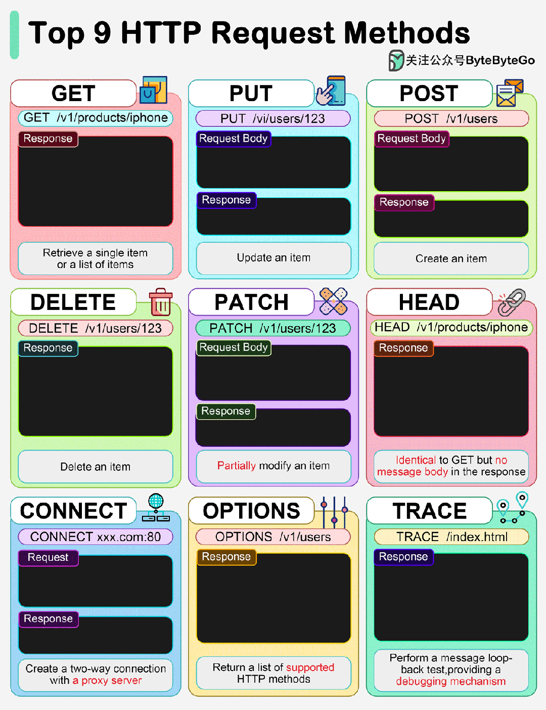

<!-- more -->

> HTTP协议是目前使用最为广泛的应用层协议

## HTTP发展简史

* **1989 年**：蒂姆·伯纳斯-李在 CERN 提出万维网的概念。
* **1991 年**：蒂姆·伯纳斯-李发布 HTTP/0.9，HTTP 协议的第一个版本。
* **1996 年**：HTTP/1.0 发布，引入了状态码、头字段和持久连接等新功能。
* **1997 年**：HTTP/1.1 发布，对 HTTP/1.0 进行了重大更新，包括管道化请求、分块传输编码和主机头字段。
* **2015 年**：HTTP/2 发布，对 HTTP/1.1 进行了重大重新设计，重点是提高性能和效率。
* **2022 年**：HTTP/3 发布，HTTP/2 的最新版本，基于 QUIC 传输协议。

HTTP/1.1 仍然是当今互联网上使用最广泛的 HTTP 版本，但 HTTP/2 和 HTTP/3 正在逐渐获得采用。随着时间的推移，预计 HTTP/3 将成为新的标准。

## HTTP方法

HTTP 方法是客户端向服务器发送请求时所使用的动作。最常用的 HTTP 方法包括：

* **GET：** 从服务器获取指定资源。这是最基本的 HTTP 方法，用于检索网页、图像或其他文件。
* **POST：** 向服务器提交数据以创建资源。通常用于提交表单数据或上传文件。
* **PUT：** 更新服务器上的现有资源。
* **DELETE：** 删除服务器上的资源。
* **HEAD：** 获取资源的元数据（如大小和内容类型），而不实际获取资源内容。
* **OPTIONS：** 获取服务器支持的 HTTP 方法和功能。
* **PATCH：** 部分更新服务器上的资源。

**示例**

以下是一些 HTTP 方法的示例：

* `GET /index.html HTTP/1.1`：从服务器获取 index.html 文件。
* `POST /submit-form HTTP/1.1`：向服务器提交表单数据。
* `PUT /users/1 HTTP/1.1`：更新服务器上 ID 为 1 的用户。
* `DELETE /files/image.png HTTP/1.1`：从服务器删除 image.png 文件。
* `HEAD /about-us HTTP/1.1`：获取关于我们页面的元数据。
* `OPTIONS /api/v1 HTTP/1.1`：获取 API 的功能信息。
* `PATCH /users/1 HTTP/1.1`：部分更新用户个人资料（例如，仅更新姓名）。

## HTTP状态码

TTP 状态码分为五类，每类表示一个不同的响应类别：

**1xx 信息响应**

* 表示请求已收到并正在处理。
* 例如：
    * 100 继续
    * 101 切换协议

**2xx 成功响应**

* 表示请求已成功处理。
* 例如：
    * 200 OK
    * 201 已创建
    * 204 无内容

**3xx 重定向**

* 表示需要进一步操作才能完成请求。
* 例如：
    * 301 永久重定向
    * 302 临时重定向
    * 308 永久重定向

**4xx 客户端错误**

* 表示客户端请求有误。
* 例如：
    * 400 错误的请求
    * 401 未经授权
    * 404 未找到

**5xx 服务器错误**

* 表示服务器在处理请求时遇到错误。
* 例如：
    * 500 内部服务器错误
    * 502 错误的网关
    * 503 服务不可用

## 参考链接

[HTTP发放和使用大全](https://mp.weixin.qq.com/s/AuYEWkY9LN6TRrQvU-AaQA)
[HTTP状态码完整指南](https://mp.weixin.qq.com/s/Q_BeNgqNWizwVkMkH39e7g)
[图解|什么是HTTP简史](https://mp.weixin.qq.com/s/VTFC8WEJTnoDzEtKsi48Aw)