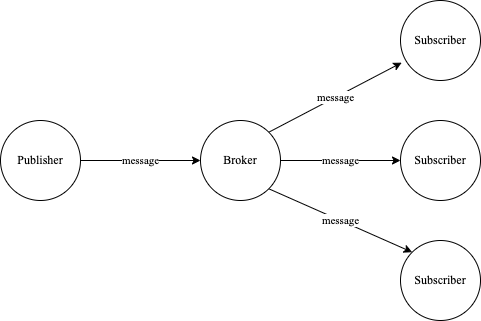
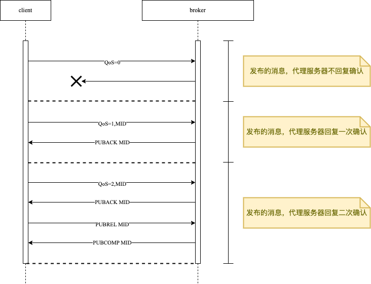
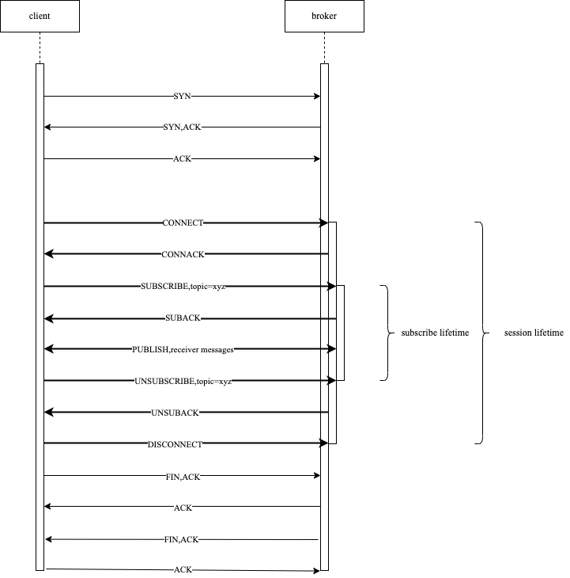

> MQTT(Mesage Queuing Telemetry Transport，消息队列遥测传输协议)，是一种基于发布/订阅模式的轻量级通讯协议，该协议构建于TCP/IP协议上。

## 发展历史

- 1999年由IBM发明，起初用于原油管道数据采集监控系统，解决卫星与原油管道检测数据的传输问题。
- 2010 发布MQTT 3.1。
- 2014年在 **OASIS** 标准化组织的推动下于公布了 [`V3.1.1`](https://docs.oasis-open.org/mqtt/mqtt/v3.1.1/os/mqtt-v3.1.1-os.html) 版本规范。
- 2019年3月发布了最新的 [`V5.0`](https://docs.oasis-open.org/mqtt/mqtt/v5.0/cs02/mqtt-v5.0-cs02.html) 版本规范。

## 优点

- 支持QoS（设备网络环境复杂）
- 轻量且省带宽（MQTT报文紧凑，可在严重受限的硬件设备和低带宽、高延迟的网络上实现稳定传输）
- 发布订阅模式，将发布者与订阅者解耦
- 持续会话感知能力（时刻知道设备是否在线）

## 通信模式

> 发布/订阅模式(Publish/Subscribe)将发送消息的发布者(Publisher)与接收消息的订阅者(Subscriber)分离，之间的连接关系由代理者(Broker)进行处理。两者不直接进行通信，甚至彼此之前都不知道对方的存在。



### 特点

> 发布/订阅模式的重要特性就是将消息的发布者与订阅者解耦，这种解耦体现在以下三个方面：
>
> - 空间解耦：发布者和订阅者不需要相互了解（例如无须交换IP地址与端口）；
> - 时间解耦：发布者与订阅者的操作不需要同时运行（可下线）；
> - 同步解耦：在发布或者订阅消息的过程当中，发布者和订阅者可以异步进行工作（C/S模式需要客户端或服务端等待）；

Broker通过某种**过滤规则**将Publisher的消息发送给Subscriber，该**过滤规则**就是**Topic**

## 核心概念

### 主题 Topic

> MQTT 协议的**主题**（Topic）是指**代理者**用于为**客户端**过滤与路由消息的 **UTF-8 编码字符串**
>
> 一个**主题**是由一个或者多个**主题级别**（Topic Level）构成，每个主题级别由正斜线 `/` 进行分隔。
>
> 例如：<父级Topic名称>/<二级Topic名称>/<三级Topic名称>
>
> 每个**主题**必须至少包含 1 个字符（一个单独的斜杆 `/` 也是一个有效的主题），并且主题字符串允许存在**空格**。
>
> 主题**区分大小写**，`home/temperature` 与 `Home/Temperature` 是 2 个不同的**主题**。
>
> 主题不需要提前创建，发布者发送消息到某个主题或订阅者订阅某个主题时，Broker就会自动创建

#### 通配符

- 单级通配符：`+`

  > 只能匹配一个主题级别

```text
  例如：订阅myhome/groundfloor/+/temperature
  myhome/groundfloor/livingroom/temperature		//匹配
  myhome/groundfloor/kitchen/temperature			//匹配
  myhome/groundfloor/kitchen/brightness			//不匹配
  myhome/firstfloor/kitchen/temperature			//不匹配
  myhome/groundfloor/kitchen/fridge/temperature	//不匹配
```

- 多级通配符：`#`

  > 可以匹配多个主题级别

```text
  例如：订阅myhome/groundfloor/#
  myhome/groundfloor/livingroom/temperature		//匹配
  myhome/groundfloor/kitchen/temperature			//匹配
  myhome/groundfloor/kitchen/brightness			//匹配
  myhome/firstfloor/kitchen/temperature			//不匹配
```

- 系统保留主题：`$`

  > MQTT系统内部保留，用于代理者内部统计信息

```text
  $SYS/broker/clients/disconnected
  $SYS/broker/clients/connected
  $SYS/broker/messages/sent
  $SYS/broker/clients/total
  $SYS/broker/uptime
```

#### 用例

比如我们用传感器监视家里的卧室、客厅以及厨房的温度、湿度和空气质量，可以设计一下几个主题：

- `myhome/bedroom/temperature`
- `myhome/bedroom/humidity`
- `myhome/bedroom/airquality`
- `myhome/livingroom/temperature`
- `myhome/livingroom/humidity`
- `myhome/livingroom/airquality`
- `myhome/kitchen/temperature`
- `myhome/kitchen/humidity`
- `myhome/kitchen/airquality`

当我们想获取卧室的所有数据时，可以订阅 `myhome/bedroom/+` 主题，当我们想获取三个房间的温度数据的时候，可以订阅 `myhome/+/temperature` 主题，当我们想获取所有的数据的时候，可以订阅 `myhome/#` 或者 `#`。

#### 最佳实践

- 切勿在主题开头使用正斜杠 `/`，避免引入一个**零字符**作为不必要的主题级别；
- 永远不要在主题中使用空格（包括 UTF-8 当中不同类型的空白），从而避免为阅读和调试带来不必要的困扰；
- 尽量保持主题简短，对于资源有限的物联网设备，每个字节占用的存储空间都非常重要；
- 仅使用 ASCII 字符，避免使用一些不可打印的字符；
- 将唯一标识符或者**客户端** ID 嵌入主题，从而方便的识别消息的发送者；
- 不要轻易直接订阅 `#`，即不要直接使用**多级通配符**订阅**代理者**上发布的全部消息，避免给**订阅者**带来过大的数据吞吐量；
- 优化主题层次结构，保持主题命名的长期扩展性；

### 服务质量 QoS

- QoS-0(至多一次)：接收方不会确认收到消息，发送发也不会存储和重新传输消息，消息发布完全依赖底层TCP/IP网络，消息可能会丢失。
- QoS-1(至少一次)：发送方会存储消息直至接收方获得确认消息的PUBACK数据包为止，确保消息到达，但可能会出现重复；
- QoS-2(只有一次)：确保消息到达且没有重复。



http://www.steves-internet-guide.com/mqtt-publish-subscribe/

- 当客户端 A 的发布 QoS 大于客户端 B 的订阅 QoS 时，服务端向客户端 B 转发消息时使用的 QoS 为客户端 B 的订阅 QoS。
- 当客户端 A 的发布 QoS 小于客户端 B 的订阅 QoS 时，服务端向客户端 B 转发消息时使用的 QoS 为客户端 A 的发布 QoS

### 消息类型

- CONNECT/CONNACK 连接相关
- PUBLISH/PUBACK 发布相关
- SUBSCRIBE/SUBACK 订阅相关
- UNSUBSCRIBE/UNSUBACK 取消订阅相关
- PINGREQ/PINGRESP 心跳相关
- DISCONNECT 关闭连接

#### CONNECT


- **客户端标识符** `clientId`：用于标识连接到**代理者**的每个**客户端**，该标识符的取值对于**代理者**与**客户端**而言必须唯一；
- **清理会话** `cleanSession`：用于告知**代理者**，当前**客户端**是否需要建立持久会话；
  - 当 `CleanSession = false` 时，**代理者**将存储**客户端**的所有订阅，以及客户端以**服务质量**（QoS）级别 `1` 或者 `2` 所订阅的全部遗漏消息；
  - 当 `CleanSession = true` 时，**代理者**不但不会为**客户端**保存任何消息，还会清除掉来自于之前持久会话的所有消息；
- **用户名/密码** `username`/`password`：用于对**客户端**进行认证与授权，默认为明文传输，实际应用当中应当进行加密处理；
- **临终遗嘱** `lastWill*`：属于 MQTT **临终遗嘱**（LWT，Last Will and Testament）特性的一部分，当**客户端**非正常断开连接时，用于发送遗嘱消息通知其它的**客户端**；
- **保持连接** `keepAlive`：用于指定**客户端**在连接建立时，与**代理者**通信的时间间隔（以**秒**为单位），即**代理者**与**客户端**在不发送消息的情况下，可以保持连接的最长时间；

#### CONNACK


- **会话出现标识** `sessionPresent`：用于告知**客户端**，当前的**代理者**是否已经拥有了一个会话；当**客户端**连接消息的 `cleanSession = true` 时，由于当前没有可用的会话，所以该项总是为 `false`；而当**客户端**连接消息的 `cleanSession = false` 时，此时就会存在两种可能性：

  - 如果会话消息对于 `clientId` 可用，并且**代理者**服务已经缓存了这些会话信息，那么 `sessionPresent` 为 `true`；
  - 反之，如果**代理者**没有任何这个 `clientId` 的会话信息，那么该项就为 `false`；

- **连接返回码** `returnCode`：用于通知**客户端**当前连接是否成功，具体取值请参考下面表格：

  | 返回代码 | 返回码响应                       |
  | :------: | -------------------------------- |
  |   `0`    | 已接受连接；                     |
  |   `1`    | 连接被拒绝，不可接受的协议版本； |
  |   `2`    | 连接被拒绝，标识符被拒绝；       |
  |   `3`    | 连接被拒绝，服务器不可用；       |
  |   `4`    | 连接被拒绝，用户名或密码错误；   |
  |   `5`    | 连接被拒绝，未获得授权；         |

#### PUBLISH


- **主题名称** `topicName`：是一段以斜杠`/`作为分隔符，具有层次结构的简单字符串，例如 `home/bedroom/moisture`；
- **服务质量** `qos`：服务质量（QoS，Quality of Service）等级有 `0`、`1`、`2` 三个等级，用于确定消息到达接收者（**发布者**、**订阅者**、**代理者**）所需的保障类型；
- **保留标记** `retainFlag`：用于定义**代理者**是否缓存指定**主题**的最后一个正确值，当一个新的**客户端**订阅该**主题**时，就会接收到保留在该**主题**上的最后一条消息；
- **负载** `payload`：指定消息所要传输的实际内容，可以是`图像`、`文本`、`二进制`等数据类型；
- **数据包标识符** `packetId`：在**客户端**与**代理者**进行消息传输时，为每个数据包添加的唯一标识，并且只与大于 `0` 的 QoS 级别有关，通常由**客户端**或者**代理者**自动进行设置；
- **DUP 标志** `dupFlag`：用于标识这条消息是重复的，由于预期接收者（**客户端**、**代理者**）没有确认原始消息而被重发，该场景仅与 QoS 大于 `0` 场景有关；

#### SUBSCRIBE


- **数据包标识符** `packetId`：**订阅者**向**代理者**订阅消息时，会自动为每个数据包添加唯一的标识；
- **主题/服务质量列表**：一条 `SUBSCRIBE` 消息可以包含多个订阅，每个订阅由一个 `Topic` 主题和一个 `QoS` 级别组成；`SUBSCRIBE` 消息中的**主题**可以包含**通配符**，以便订阅指定**主题模式**（而非特定的**主题**）；如果当前客户端具有重复的订阅，那么**代理者**将会响应该主题所具有的最高 `QoS` 级别消息；

#### SUBACK

为了确认每条订阅，**代理者**会向**订阅者**发送一条 `SUBACK` 确认消息，该消息包含有原始订阅消息的**数据包标识符** `packetId`，以及一个**返回码** `returnCode` 列表。


- **数据包标识符** `packetId`：数据包的唯一标识符，与 `SUBSCRIBE` 订阅消息当中的 `packetId` 保持一致；
- **返回码** `returnCode`：**代理者**会为在 `SUBSCRIBE` 消息当中接收到的每个 `topic/qos` 响应一个返回码，例如**订阅者**发送的 `SUBSCRIBE` 消息拥有 `5` 个订阅，那么**代理者**响应的 `SUBACK` 退订消息就会包含 `5` 个返回码，这些返回码用于确认每个**主题**是否都已经被正确订阅，并且展示**代理者**所授予的 QoS 级别；如果**代理者**由于权限或者主题不正确等原因拒绝了本次订阅，则 `SUBACK` 消息将会包含该主题的失败返回码；

| 返回代码 |         返回码响应          |
| :------: | :-------------------------: |
|   `0`    | **成功**，最大 QoS 为 `0`； |
|   `1`    | **成功**，最大 QoS 为 `1`； |
|   `2`    | **成功**，最大 QoS 为 `2`； |
|  `128`   |         **失败**；          |

### 保持连接 keepAlive

背景

MQTT构建在TCP之上，TCP能够确保数据包可靠有序，并经过错误检查之后在网络上传输。但有时候通信双方之间的传输会不同步（例如其中一方崩溃或发生传输错误），这种不完整的连接状态在TCP当中被称为**半开连接（Half-open Connection）**，进而造成通信的一方明明已经传输失败，而另一方仍然在尝试发送消息并且等待这些消息被确认。

方式

> CONNECT报文里可设置Keepalive字段，来设置保活心跳包：PINGREQ/PINGRESP的发送时间间隔。
>
> 当长时间无法收到设备的PINGREQ的时候，Broker认为设备已下线

作用

- 发现对端死亡或者网络中断
- 在长时间无消息交互的情况下，保持连接不被网络设备断开

### 消息保留机制

> 发布者只能确保消息安全的传递给代理者，而无法保证消息一定会被订阅者收到。而订阅者可能网路原因导致下线，下线期间的消息需要保证设备下一次上线时送达，MQTT消息保留机制用于解决这个问题。

#### 对于发布者

发布者在发布主题的时候，将`retainFlag`设置为`true`时，代理者会存储该主题下的`最后一条保留消息`以及相应的QoS级别。

如果要删除保留消息，则可以向对应的主题发送仅有`0 Byte`有效载荷的保留消息，代理者会删除之前保留的消息。

#### 对于订阅者

持久会话会在订阅者与代理者建立连接时，由客户端提供自身的clientId给代理者，用于鉴别每次会话请求。

代理者通常会持有如下信息：

- 该客户端会话之前是否存在；
- 该客户端的所有订阅信息；
- 在服务质量QoS级别`1`和`2`的工作流程当中，客户端尚未确认的消息；（消息已发，但未确认）
- 客户端下线时错过的所有新的QoS级别`1`和`2`的消息；（新的消息）
- 从客户端接收到，但是尚未完全确认的Qos级别`2`的消息；（消息已发，客户端只确认一次）

客户端使用一个清理会话`cleanSession`标志来通知代理者是否持久会话

- 当`cleanSession=true`，表示当前客户端不需要持久化会话，断开连接期间信息会丢失；
- 当`cleanSession=false`，表示当前客户端需要持久化会话，断开连接期间信息会保留；

### 临终遗嘱 lastWill

> 当某个客户端未能正常断开与代理者之间的连接，那么就可以采用MQTT的临终遗嘱（LWT，Last Will and Testament）机制来通知其他客户端。

广播时机：

- 代理者检测到I/o错误或者网络故障；
- 客户端在定义的保持连接周期内通信失败；
- 客户端在关闭网络连接之前，没有发送DISCONNECT数据包；
- 由于协议发生错误，代理者关闭网络连接；

最佳实践：

> 客户端下线，broker向某个topic发布一条消息，通知业务系统设备状态发生更新。
>
> 1. client1向代理者发送一条带有lastWillMessag参数的CONNECT消息，该消息有效负载`payload="offline"`,同时设置临终遗嘱属性为`lastWillRetain=true`和`lastWillTopic=status/client1`；
> 2. client1在`status/client1`主题下发布有效负载`payload="online"`以及保留标志`retainFlag=true`的消息；
> 3. 只要client1保持连接，订阅到`status/client1`主题的客户端就会收到“online”的保留消息；
> 4. 如果client1意外断开连接，则代理者将发布有效负载`payload="offline"`到`status/client1`主题，此时其他客户端就知道client1下线。

## 交互流程



## 报文结构

| Fixed header固定报头，2个字节，所有消息类型都包含 |
| :-----------------------------------------------: |
|     Variable header可变报头，部分消息类型包含     |
|         Payload有效载荷，部分消息类型包含         |

### 固定报头

<table>
    <tr align="center">
        <td>Bit</td>
        <td>7</td>
        <td>6</td>
        <td>5</td>
        <td>4</td>
        <td>3</td>
        <td>2</td>
        <td>1</td>
        <td>0</td>
    </tr>
    <tr align="center">
        <td>byte1</td>
        <td colspan="4">MQTT控制报文类型</td>
        <td colspan="4">用于指定控制报文类型的控制位</td>
    </tr>
    <tr align="center">
        <td>byte2</td>
        <td colspan="8">剩余长度</td>
    </tr>
</table>

- MQTT控制报文类型（4~7位置）

  |    名字     |  值  |  报文流动方向  |                描述                 |
  | :---------: | :--: | :------------: | :---------------------------------: |
  |  Reserved   |  0   |      禁止      |                保留                 |
  |   CONNECT   |  1   | 客户端到服务端 |        客户端请求连接服务端         |
  |   CONNACK   |  2   | 服务端到客户端 |            连接报文确认             |
  |   PUBLISH   |  3   | 两个方向都允许 |              发布消息               |
  |   PUBACK    |  4   | 两个方向都允许 |        QoS 1消息发布收到确认        |
  |   PUBREC    |  5   | 两个方向都允许 |     发布收到（保证交付第一步）      |
  |   PUBREL    |  6   | 两个方向都允许 |     发布释放（保证交付第二步）      |
  |   PUBCOMP   |  7   | 两个方向都允许 | QoS 2消息发布完成（保证交付第三步） |
  |  SUBSCRIBE  |  8   | 客户端到服务端 |           客户端订阅请求            |
  |   SUBACK    |  9   | 服务端到客户端 |          订阅请求报文确认           |
  | UNSUBSCRIBE |  10  | 客户端到服务端 |         客户端取消订阅请求          |
  |  UNSUNACK   |  11  | 服务端到客户端 |          取消订阅报文确认           |
  |   PINGREQ   |  12  | 客户端到服务端 |              心跳请求               |
  |  PINGRESP   |  13  | 服务端到客户端 |              心跳响应               |
  | DISCONNECT  |  14  | 客户端到服务端 |           客户端断开连接            |
  |  Reserved   |  15  |      禁止      |                保留                 |

- 标志位（0~3位置）

  |  控制报文   |    固定报头标志    | Bit3 | Bit2 | Bit1 |  Bit0   |
  | :---------: | :----------------: | :--: | :--: | :--: | :-----: |
  |   CONNECT   |      Reserved      |  0   |  0   |  0   |    0    |
  |   CONNACK   |      Reserved      |  0   |  0   |  0   |    0    |
  |   PUBLISH   | Used in MQTT 3.1.1 | DUP1 | QoS2 | QoS2 | RETAIN3 |
  |   PUBACK    |      Reserved      |  0   |  0   |  0   |    0    |
  |   PUBREC    |      Reserved      |  0   |  0   |  0   |    0    |
  |   PUBREL    |      Reserved      |  0   |  0   |  1   |    0    |
  |   PUBCOMP   |      Reserved      |  0   |  0   |  0   |    0    |
  |  SUBSCRIBE  |      Reserved      |  0   |  0   |  1   |    0    |
  |   SUBACK    |      Reserved      |  0   |  0   |  0   |    0    |
  | UNSUBSCRIBE |      Reserved      |  0   |  0   |  1   |    0    |
  |  UNSUBACK   |      Reserved      |  0   |  0   |  0   |    0    |
  |   PINGREQ   |      Reserved      | 0 v0 |  0   |  0   |         |
  |  PINGRESP   |      Reserved      |  0   |  0   |  0   |    0    |
  | DISCONNECT  |      Reserved      |  0   |  0   |  0   |    0    |

  DUP1 =控制报文的重复分发标志

  QoS2 = PUBLISH 报文的服务质量等级

  RETAIN3 = PUBLISH 报文的保留标志

- 剩余长度

  从第2个字节开始

  包括可变报头和负载的数据，变长度编码方案，每个字节可以编码128个数值和一个延续位，剩余长度字段最大4个。

### 可变报头

某些MQTT控制报文包含一个可变报头部分，它在固定报头和负载之间。可变报头的内容根据报文类型的不同而不同。可变报头的报文标识符字段存在多个类型的报文里。如

CONNECT报文的可变报头按下列次数包含四个字段：协议名、协议级别、连接标志和保持连接

## MQTT5新特性

### 自定义MQTT协议头

> MQTT 5可以在协议头部当中添加自定义的键值对，类似HTTP协议。

### 原因码 Reason Codes

> 原因码用于标识一些预定义的协议错误，通常放置在数据包当中。从而允许客户端与代理者去解释错误条件。原因码有时也被称为消极确认（Negative Acknowledgements）

### 不支持特性返回码

背景

> 许多企业与开源组织并提供了诸多MQTT实现，但是并非所有这些实现都与MQTT规范完全兼容。为此，MQTT5提供了一些返回码说明代理者不支持某个特性，客户端需要解释这些返回码，确保不会使用到这些不支持的特性。

实现

> 代理者通过`CONNACK`数据包当中的预定义协议头来标识

| 预定义协议头                       | 数据类型  | 功能描述                                                     |
| ---------------------------------- | --------- | ------------------------------------------------------------ |
| Retain Available                   | `Boolean` | 标识**保留消息**是否可用；                                   |
| Maximum QoS                        | `Number`  | 允许**客户端**用于发布消息、订阅主题的最大 **QoS** 级别；    |
| Wildcard available                 | `Boolean` | **通配符**是否可以用于主题订阅；                             |
| Subscription identifiers available | `Boolean` | **订阅标识符**对于 MQTT 客户端是否可用；                     |
| Shared Subscriptions available     | `Boolean` | **共享订阅**对于 MQTT 客户端是否可用；                       |
| Maximum Message Size               | `Number`  | MQTT **客户端**能够使用的最大**消息**尺寸；                  |
| Server Keep Alive                  | `Number`  | **代理者**为某个**客户端**所能够支持的**保持连接**时间间隔； |

### 清理会话

背景

> MQTT v3.1.1 没有规定持久会话应该什么时候过期，从协议层这个会话应该永久存在，会非常占用服务端的资源。
>
> 清理会话功能由`Clean Session`拆分为`Clean Start`和`Session Expiry Interval`
>
> - `Clean Start`字段指定是否需要全新的会话；
> - `Session Expiiry Interval`字段指定会话过期时间；

### AUTH数据包

> MQTT5引入了崭新的AUTH包，主要应用于实现一些特定的身份验证机制。

### 双向断开DISCONNECT

> MQTT3.1.1客户端会在关闭TCP之前，发送DISCONNECT数据包来通知代理者服务正常断开连接。
>
> MQTT5允许代理者向客户端发送DISCONNECT数据包

### QoS级别1与2消息不再重试

> MQTT3.1.1对应QoS级别为1和2条件下，如果TCP连接中断，会发起多次TCP连接保证消息被正确的传递。但对于超出负载能力的客户端可能会因此变得更加超载

例如：

- 客户端从代理者接收到一条消息，需要耗时11秒处理，并且在处理之后确认数据包
- 代理者会在10秒之后重新传输消息，会浪费带宽并加重客户端的负担。

> MQTT5不允许代理者和客户端在正常的TCP连接上重新传递消息，如果遇到TCP连接关闭，则代理者与客户端必须重新发送未经确认的数据包。即：不重新发送消息，而是发送确认包。

## 安全

### 传输层认证

> 传输层支持TLS认证，并加密通讯
>
> 如果客户端不支持TLS，可以对消息体进行加密

### 应用层认证

> 不加密通讯，支持：
>
> - client id
> - username/password

### Broker管理

> 对topic增加读写管理权限，可以限制指定用户对指定Topic的数据读写

## 开源MQTT broker

https://github.com/mqtt/mqtt.org/wiki/servers

|          |          Eclipse Mosquitto           |                             EMQX                             |              Mosca               |                           VerneMQ                            |                      ejabberd                       |                emitter                |
| :------: | :----------------------------------: | :----------------------------------------------------------: | :------------------------------: | :----------------------------------------------------------: | :-------------------------------------------------: | :-----------------------------------: |
|   地址   | https://github.com/eclipse/mosquitto |                 https://github.com/emqx/emqx                 | https://github.com/moscajs/mosca |              https://github.com/vernemq/vernemq              |       https://github.com/processone/ejabberd        | https://github.com/emitter-io/emitter |
| 开源协议 |      Eclipse Public License 2.0      |                           APL-2.0                            |                无                |                           APL-2.0                            |                       GPL-2.0                       |               AGPL-3.0                |
|   Star   |                 6.2k                 |                             9.6k                             |               3.1k               |                             2.7k                             |                        5.2k                         |                 3.3k                  |
| 更新频率 |               几个月前               |                             经常                             |        2020年1月不再更新         |                             经常                             |                        经常                         |               几个月前                |
| 开发语言 |                  C                   |                            Erlang                            |              nodejs              |                            Erlang                            |                       Erlang                        |                  go                   |
| 协议支持 |      MQTT3.1、MQTT3.1.1、MQTT5       |                  MQTT3.1、MQTT3.1.1、MQTT5                   |        MQTT3.1、MQTT3.1.1        |                  MQTT3.1、MQTT3.1.1、MQTT5                   |              MQTT3.1、MQTT3.1.1、MQTT5              |                                       |
| 集群能力 |           通过桥接支持集群           |                             支持                             |               支持               |                             支持                             |                        支持                         |                                       |
| 扩展能力 |             持久化到磁盘             | 支持关系数据库、NoSQL、以及常见的消息队列如：kafka、RabbitMQ、Pulsar |                                  | 支持离线消息存储（LevelDB）,身份验证（MongoDB、Redis、PostgreSQL、CockroachDB、Memcached）、支持Lua脚本 | 支持MySQL、PostgreSQL持久化数据，redis会话，lua脚本 |             支持内存、SSD             |
