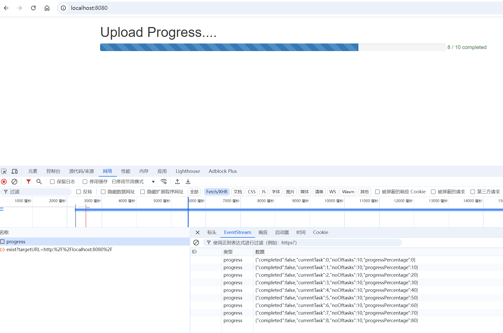

> SSE常用于消息推送，ChatGPT采用的就是该技术。

<!-- more -->

## 什么是SSE

SSE(Server-Sent Events)是一种允许服务器向客户端推送消息的技术，而无需客户端轮询服务器。它基于HTTP协议，通过建立一个持久的连接，服务端可以在客户端不发送新的请求的情况下，主动持续的发送数据。SSE通常用于实时消息推送、实时数据更新等场景。

## SSE的工作原理

SSE的工作原理基于HTTP协议，通过建立一个持久的连接，服务端可以在客户端不发送新的请求的情况下，主动持续的发送数据。具体步骤如下：

1. 客户端向服务器发送一个HTTP请求，请求头中包含`Accept: text/event-stream`，表示客户端希望接收服务器推送的事件流。
2. 服务器接收到请求后，会返回一个HTTP响应，响应头中包含`Content-Type: text/event-stream`，表示服务器将返回一个事件流。响应体中包含多个事件，每个事件由一个或多个数据行组成，数据行之间用换行符分隔。与传统的HTTP请求不同，这个连接不会再发送完一次响应后立即关闭。
3. 客户端接收到服务器推送的事件流后，会解析每个事件，并根据事件类型进行相应的处理。

## SSE的示例

> 示例展示：后端向前端推送进度，前端展示进度条。[代码详见](https://github.com/pcpratheesh/golang-sse-progress-bar)



后端代码分析：通过`c.SSEvent`方法，循环十次向前端推送进度消息，最后推送完成消息。

```go
func progressor(c *gin.Context) {
	noOfExecution := 10
	progress := 0
	for progress <= noOfExecution {
		progressPercentage := float64(progress) / float64(noOfExecution) * 100

		c.SSEvent("progress", map[string]interface{}{
			"currentTask":        progress,
			"progressPercentage": progressPercentage,
			"noOftasks":          noOfExecution,
			"completed":          false,
		})
		// Flush the response to ensure the data is sent immediately
		c.Writer.Flush()

		progress += 1
		time.Sleep(2 * time.Second)
	}

	c.SSEvent("progress", map[string]interface{}{
		"completed":          true,
		"progressPercentage": 100,
	})

	// Flush the response to ensure the data is sent immediately
	c.Writer.Flush()

}
```

前端代码分析：EventSource对象用于监听服务器推送的事件流，当事件流到达时，会触发`progress`事件，事件处理函数中解析事件数据，并根据事件类型进行相应的处理。


```js
const eventSource = new EventSource('progress');

eventSource.addEventListener('progress', function (event) {
    const data = JSON.parse(event.data)

    if (data.currentTask != undefined) {
        progressBar(data)
    }

    if (data.completed == true) {
        closeEventStream()
    }

});
```


## SSE 特点

**单向通信**

>SSE 是一种单向的通信方式，即服务器向客户端发送消息，客户端不能直接向服务器发送消息。如果需要双向通信，可以结合其他技术如 WebSocket。

**实时性**

> 由于服务器可以随时向客户端发送消息，SSE 可以实现实时的消息推送。例如，在股票交易应用中，服务器可以实时向客户端推送股票价格变化的消息。

**轻量级**

> SSE 使用简单的文本格式进行消息传输，不需要复杂的二进制协议，因此相对轻量级。这使得它在网络带宽有限的情况下也能高效工作。

**兼容性好**

> SSE 基于 HTTP 协议，因此可以在大多数现代浏览器中使用，无需安装额外的插件或软件。