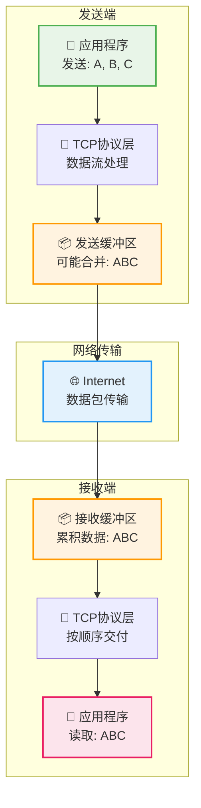
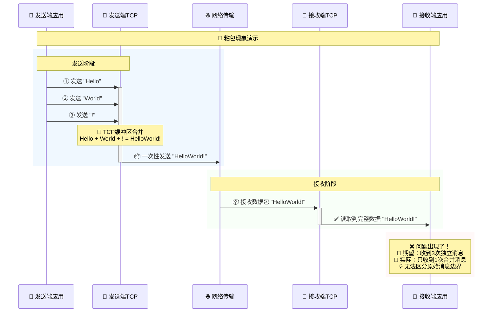
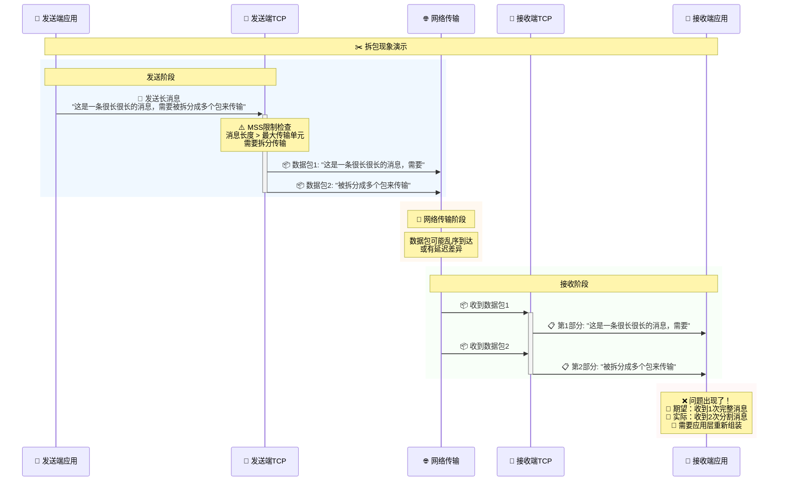
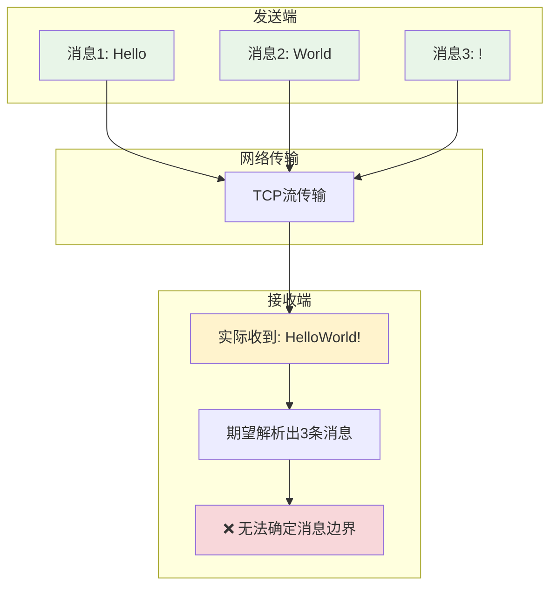
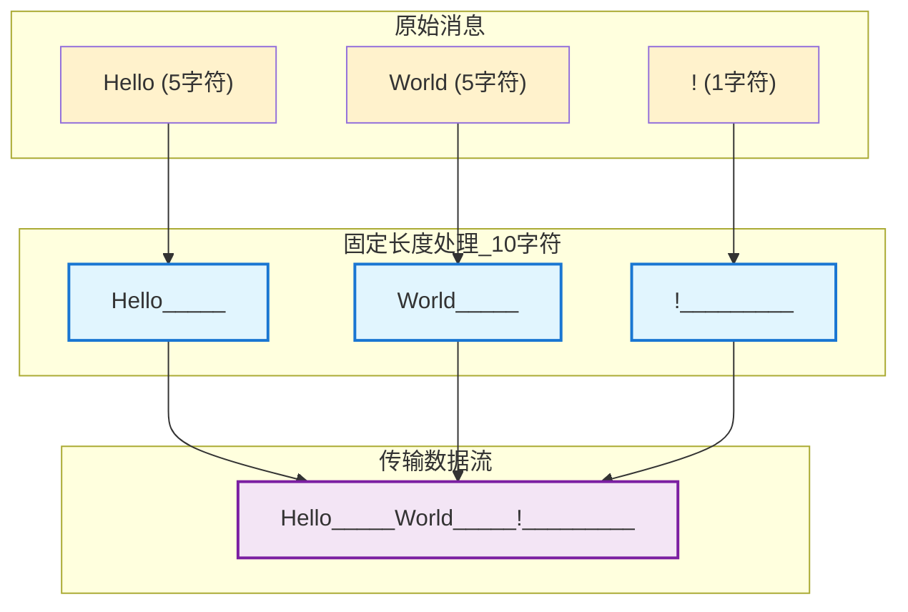
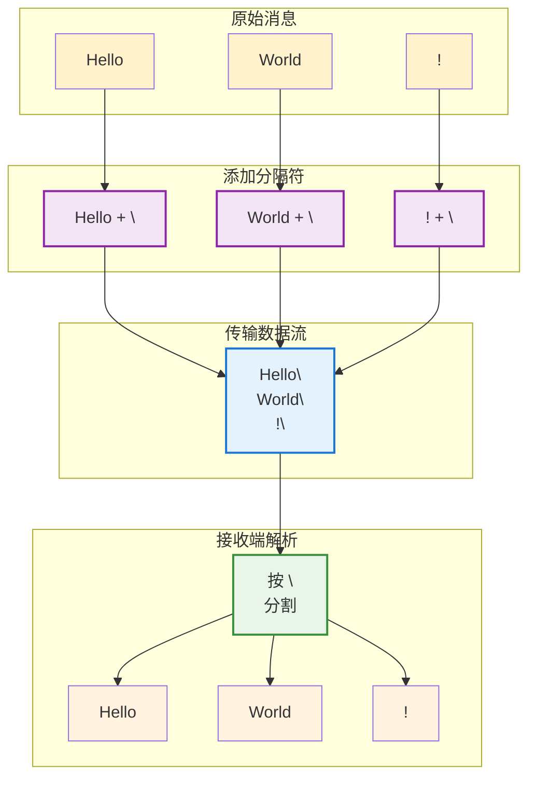
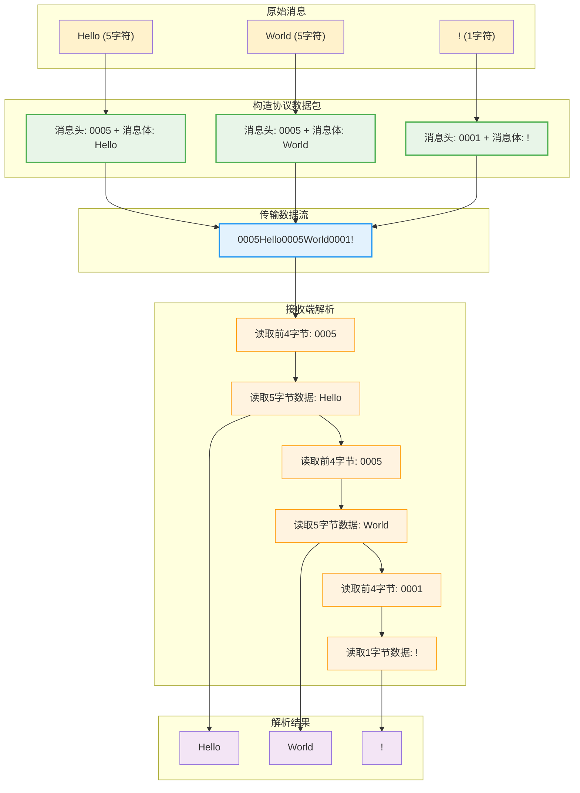
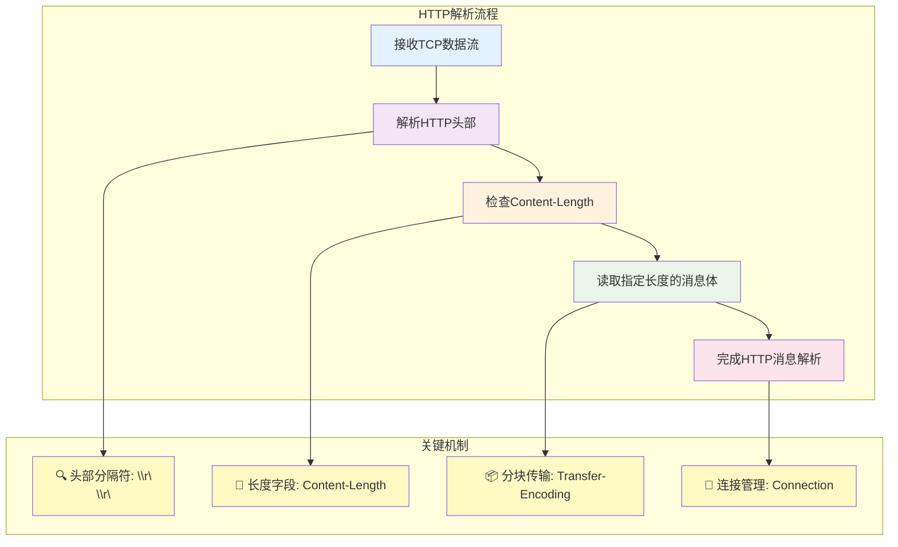

这是一篇AI写的文章，用于解释TCP粘包和拆包的概念。我觉得写的很好，对我有帮助。

<!-- more -->

## 什么是TCP粘包和拆包？

想象一下，你正在寄快递给朋友。你有3个包裹要寄，但是快递小哥有时候会把你的包裹组合处理：

- 有时候把你的3个包裹装在一个大箱子里一起送（**粘包**）
- 有时候把你的1个大包裹分成2个小箱子分别送（**拆包**）

TCP 协议中的粘包和拆包就是类似的情况！

## 为什么会发生粘包和拆包？

TCP 是一个**面向流**的协议，它就像一条河流，数据像水一样连续不断地流动。TCP 只关心数据的顺序和完整性，但不关心你原来是怎么分割数据的。



### 粘包的原因

1. **发送端缓冲区**：TCP 会把小的数据包攒一起发送，提高效率
2. **接收端缓冲区**：接收端可能一次性读取了多个数据包
3. **网络优化**：Nagle 算法会延迟发送小包，等待更多数据

### 拆包的原因

1. **MSS 限制**：数据包太大，超过了最大传输单元
2. **缓冲区不足**：发送或接收缓冲区空间不够
3. **网络拥塞**：网络状况导致数据包被分割

## 生动的例子

### 粘包场景



**发送端想发送的**：
- 第1次：`"Hello"`
- 第2次：`"World"`  
- 第3次：`"!"`

**接收端实际收到的**：
- 第1次：`"HelloWorld!"`

### 拆包场景



## 粘包和拆包的危害

### 数据解析错误



### 业务逻辑混乱

假设你在开发一个聊天应用：

```json
// 发送端发送两条消息
{"type":"message","content":"你好"}
{"type":"message","content":"在吗？"}

// 接收端可能收到粘包
{"type":"message","content":"你好"}{"type":"message","content":"在吗？"}
```

这样就无法正确解析 JSON 了！

## 如何解决粘包和拆包？

### 1. 固定长度分割

每个消息都是固定长度，不足的用特殊字符填充。



**说明**：下划线 `_` 表示填充字符（实际可能是空格或NULL字符）

**优点**：简单易实现  
**缺点**：浪费空间，不够灵活

### 2. 特殊分隔符

用特殊字符（如 `\n`、`\r\n` 等）分割消息。



**说明**：`\n` 是换行符，作为消息边界标识

**优点**：节省空间  
**缺点**：如果消息内容包含分隔符就麻烦了

### 3. 消息头+消息体（推荐）

在每个消息前面加一个固定长度的头部，说明消息体的长度。



### 4. 自定义协议

设计更复杂的协议格式：


**示例数据包**：`CAFE 01 10 0005 Hello 1A2B`

**字段说明**：
- **魔数 (2字节)**：协议识别标识，防止误解析
- **版本 (1字节)**：协议版本号，支持升级
- **类型 (1字节)**：消息分类 (10=文本消息)  
- **长度 (2字节)**：消息体字节数
- **消息体 (变长)**：实际传输的数据
- **校验 (2字节)**：数据完整性验证

**协议优势**：
- 🔒 **安全性**：魔数防止误解析，校验和保证数据完整性
- 🚀 **扩展性**：版本号支持协议升级，消息类型支持多种数据格式
- 🎯 **可靠性**：完整的错误检测和处理机制

## 实际开发中的解决方案

### HTTP 协议的解决方案

HTTP 协议是解决 TCP 粘包问题的经典范例，它采用了多种机制来确保消息边界的正确识别：

#### 1. Content-Length 方式

使用 `Content-Length` 头部明确指定消息体长度：

```http
POST /api/user HTTP/1.1
Host: example.com
Content-Type: application/json
Content-Length: 25

{"name":"张三","age":18}
```

**解析流程**：
1. 读取 HTTP 头部直到遇到 `\r\n\r\n`（双换行符）
2. 解析 `Content-Length` 字段，获取消息体长度（25字节）
3. 精确读取25字节作为消息体
4. 完成一个完整的 HTTP 请求解析

#### 2. Transfer-Encoding: chunked 方式

用于不确定内容长度的场景：

```http
HTTP/1.1 200 OK
Content-Type: text/html
Transfer-Encoding: chunked

7\r\n
Mozilla\r\n
9\r\n
Developer\r\n
7\r\n
Network\r\n
0\r\n
\r\n
```

**Chunked 编码格式**：
- 每个数据块前面有一行十六进制数字，表示块大小
- 数据块后面跟 `\r\n`
- 最后一个块大小为 0，表示传输结束

#### 3. Connection: close 方式

通过关闭连接来标识消息结束：

```http
HTTP/1.0 200 OK
Content-Type: text/html
Connection: close

<html>
<body>
    <h1>Hello World</h1>
</body>
</html>
```

**工作原理**：服务器发送完响应后主动关闭连接，客户端检测到连接关闭就知道消息传输完毕。

#### HTTP 协议的优势



## 总结

TCP 粘包和拆包是网络编程中的常见问题，就像寄快递时包裹被重新组合一样。解决的关键是：

1. **理解原因**：TCP 是面向流的协议，不保留消息边界
2. **选择合适的解决方案**：
   - 简单场景：固定长度或分隔符
   - 复杂场景：消息头+消息体
3. **在应用层处理**：TCP 协议本身不解决这个问题，需要应用层设计协议

记住：**TCP 负责可靠传输，应用层负责消息分割！**


