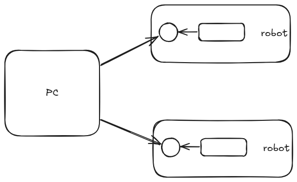

<!-- more -->

最近做的一个项目需要进行tcp转发名为tunnel，这里记录在此遇见的坑。

## tunnel架构



机器人robot服务作为client，通过tcp连接到tunnel。pc也作为客户端连接到tunnel，通过tunnel可以互相转发pc和robot服务之间的数据。

具体为何robot作为client，这里是由于其他项目需要robot作为client，不必纠结。

## tunnel实现

### 第一版

```go
package tunnel

import (
	"io"
	"net"
	"sync"
    "log"
)

var clients sync.Map

func Tunnel_server(port string) {
	ln, err := net.Listen("tcp", ":"+port)
	if err != nil {
		log.Println(err)
		return
	}
	defer ln.Close()
	for {
		conn, err := ln.Accept()
		if err != nil {
			log.Println(err)
			continue
		}
		go func() {
			defer func() {
				if err := recover(); err != nil {
					log.Println.Error(err)
				}
			}()
			handleConnection(conn)
		}()
	}
}

func handleConnection(conn net.Conn) {
	defer func() {
		clients.Delete(conn.RemoteAddr().String())
		conn.Close()
	}()
	clients.Store(conn.RemoteAddr().String(), conn)
	buf := make([]byte, 10000)
	for {
		count, err := conn.Read(buf)
		if err != nil {
			if err == io.EOF {
				log.Println("client:", conn.RemoteAddr().String(), " disconnected")
			} else if netErr, ok := err.(net.Error); ok && netErr.Timeout() {
				log.Println("client:", conn.RemoteAddr().String(), " read timeout")
			} else {
				log.Println("client:", conn.RemoteAddr().String(), " Read byte error:", err)
			}
			return
		}
		clients.Range(func(key, value any) bool {
			client, ok := value.(net.Conn)
			if !ok {
				clients.Delete(key)
				return true
			}
			if key != conn.RemoteAddr().String() { // Avoid sending data back to the sender
				_, err = client.Write(buf[:count])
				if err != nil {
					log.Println("[handleConnection] client Write byte error:", err, ">client:", client.RemoteAddr().String())
				}
			}
			return true
		})
	}
}
```

::: warning 当前存在的问题
- pc发过来的消息会转发到其他pc上面
- 当前写消息还是同步的写，如果连接的pc很多的话，性能会很差
- 无法排查当前有多少client连接tunnel
::: 

### 第二版


```go{70-79,110-116}
package tunnel

import (
	"io"
	"net"
	"strings"
	"sync"
    "log"
)

var clients sync.Map

func Tunnel_server(port string) {
	ln, err := net.Listen("tcp", ":"+port)
	if err != nil {
		log.Println(err)
		return
	}
	defer ln.Close()
	log.Println("Tunnel server listening on port:", port)

	for {
		conn, err := ln.Accept()
		if err != nil {
			log.Println(err)
			continue
		}
		log.Println("tunnel client connected:", conn.RemoteAddr())
		go func() {
			defer func() {
				if err := recover(); err != nil {
					log.Println(err)
				}
			}()
			handleConnection(conn)
		}()

	}
}

var clients sync.Map

func Tunnel_server(port string) {
	ln, err := net.Listen("tcp", ":"+port)
	if err != nil {
		log.Println(err)
		return
	}
	defer ln.Close()
	log.Println("Tunnel server listening on port:", port)

	for {
		conn, err := ln.Accept()
		if err != nil {
			log.Println(err)
			continue
		}
		log.Println("tunnel client connected:", conn.RemoteAddr())
		go func() {
			defer func() {
				if err := recover(); err != nil {
					log.Println(err)
				}
			}()
			handleConnection(conn)
		}()
	}
}

func ListClient() []string {
	var clientsList []string
	clients.Range(func(key, value any) bool {
		if addr, ok := key.(string); ok {
			clientsList = append(clientsList, addr)
		}
		return true
	})
	return clientsList
}

func handleConnection(conn net.Conn) {
	defer func() {
		clients.Delete(conn.RemoteAddr().String())
		conn.Close()
	}()
	clients.Store(conn.RemoteAddr().String(), conn)
	buf := make([]byte, 10000)
	for {
		count, err := conn.Read(buf)
		if err != nil {
			if err == io.EOF {
				log.Println("tunnel client:", conn.RemoteAddr().String(), " disconnected")
			} else if netErr, ok := err.(net.Error); ok && netErr.Timeout() {
				log.Println("tunnel client:", conn.RemoteAddr().String(), " read timeout")
			} else {
				log.Println("tunnel client:", conn.RemoteAddr().String(), " Read byte error:", err)
			}
			return
		}
        data := buf[:count]

		clients.Range(func(key, value any) bool {
			client, ok := value.(net.Conn)
			if !ok {
				clients.Delete(key)
				return true
			}
			if key != conn.RemoteAddr().String() { // 避免数据回传给发送者
				// 必须是本机的gateway和pc才能转发数据，pc与pc之间不转发
				if strings.HasPrefix(key.(string), "127.0.0.1") || strings.HasPrefix(conn.RemoteAddr().String(), "127.0.0.1") {
					go func(message []byte) {
						_, err = client.Write(message)
						if err != nil {
							log.Println("tunnel client Write byte error:", err, ">client:", client.RemoteAddr().String())
						}
					}(data)
				}
			}
			return true
		})
	}
}
```

::: info 第二版主要解决了第一版中的三个问题
- 通过限制发送的ip包含"127.0.0.1"来避免pc与pc之间转发数据
- 通过goroutine来异步写数据，避免同步写数据导致的性能问题
- 通过ListClient函数来获取当前连接的client列表
::: 

::: caution 但实际测试中遇到的致命问题
- 由于我们这边开启了goroutine写数据，但goroutine的调度并不是确定的。很可能后启动的goroutine先执行，导致业务层自定义的协议无法解决tcp粘包和拆包问题。
- 发送数据的data是共享同一个buf切片的，导致goroutine写的数据可能被覆盖。
::: 

### 第三版

```go
package tunnel

import (
    "io"
    "net"
    "strings"
    "sync"
    "log"
)

var clients sync.Map

// ClientSender 为每个客户端维护有序发送队列
type ClientSender struct {
    conn   net.Conn
    sendCh chan []byte
    addr   string
}

func NewClientSender(conn net.Conn) *ClientSender {
    cs := &ClientSender{
        conn:   conn,
        sendCh: make(chan []byte, 1000), // 缓冲队列
        addr:   conn.RemoteAddr().String(),
    }
    cs.start()
    return cs
}

func (cs *ClientSender) start() {
    go func() {
        defer func() {
            if err := recover(); err != nil {
                log.Println("ClientSender panic:", err)
            }
            close(cs.sendCh)
        }()
        
        for data := range cs.sendCh {
            _, err := cs.conn.Write(data)
            if err != nil {
                log.Println("tunnel client Write error:", err, ">client:", cs.addr)
                return // 连接断开，退出发送循环
            }
        }
    }()
}

func (cs *ClientSender) Send(data []byte) {
    cs.sendCh <- data:
}

func (cs *ClientSender) Close() {
    close(cs.sendCh)
}

func Tunnel_server(port string) {
    ln, err := net.Listen("tcp", ":"+port)
    if err != nil {
        log.Println(err)
        return
    }
    defer ln.Close()
    log.Println("Tunnel server listening on port:", port)

    for {
        conn, err := ln.Accept()
        if err != nil {
            log.Println(err)
            continue
        }
        log.Println("tunnel client connected:", conn.RemoteAddr())
        go func() {
            defer func() {
                if err := recover(); err != nil {
                    log.Println(err)
                }
            }()
            handleConnection(conn)
        }()
    }
}

func ListClient() []string {
    var clientsList []string
    clients.Range(func(key, value any) bool {
        if addr, ok := key.(string); ok {
            clientsList = append(clientsList, addr)
        }
        return true
    })
    return clientsList
}

func handleConnection(conn net.Conn) {
    addr := conn.RemoteAddr().String()
    sender := NewClientSender(conn)
    
    defer func() {
        sender.Close()
        clients.Delete(addr)
        conn.Close()
    }()
    
    clients.Store(addr, sender)
    buf := make([]byte, 10000) 
    
    for {
        count, err := conn.Read(buf)
        if err != nil {
            if err == io.EOF {
                log.Println("tunnel client:", addr, " disconnected")
            } else if netErr, ok := err.(net.Error); ok && netErr.Timeout() {
                log.Println("tunnel client:", addr, " read timeout")
            } else {
                log.Println("tunnel client:", addr, " Read byte error:", err)
            }
            return
        }
        
        // 创建独立的数据副本
        data := make([]byte, count)
        copy(data, buf[:count])

        // 转发给其他客户端
        clients.Range(func(key, value any) bool {
            if key.(string) != addr { // 避免回传
                if sender, ok := value.(*ClientSender); ok {
                    // 检查转发条件
                    if strings.HasPrefix(key.(string), "127.0.0.1") || strings.HasPrefix(addr, "127.0.0.1") {
                        sender.Send(data) 
                    }
                } else {
                    // 清理无效连接
                    clients.Delete(key)
                }
            }
            return true
        })
    }
}
```

::: info 第三版通过以下方式解决第二版致命问题
- 每个tcp连接拥有一个channel，再启动协程。这样保障了发送的tcp报文是有序的，pc端按照自定义协议可以解决tcp粘包合拆包问题。
- 发送数据的data是独立的数据副本，避免了goroutine写数据被覆盖的问题。
:::