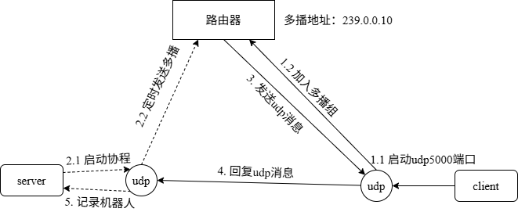

<!-- more -->

项目上需要通过UDP多播实现设备发现功能，本文通过Go语言提供示例

整体的流程如下：



## 服务端代码

```go
package main

import (
	"flag"
	"fmt"
	"net"
	"os"
	"time"
)

var multicastAddress = flag.String("multicast", "239.0.0.10", "Multicast address")
var duration = flag.Duration("duration", 5*time.Second, "Discovery duration")

func main() {
	flag.Parse()
	group := *multicastAddress + ":5000"
	addr, err := net.ResolveUDPAddr("udp", group)
	if err != nil {
		fmt.Println("ResolveUDPAddr failed:", err)
		os.Exit(1)
	}
	listenAddr, err := net.ResolveUDPAddr("udp", "0.0.0.0:0")
	if err != nil {
		fmt.Println("ResolveUDPAddr failed:", err)
		os.Exit(1)
	}
	replyConn, err := net.ListenUDP("udp", listenAddr)
	if err != nil {
		fmt.Println("ListenUDP failed:", err)
		os.Exit(1)
	}
	defer replyConn.Close()

	// 定时发送发现请求
	go func() {
		for {
			msg := []byte("Who is online?")
			_, err := replyConn.WriteToUDP(msg, addr)
			if err != nil {
				fmt.Println("WriteToUDP failed:", err)
				return
			}
			fmt.Println("Sent multicast discovery")
			// 每隔5秒发送一次
			time.Sleep(*duration)
		}
	}()

	// 接收设备回复
	buf := make([]byte, 1024)
	for {
		n, src, err := replyConn.ReadFromUDP(buf)
		if err != nil {
			fmt.Printf("Receive error: %v\n", err)
			break
		}
		fmt.Printf("Device reply from %s: %s\n", src, string(buf[:n]))
	}
}
```

## 客户端代码(不支持windows本机接收)

```go
package main

import (
	"fmt"
	"net"
	"os"
)

func main() {
	group := "239.0.0.10:5000"
	addr, _ := net.ResolveUDPAddr("udp", group)

	// 监听组播地址
	conn, err := net.ListenMulticastUDP("udp", nil, addr)
	if err != nil {
		fmt.Println("ListenMulticastUDP failed:", err)
		os.Exit(1)
	}
	defer conn.Close()
	conn.SetReadBuffer(1024)

	fmt.Println("Waiting for discovery...")

	buf := make([]byte, 1024)
	for {
		n, src, err := conn.ReadFromUDP(buf)
		if err != nil {
			fmt.Println("ReadFromUDP failed:", err)
			continue
		}
		msg := string(buf[:n])
		fmt.Printf("Received %s from %s\n", msg, src)

		// 回复到服务端的IP:10000端口
		replyAddr := &net.UDPAddr{
			IP:   src.IP,
			Port: src.Port,
		}
		hostname, _ := os.Hostname()
		resMsg := fmt.Sprintf("Device: %s", hostname)
		_, err = conn.WriteToUDP([]byte(resMsg), replyAddr)
		if err != nil {
			fmt.Println("WriteToUDP failed:", err)
		}
	}
}
```

这个示例能发送udp多播消息，但windows下本机却接收不到消息。具体原因参考[^1]、[^2]


## 客户端代码

```go
package main

import (
	"fmt"
	"log"
	"net"
	"os"

	"golang.org/x/net/ipv4"
)

// 组播地址和端口
var (
	multicastAddress = "239.0.0.10"
	port             = 5000
)

func main() {
	// 绑定IP和端口
	listener, err := net.ListenPacket("udp4", fmt.Sprintf("0.0.0.0:%d", port))
	if err != nil {
		log.Fatal(err)
	}
	// 关闭监听
	defer listener.Close()

	pc := ipv4.NewPacketConn(listener)

	// 加入组播
	if err := pc.JoinGroup(nil, &net.UDPAddr{IP: net.ParseIP(multicastAddress)}); err != nil {
		log.Fatal(err)
	}
	// 离开组播
	defer pc.LeaveGroup(nil, &net.UDPAddr{IP: net.ParseIP(multicastAddress)})

	// 创建一个缓冲区(切片)用于接收数据
	buffer := make([]byte, 1024)
	for {
		// 接收数据
		n, cm, src, err := pc.ReadFrom(buffer)
		if err != nil {
			log.Println("Error reading:", err)
			continue
		}
		// 打印接收到的数据和源地址
		msg := buffer[:n]
		fmt.Printf("Received %s from %s, control message: %v\n", msg, src, cm)

		hostname, _ := os.Hostname()
		resMsg := fmt.Sprintf("Device: %s", hostname)
		_, err = pc.WriteTo([]byte(resMsg), nil, src)
		if err != nil {
			fmt.Println("WriteToUDP failed:", err)
		}
	}
}
```

最后推荐这篇文章[^3]。

## 参考文献

[^1]: [golang-udp-multicast-not-working-in-windows10](https://stackoverflow.com/questions/73062193/golang-udp-multicast-not-working-in-windows10)
[^2]: [how-to-set-ip-multicast-loop-on-multicast-udpconn-in-golang](https://stackoverflow.com/questions/43109552/how-to-set-ip-multicast-loop-on-multicast-udpconn-in-golang)
[^3]: [Go-UDP-Programming](https://colobu.com/2016/10/19/Go-UDP-Programming/)
