使用Go+Vue开发的通用后台管理系统，支持用户登录和日志，部门管理，用户管理，角色管理，菜单管理。

<!-- more -->

[](https://goreportcard.com/report/github.com/hexiaopi/data-space)
[](https://opensource.org/licenses/MIT)
[](https://github.com/Hexiaopi/data-space)

## 功能

- 用户登录和日志
- 部门管理
- 用户管理
- 角色管理
- 菜单管理

## 🛠 技术栈

### 前端

- vue3
- vite
- pina
- element-plus

### 后端

- go
- mysql
- gin
- opentelemetry
- prometheus metric

## 安装

### 前端

```bash
  cd web
  npm install
```

### 后端

```bash
  go mod tidy
```

## 本地运行

### 前端

```bash
  cd web
  npm run dev
```

### 后端

```bash
  go run cmd/root.go
```

## 截图

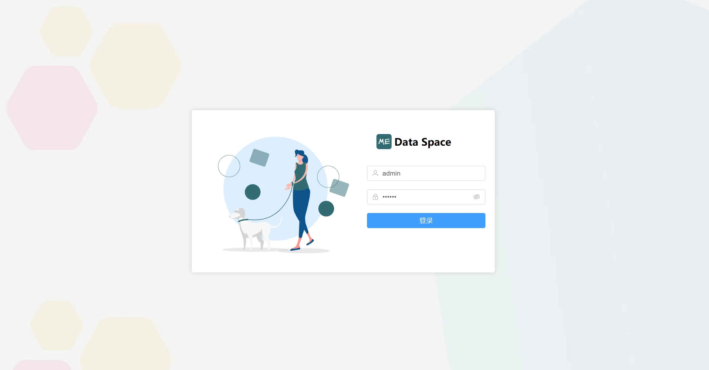

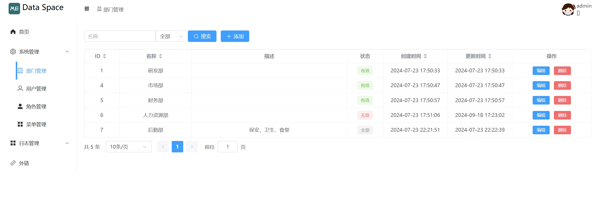
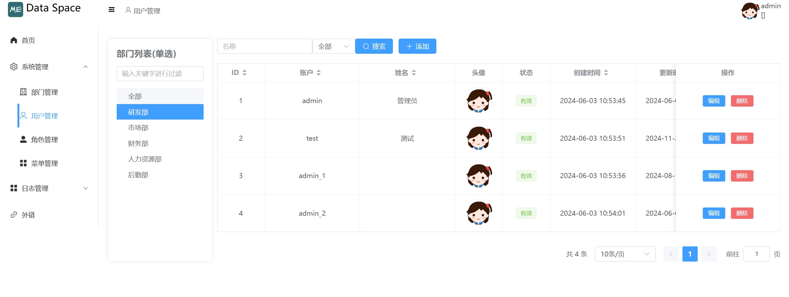
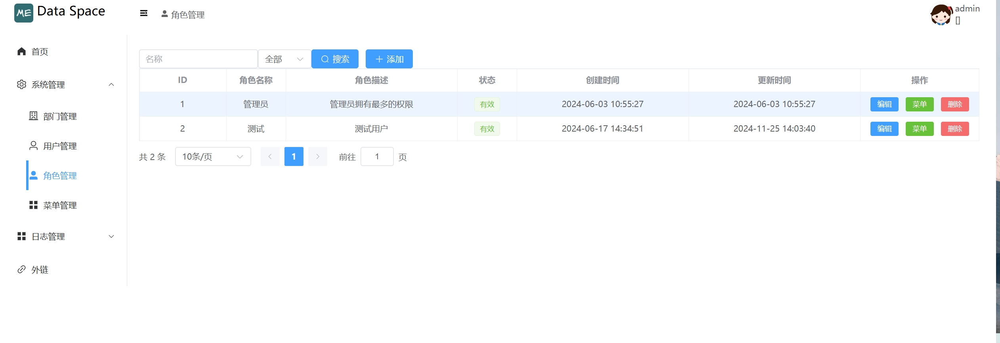
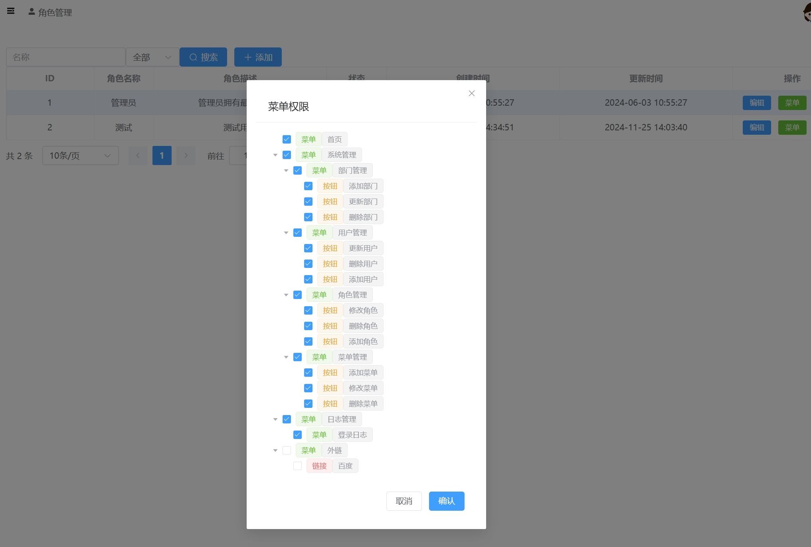
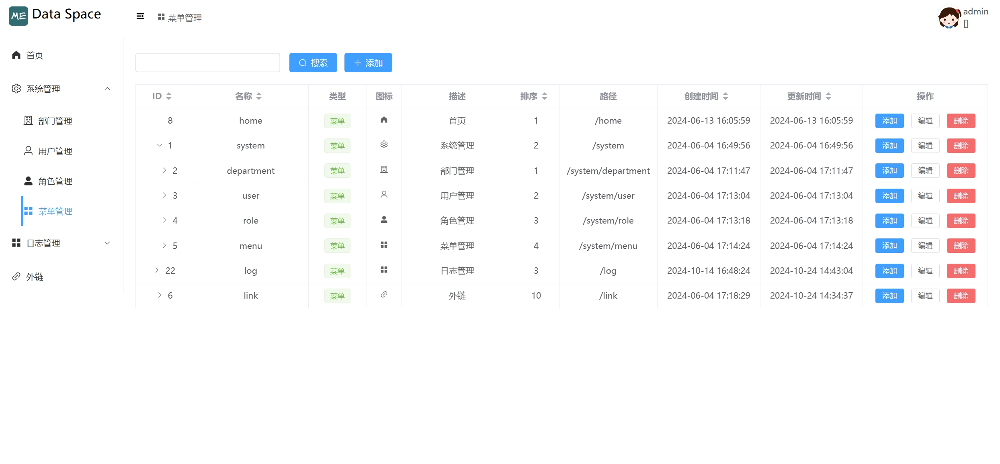
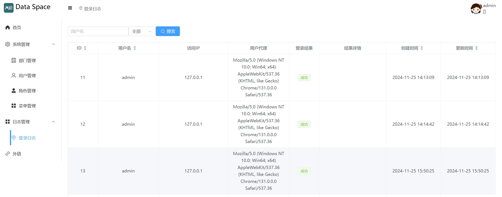
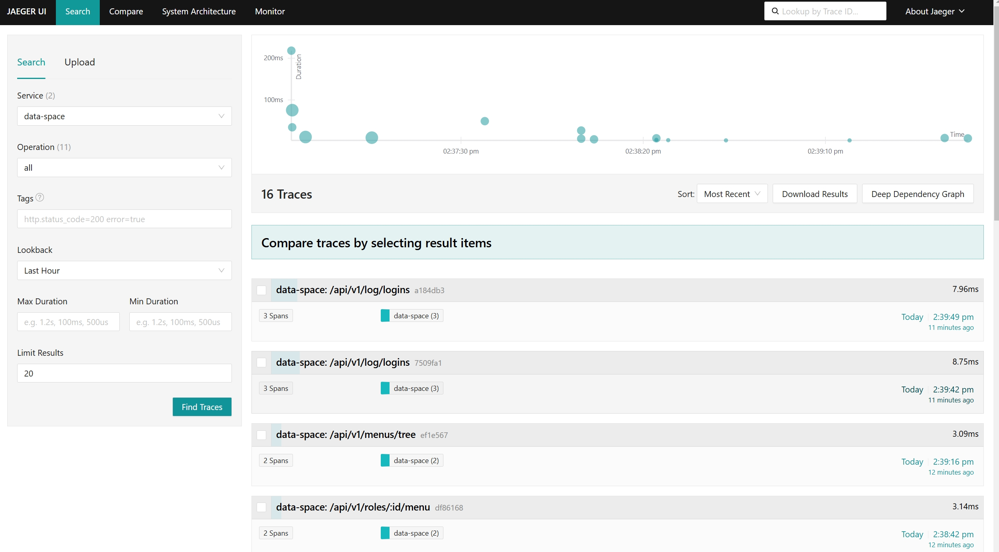
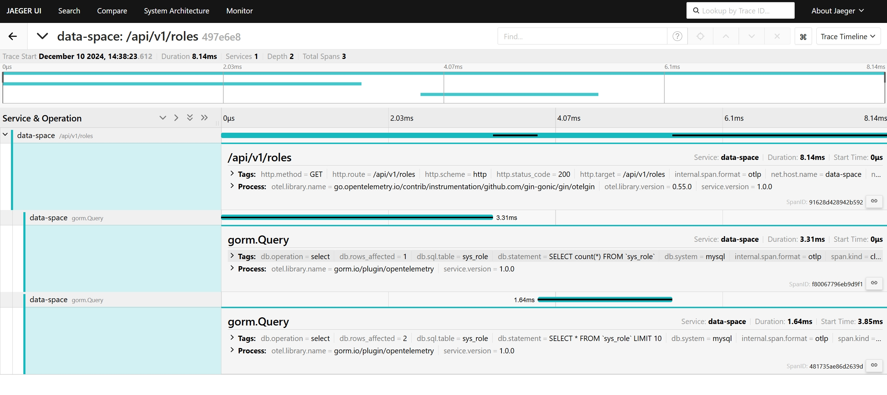
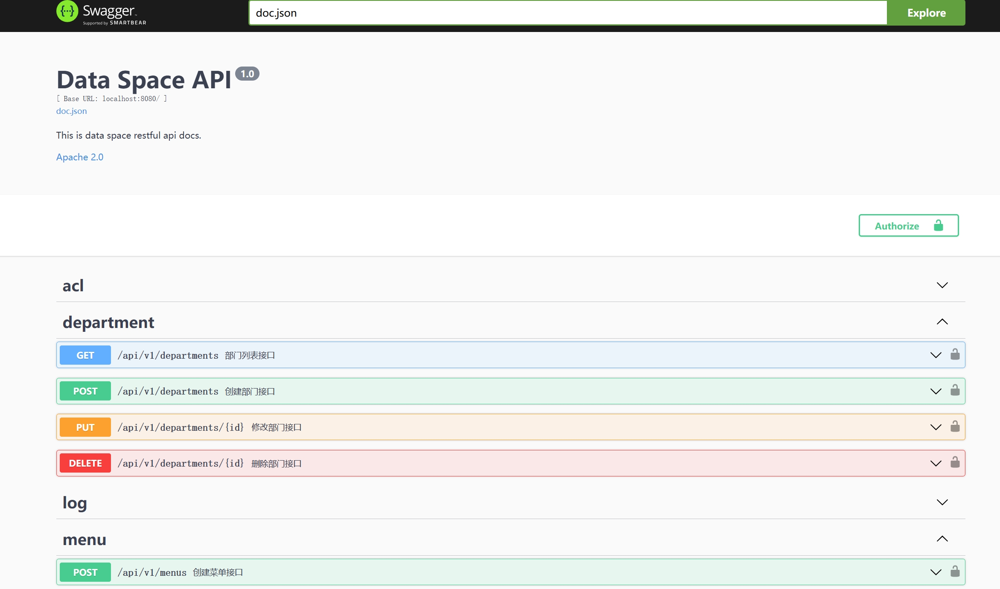
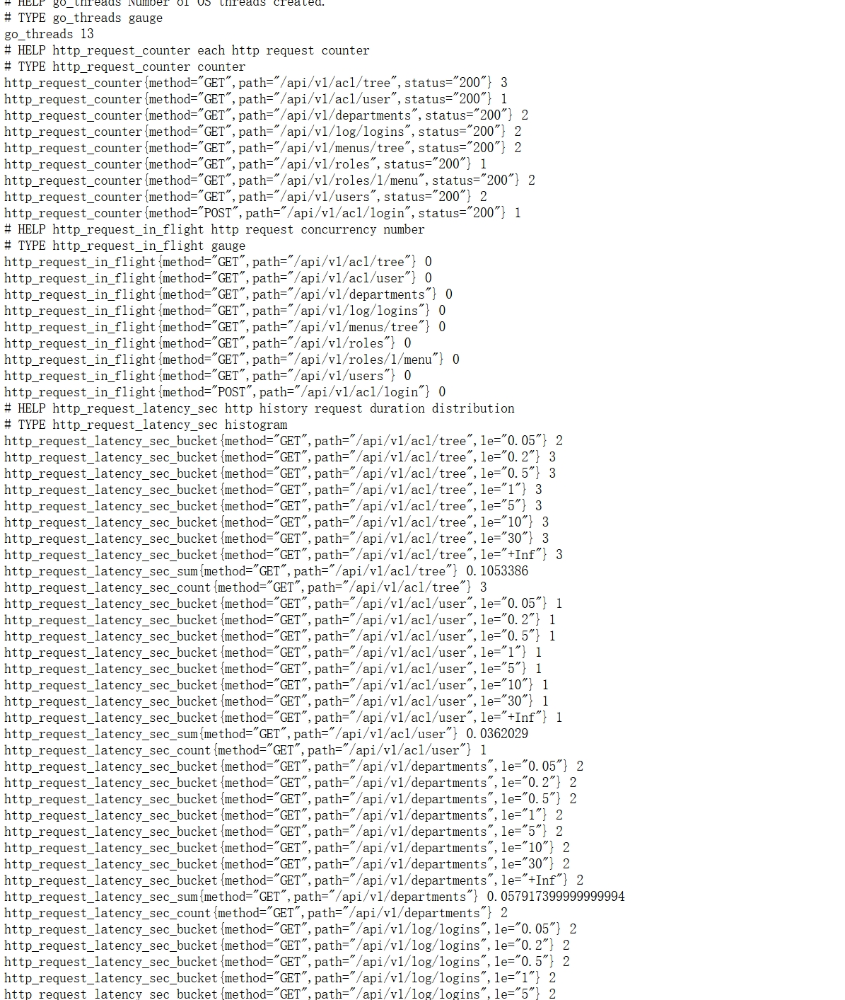

## 收藏历史

[](https://star-history.com/#hexiaopi/data-space&Date)

## 许可证

[MIT](https://choosealicense.com/licenses/mit/)
