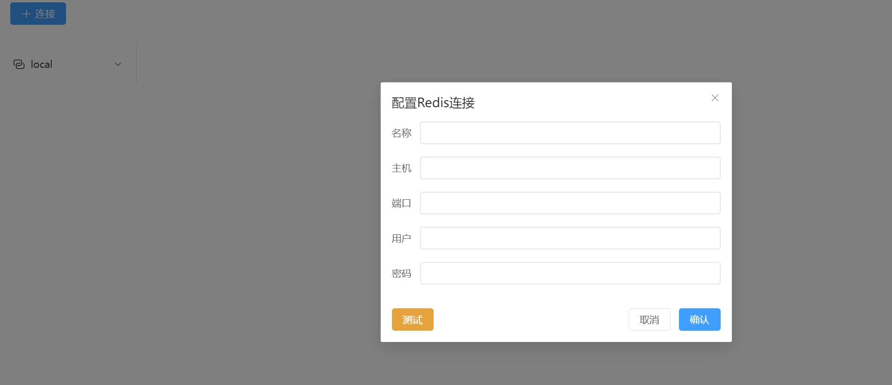
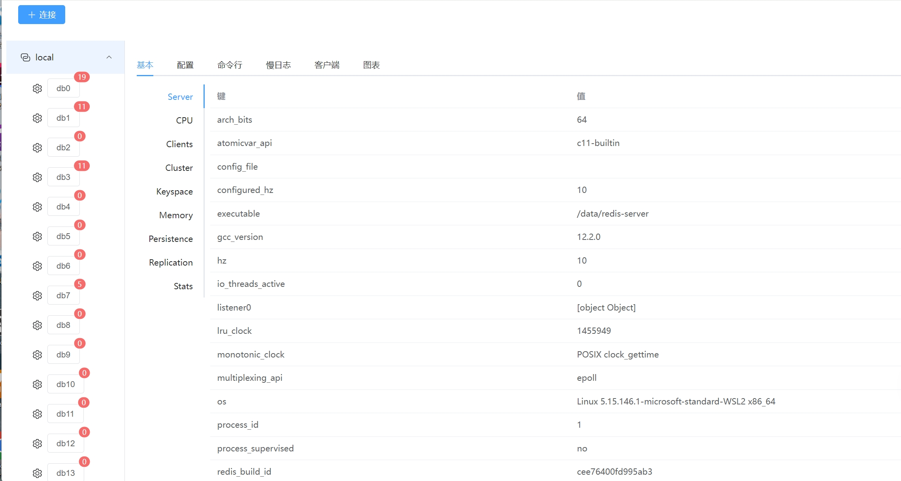
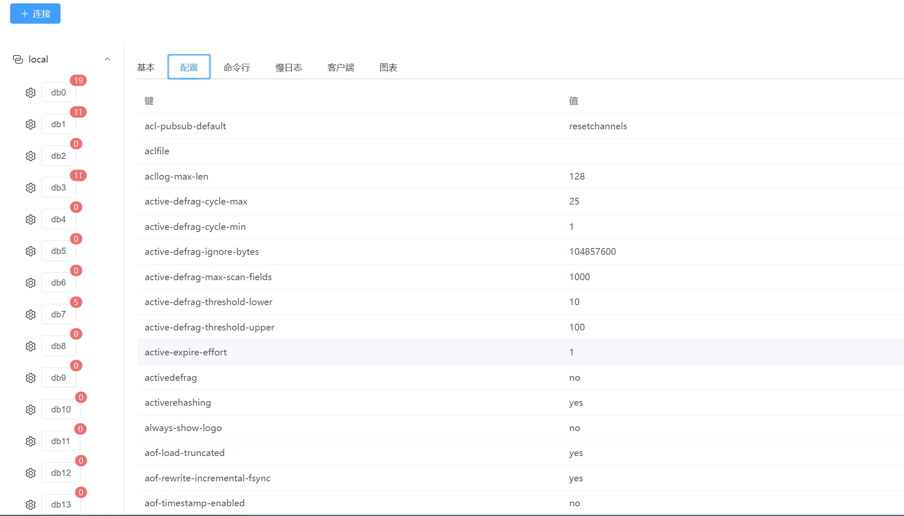
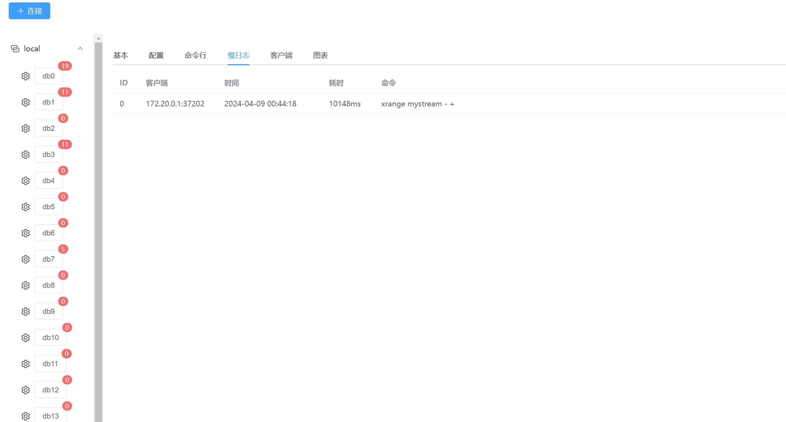
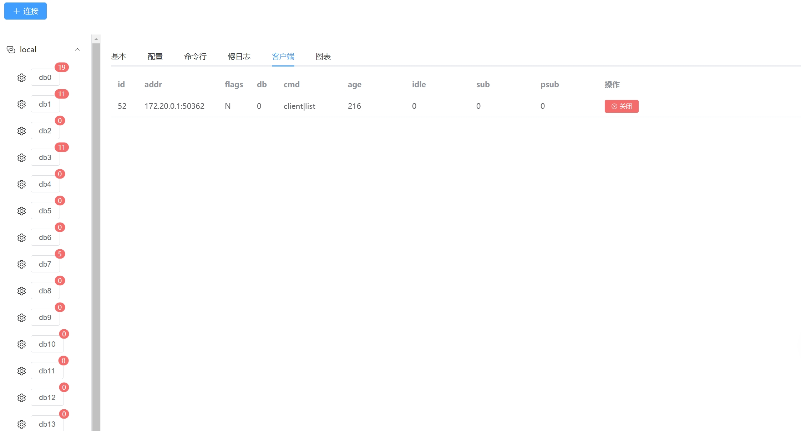
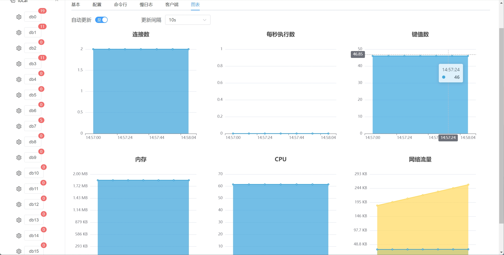
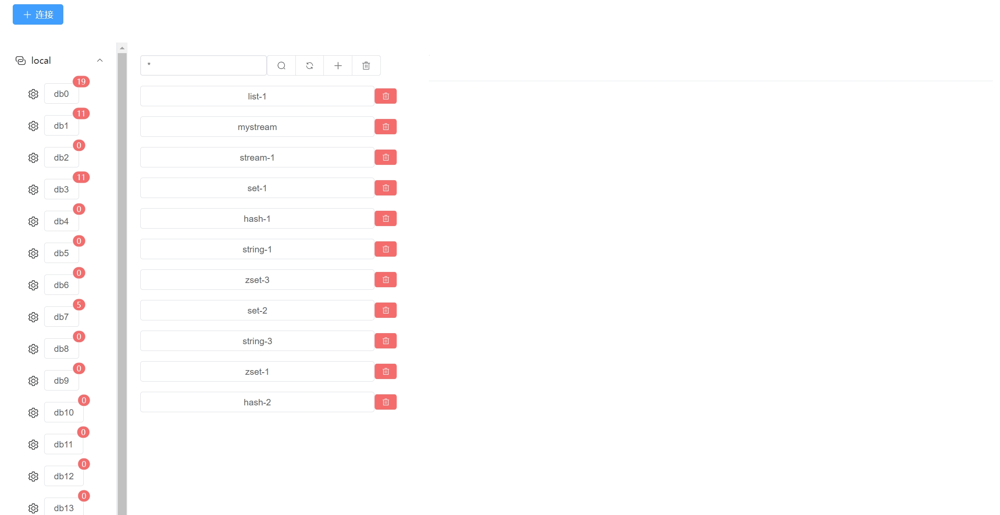
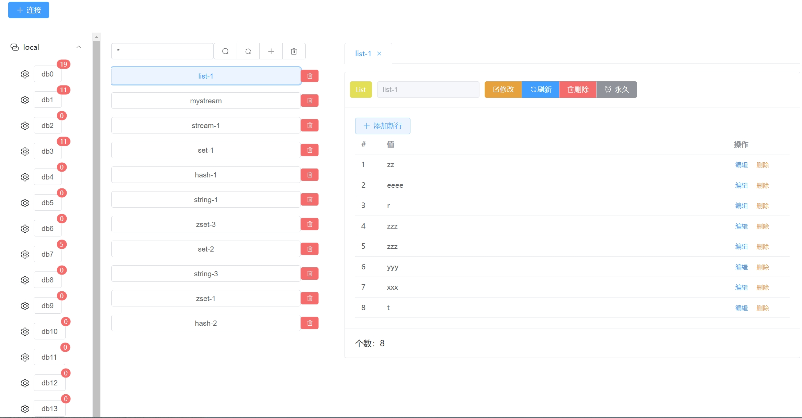

redis 可视化管理工具

<!-- more -->

## 功能

- redis 管理
- db 管理
- key 管理
- 支持命令行

## 🛠 技术栈

### 前端

- vue3
- vite
- pina
- element-plus

### 后端

- go
- redis
- gin

## 安装

### 前端

```bash
  cd frontend
  npm install
```

### 后端

```bash
  cd backend
  go mod tidy
```

## 本地运行

### 前端

```bash
  cd frontend
  npm run dev
```

### 后端

```bash
  cd backend
  go run cmd/root.go
```

## 截图











## 收藏历史

[](https://star-history.com/#hexiaopi/rdm-toy&Date)

## 许可证

[MIT](https://choosealicense.com/licenses/mit/)
